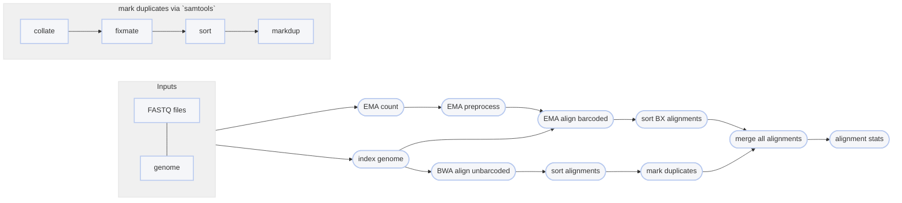

# :icon-quote: Map Reads onto a genome with EMA
===  :icon-checklist: You will need
- at least 4 cores/threads available
- a genome assembly in FASTA format: [!badge variant="success" text=".fasta"] [!badge variant="success" text=".fa"] [!badge variant="success" text=".fasta.gz"] [!badge variant="success" text=".fa.gz"]
- paired-end fastq sequence file with the [proper naming convention](/haplotagdata/#naming-conventions) [!badge variant="secondary" text="gzipped recommended"]
    - **forward**: [!badge variant="success" text="_F"] [!badge variant="success" text=".F"] [!badge variant="success" text=".1"] [!badge variant="success" text="_1"] [!badge variant="success" text="_R1_001"] [!badge variant="success" text=".R1_001"] [!badge variant="success" text="_R1"] [!badge variant="success" text=".R1"] 
    - **reverse**: [!badge variant="success" text="_R"] [!badge variant="success" text=".R"] [!badge variant="success" text=".2"] [!badge variant="success" text="_2"] [!badge variant="success" text="_R2_001"] [!badge variant="success" text=".R2_001"] [!badge variant="success" text="_R2"] [!badge variant="success" text=".R2"] 
    - **fastq extension**: [!badge variant="success" text=".fq"] [!badge variant="success" text=".fastq"] [!badge variant="success" text=".FQ"] [!badge variant="success" text=".FASTQ"]
- patience because EMA is [!badge variant="warning" text="slow"]
==- Why EMA?
The original haplotag manuscript uses BWA to map reads. The authors have since recommended
the use of EMA (EMerald Aligner) for most applications. EMA is barcode-aware,
meaning it considers sequences with identical barcodes to have originated from the same 
molecule, and therefore has higher mapping accuracy than using BWA. Here's a comparison
from the [EMA manuscript](https://www.biorxiv.org/content/10.1101/220236v1):

==-

Once sequences have been trimmed and passed through other QC filters, they will need to
be aligned to a reference genome. This module within Harpy expects filtered reads as input,
such as those derived using [!badge corners="pill" text="harpy qc"](../qc.md). You can map reads onto a genome assembly with Harpy 
using the [!badge corners="pill" text="align ema"] module:

```bash usage
harpy align ema OPTIONS... INPUTS...
```
```bash example
harpy align ema --genome genome.fasta Sequences/ 
```


## :icon-terminal: Running Options
In addition to the [!badge variant="info" corners="pill" text="common runtime options"](/commonoptions.md), the [!badge corners="pill" text="align ema"] module is configured using these command-line arguments:

{.compact}
| argument           | short name | type                  | default | required | description                                                        |
|:-------------------|:----------:|:----------------------|:-------:|:--------:|:-------------------------------------------------------------------|
| `INPUTS`           |            | file/directory paths  |         | **yes**  | Files or directories containing [input FASTQ files](/commonoptions.md#input-arguments)                  |
| `--genome`         |    `-g`    | file path             |         | **yes**  | Genome assembly for read mapping                                   |
| `--platform`       |    `-p`    | string                | haplotag | **yes** | Linked read technology: `haplotag` or `10x`                        |
| `--whitelist`      |    `-w`    | file path             |         |    no    | Path to barcode whitelist (`--platform 10x` only)                  |
| `--ema-bins`       |    `-e`    | integer (1-1000)      |   500   |    no    | Number of barcode bins for EMA                                     |
| `--quality-filter` |    `-f`    | integer (0-40)        |   30    |    no    | Minimum `MQ` (SAM mapping quality) to pass filtering               |
| `--extra-params`   |    `-x`    | string                |         |    no    | Additional EMA-align/BWA arguments, in quotes                      |

### Barcode whitelist
Some linked-read methods (e.g. 10x, Tellseq) require the inclusion of a barcode "whitelist." This file is a 
simple text file that has one barcode per line so a given software knows what barcodes to expect in your data.
If you need to process 10x data, then you will need to include the whitelist file (usually provided by 10x).
Conveniently, **haplotag data doesn't require this file**.

## Quality filtering
The `--quality` argument filters out alignments below a given $MQ$ threshold. The default, `30`, keeps alignments
that are at least 99.9% likely correctly mapped. Set this value to `1` if you only want alignments removed with
$MQ = 0$ (0% likely correct). You may also set it to `0` to keep all alignments for diagnostic purposes.
The plot below shows the relationship between $MQ$ score and the likelihood the alignment is correct and will serve to help you decide
on a value you may want to use. It is common to remove alignments with $MQ <30$ (<99.9% chance correct) or $MQ <40$ (<99.99% chance correct).

==- What is the $MQ$ score?
Every alignment in a BAM file has an associated mapping quality score ($MQ$) that informs you of the likelihood 
that the alignment is accurate. This score can range from 0-40, where higher numbers mean the alignment is more
likely correct. The math governing the $MQ$ score actually calculates the percent chance the alignment is ***incorrect***: 
$$
\%\ chance\ incorrect = 10^\frac{-MQ}{10} \times 100\\
\text{where }0\le MQ\le 40
$$
You can simply subtract it from 100 to determine the percent chance the alignment is ***correct***:
$$
\%\ chance\ correct = 100 - \%\ chance\ incorrect\\
\text{or} \\
\%\ chance\ correct = (1 - 10^\frac{-MQ}{10}) \times 100
$$

[!embed el="embed"](//plotly.com/~pdimens/7.embed)
===

## Marking PCR duplicates
EMA marks duplicates in the resulting alignments, however the read with invalid barcodes
are aligned separately with BWA. Therefore, Harpy uses `samtools markdup` to mark putative
PCR duplicates in the reads with invalid barcodes. Duplicate marking uses the `-S` option
to mark supplementary (chimeric) alignments as duplicates if the primary alignment was
marked as a duplicate. Duplicates get marked but **are not removed**.

----

## :icon-git-pull-request: EMA workflow
+++ :icon-git-merge: details
- leverages the BX barcode information to improve mapping
- sometimes better downstream SV detection
- slower
- marks split alignments as secondary alignments [⚠️](/Modules/SV/leviathan.md)
- lots of temporary files

Since [EMA](https://github.com/arshajii/ema) does extra things to account for barcode
information, the EMA workflow is a bit more complicated under the hood. Reads with 
barcodes are aligned using EMA and reads without valid barcodes are separately mapped
using BWA before merging all the alignments together again. EMA will mark duplicates
within alignments, but the BWA alignments need duplicates marked manually using 
`samtools markdup`.


+++ :icon-file-directory: EMA output
The default output directory is `Align/ema` with the folder structure below. `Sample1` is a generic sample name for demonstration purposes. 
The resulting folder also includes a `workflow` directory (not shown) with workflow-relevant runtime files and information.
```
Align/ema
├── Sample1.bam
├── Sample1.bam.bai
├── logs
│   ├── Sample1.bwa.align.log
│   ├── Sample1.bwa.sort.log
│   ├── Sample1.ema.align.log
│   ├── Sample1.ema.sort.log
│   ├── Sample1.markdup.log
│   └── preproc
│       └── Sample1.preproc.log
└── reports
    ├── barcodes.summary.html
    ├── ema.stats.html
    ├── Sample1.html
    └── data
        ├── bxstats
        │   └── Sample1.bxstats.gz
        └── coverage
            └── Sample1.cov.gz

```
{.compact}
| item                                           | description                                                                                                   |
|:-----------------------------------------------|:--------------------------------------------------------------------------------------------------------------|
| `*.bam`                                        | sequence alignments for each sample                                                                           |
| `*.bai`                                        | sequence alignment indexes for each sample                                                                    |
| `logs/preproc/*.preproc.log`                   | everything `ema preproc` writes to `stderr` during operation                                                  |
| `reports/`                                     | various counts/statistics/reports relating to sequence alignment                                              |
| `reports/ema.stats.html`                       | report summarizing `samtools flagstat and stats` results across all samples from `multiqc`                    |
| `reports/barcodes.summary.html`                | interactive html report summarizing barcode-specific metrics across all samples                                            |
| `reports/Sample1.html`              | interactive html report summarizing BX tag metrics and alignment coverage        | 
| `reports/data/coverage/*.cov.gz`    | output from samtools cov, used for plots                                         |
| `reports/data/bxstats`              | tabular data containing the information used to generate the BX stats in reports |

+++ :icon-code-square: EMA parameters
By default, Harpy runs `ema` with these parameters (excluding inputs and outputs):
```bash
ema-h align -d -p haplotag -R "@RG\tID:samplename\tSM:samplename"
```

Below is a list of all `ema align` command line arguments, excluding those Harpy already uses or those made redundant by Harpy's implementation of EMA.
These are taken directly from the [EMA documentation](https://github.com/arshajii/ema).

``` ema arguments
-d: apply fragment read density optimization [off]
-i <index>: index to follow 'BX' tag in SAM output [1]
```
+++ :icon-graph: reports
These are the summary reports Harpy generates for this workflow. You may right-click
the images and open them in a new tab if you wish to see the examples in better detail.

||| Alignment BX Information
An aggregate report of barcode-specific alignment information for all samples.

||| Molecule size and Coverage
Reports the inferred molecule sized based on barcodes in the alignments.

||| Samtools Alignment stats
Reports the general statistics computed by samtools `stats` and `flagstat`

|||

+++


