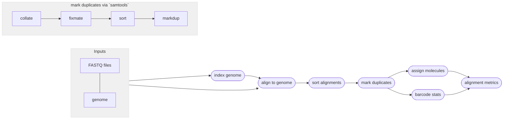

# :icon-quote: Map Reads onto a genome with Minimap2
===  :icon-checklist: You will need
- at least 4 cores/threads available
- a genome assembly in FASTA format
- paired-end fastq sequence file with the [proper naming convention](/haplotagdata/#naming-conventions) (gzipped recommended)
===

Once sequences have been trimmed and passed through other QC filters, they will need to
be aligned to a reference genome. This module within Harpy expects filtered reads as input,
such as those derived using `harpy qc`. You can map reads onto a genome assembly with Harpy 
using the `align` module:

```bash usage
harpy align minimap OPTIONS... INPUTS...
```
```bash example
harpy align minimap --genome genome.fasta Sequences/ 
```

## :icon-terminal: Running Options
In addition to the [common runtime options](/commonoptions.md), the `harpy align minimap` module is configured using these command-line arguments:

| argument           | short name | type                  | default | required | description                                           |
|:-------------------|:----------:|:----------------------|:-------:|:--------:|:------------------------------------------------------|
| `INPUTS`           |            | file/directory paths  |         | **yes**  | Files or directories containing [input FASTQ files](/commonoptions.md#input-arguments)     |
| `--genome`         |    `-g`    | file path             |         | **yes**  | Genome assembly for read mapping                      |
| `--molecule-distance` |    `-m`    | integer         |  100000  |    no    | Base-pair distance threshold to separate molecules      |
| `--quality-filter` |    `-f`    | integer (0-40)        |   30    |    no    | Minimum `MQ` (SAM mapping quality) to pass filtering  |
| `--method`         |    `-m`    | choice [`bwa`, `ema`] |   bwa   |    no    | Which aligning software to use                        |
| `--extra-params`   |    `-x`    | string                |         |    no    | Additional EMA-align/BWA arguments, in quotes         |

### Molecule distance
The `--molecule-distance` option is used during the BWA alignment workflow
to assign alignments a unique Molecular Identifier `MI:i` tag based on their
 haplotag barcode and the distance threshold you specify. See 
[haplotag data](/haplotagdata/#barcode-thresholds) for more information on
what this value does. 

## Quality filtering
The `--quality` argument filters out alignments below a given $MQ$ threshold. The default, `30`, keeps alignments
that are at least 99.9% likely correctly mapped. Set this value to `1` if you only want alignments removed with
$MQ = 0$ (0% likely correct). You may also set it to `0` to keep all alignments for diagnostic purposes.
The plot below shows the relationship between $MQ$ score and the likelihood the alignment is correct and will serve to help you decide
on a value you may want to use. It is common to remove alignments with $MQ <30$ (<99.9% chance correct) or $MQ <40$ (<99.99% chance correct).

==- What is the $MQ$ score?
Every alignment in a BAM file has an associated mapping quality score ($MQ$) that informs you of the likelihood 
that the alignment is accurate. This score can range from 0-40, where higher numbers mean the alignment is more
likely correct. The math governing the $MQ$ score actually calculates the percent chance the alignment is ***incorrect***: 
$$
\%\ chance\ incorrect = 10^\frac{-MQ}{10} \times 100\\
\text{where }0\le MQ\le 40
$$
You can simply subtract it from 100 to determine the percent chance the alignment is ***correct***:
$$
\%\ chance\ correct = 100 - \%\ chance\ incorrect\\
\text{or} \\
\%\ chance\ correct = (1 - 10^\frac{-MQ}{10}) \times 100
$$

[!embed el="embed"](//plotly.com/~pdimens/7.embed)
===

## Marking PCR duplicates
Harpy uses `samtools markdup` to mark putative PCR duplicates. By using the `--barcode-tag BX`
option, it considers the linked-read barcode for more accurate duplicate detection. Duplicate
marking also uses the `-S` option to mark supplementary (chimeric) alignments as duplicates
if the primary alignment was marked as a duplicate. Duplicates get marked but **are not removed**.

----

## :icon-git-pull-request: Minimap workflow
+++ :icon-git-merge: details
- ignores (but retains) barcode information
- ultra-fast
- comparable accuracy to BWA MEM for sequences greater than 100bp
    - accuracy may be lower for sequences less than 100bp

The [minimap2](https://github.com/lh3/minimap2) workflow is nearly identical to the BWA workflow,
the only real difference being how the input genome is indexed and that alignment is performed with
`minimap2` instead of BWA. Duplicates are marked using `samtools markdup`.
The `BX:Z` tags in the read headers are still added to the alignment headers, even though barcodes
are not used to inform mapping. The `-m` threshold is used for alignment molecule assignment.


+++ :icon-file-directory: minimap2 output
The default output directory is `Align/minimap` with the folder structure below. `Sample1` is a generic sample name for demonstration purposes.
The resulting folder also includes a `workflow` directory (not shown) with workflow-relevant runtime files and information.
```
Align/bwa
├── Sample1.bam
├── Sample1.bam.bai
├── logs
│   └── markduplicates
│       └── Sample1.markdup.log
└── reports
    ├── minimap.stats.html
    ├── BXstats
    │   ├── Sample1.bxstats.html
    │   └── data
    │       └── Sample1.bxstats.gz
    └── coverage
        ├── Sample1.gencov.html
        └── data
            └── Sample1.gencov.gz


```

| item     | description                                                                                                 |
|:---------|:------------------------------------------------------------------------------------------------------------|
| `*.bam`                             | sequence alignments for each sample                                              |
| `*.bai`                             | sequence alignment indexes for each sample                                       |
| `logs/markduplicates`               | stats provided by `samtools markdup`                                             |
| `reports/`                          | various counts/statistics/reports relating to sequence alignment                 |
| `reports/minimap.stats.html`        | report summarizing `samtools flagstat and stats` results across all samples from `multiqc` |
| `reports/reads.bxstats.html`        | interactive html report summarizing valid vs invalid barcodes across all samples | 
| `reports/BXstats/*.bxstats.html`    | interactive html report summarizing inferred molecule size                       | 
| `reports/coverage/*.html`           | summary plots of alignment coverage per contig                                   |
| `reports/coverage/data/*.gencov.gz` | output from samtools bedcov from all alignments, used for plots                  |
| `reports/BXstats/`                  | reports summarizing molecule size and reads per molecule                         |
| `reports/BXstats/data/`             | tabular data containing the information used to generate the BXstats reports     |

+++ :icon-code-square: minimap2 parameters
By default, Harpy runs `minimap2` with these parameters (excluding inputs and outputs):
```bash
minimap2 -ax sr -y --sam-hit-only -R \"@RG\\tID:samplename\\tSM:samplename\"
```

The Minimap2 aligner has a lot of parameters that can be provided, too many to list here, so please refer to the 
[Minimap2 documentation](https://lh3.github.io/minimap2/minimap2.html). The `-a` indicates to output a SAM format
file and the `-x sr` argument is a preset for short reads with these parameters:
- `-k21`
- `-w11`
- `--sr`
- `--frag=yes`
- `-A2`
- `-B8`
- `-O12,32` 
- `-E2,1`
- `-b0`
- `-r100`
- `-p.5`
- `-N20`
- `-f1000,5000` 
- `-n2`
- `-m20`
- `-s40`
- `-g100`
- `-2K50m`
- `--heap-sort=yes`
- `--secondary=no`

+++ :icon-graph: reports
These are the summary reports Harpy generates for this workflow. You may right-click
the images and open them in a new tab if you wish to see the examples in better detail.
||| Depth and coverage
Reports the depth of alignments in 10kb windows.

||| BX validation
Reports the number of valid/invalid barcodes in the alignments.

||| Molecule size
Reports the inferred molecule sized based on barcodes in the alignments.

||| Alignment stats
Reports the general statistics computed by samtools `stats` and `flagstat`

|||

+++
