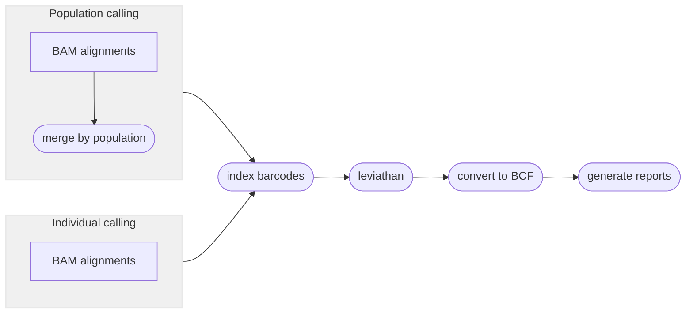

# :icon-sliders: Call Structural Variants using LEVIATHAN
(like indels, insertions, duplications, breakends)

===  :icon-checklist: You will need
- at least 4 cores/threads available
- sequence alignments, in `.bam` format
- genome assembly in FASTA format
- (optional) sample grouping file ([see below](#pooled-sample-variant-calling))

!!!warning EMA-mapped reads
Leviathan relies on split-read information in the sequence alignments to call variants. The EMA aligner
does not report split read alignments, instead it reports secondary alignments. It is recommended to use
BWA-generated alignments if intending to call variants with leviathan. 
!!!
==- :icon-file: sample grouping file
This file is optional and only useful if you want variant calling to happen on a per-population level.
- takes the format of sample\<*tab*\>group
    - spaces can be used as delimeters too
- the groups can be numbers or text (_i.e._ meaningful population names)
- you can comment out lines with `#` for Harpy to ignore them
- create with `harpy popgroup -d <samplefolder>` or manually
- if created with `harpy popgroup`, all the samples will be assigned to group `pop1`
    - make sure to edit the second column to reflect your data correctly.

``` example file for --populations
sample1 pop1
sample2 pop1
sample3 pop2
sample4 pop1
sample5 pop3
#sample 6   pop4
```

!!!warning known quirk
There's an unusual error on the Snakemake side of things that happens when the name of a sample and population are identical.
It has been unclear how to resolve this issue, so to protect yourself, it's best to make sure the population names are different
from the sample names. A simple fix would be to use underscores (`_`) to differentiate the population name.
!!!
===

After reads have been aligned, _e.g._ with `harpy align`, you can use those alignment files
(`.bam`) to call structural variants in your data using LEVIATHAN. To make sure your data
will work seemlessly with LEVIATHAN, the alignments in the [input BAM files](/commonoptions.md) should **end**
with a `BX:Z:AxxCxxBxxDxx` tag. Use `harpy preflight bam` if you want to double-check file
format validity.

```bash usage
harpy sv leviathan OPTIONS... INPUTS...
```

```bash example
harpy sv leviathan --threads 20 -g genome.fasta Align/bwa
```

## :icon-terminal: Running Options
In addition to the [common runtime options](/commonoptions.md), the `harpy sv leviathan` module is configured using these command-line arguments:

| argument         | short name | type          | default | required | description                                        |
|:-----------------|:----------:|:--------------|:-------:|:--------:|:---------------------------------------------------|
| `INPUTS`         |            | file/directory paths  |         | **yes**  | Files or directories containing [input BAM files](/commonoptions.md#input-arguments)     |
| `--genome`       |    `-g`    | file path     |         |    yes | Genome assembly that was used to create alignments    |
| `--populations`  |    `-p`    | file path     |         |    no             | Tab-delimited file of sample\<*tab*\>group         |
| `--extra-params` |    `-x`    | string        |         |    no             | Additional naibr arguments, in quotes              |

### Single-sample variant calling
When **not** using a population grouping file via `--populations`, variants will be called per-sample. 
Due to the nature of structural variant VCF files, there isn't an entirely fool-proof way 
of combining the variants of all the samples into a single VCF file, therefore the output will be a VCF for every sample.

### Pooled-sample variant calling
With the inclusion of a population grouping file via `--populations`, Harpy will merge the bam files of all samples within a 
population and call variants on these alignment pools. Preliminary work shows that this way identifies more variants and with fewer false 
positives. **However**, individual-level information gets lost using this approach, so you will only be able to assess 
group-level variants, if that's what your primary interest is.

!!! a little lifehack
If you have a small number of samples (~10 or fewer) that you are interested in comparing the results of structural variant calling for,
you can provide a sample grouping file via `--populations` where each sample is its own population and Harpy will output a report
comparing "populations" as usual. Keep in mind that if there are too many samples, the formatting of the reports might not render
it too well.
!!!

----

## :icon-git-pull-request: LEVIATHAN workflow
+++ :icon-git-merge: details
[Leviathan](https://github.com/morispi/LEVIATHAN) is an alternative variant caller that uses linked read barcode information 
to call structural variants (indels, inversions, etc.) exclusively, meaning it does not call SNPs. Harpy first uses [LRez](https://github.com/morispi/LRez) to index the barcodes 
in the alignments, then it calls variants using Leviathan.


+++ :icon-file-directory: leviathan output
The default output directory is `SV/leviathan` with the folder structure below. `sample1` and `sample2` are generic sample names for demonstration purposes.
The resulting folder also includes a `workflow` directory (not shown) with workflow-relevant runtime files and information.

```
SV/leviathan
├── sample1.bcf
├── sample2.bcf
├── logs
│   ├── sample1.leviathan.log
│   ├── sample1.candidates
│   ├── sample2.leviathan.log
│   └── sample2.candidates
├── reports
│   ├── sample1.SV.html
│   └── sample2.SV.html
└── stats
    ├── sample1.sv.stats
    └── sample2.sv.stats
```

| item                   | description                                              |
|:-----------------------|:---------------------------------------------------------|
| `*.bcf`                | structural variants identified by LEVIATHAN              |
| `logs/sample.groups`   | if provided, a copy of the file provided to `--populations` with commented lines removed  |
| `logs/*candidates`     | candidate structural variants LEVIATHAN identified       |
| `reports/`             | summary reports with interactive plots of detected SV    |
| `logs/harpy.variants.log` | relevant runtime parameters for the variants module  |
| `stats/`               | results of `bcftools stats` on the vcf LEVIATHAN creates |

+++ :icon-code-square: leviathan parameters
By default, Harpy runs `leviathan` with default parameters (shown below), only modifying inputs and outputs at the command line.

Below is a list of all `leviathan` command line options, excluding those Harpy already uses or those made redundant by Harpy's implementation of LEVIATHAN.
These are taken directly from the [LEVIATHAN documentation](https://github.com/morispi/LEVIATHAN).
``` LEVIATHAN arguments
  -r, --regionSize:         Size of the regions on the reference genome to consider (default: 1000)
  -v, --minVariantSize:     Minimum size of the SVs to detect (default: same as regionSize)
  -n, --maxLinks:           Remove from candidates list all candidates which have a region involved in that much candidates (default: 1000)
  -M, --mediumSize:         Minimum size of medium variants (default: 2000)
  -L, --largeSize:          Minimum size of large variants (default: 10000)
  -s, --smallRate:          Percentile to chose as a threshold in the distribution of the number of shared barcodes for small variants (default: 99)
  -m, --mediumRate:         Percentile to chose as a threshold in the distribution of the number of shared barcodes for medium variants (default: 99)
  -l, --largeRate:          Percentile to chose as a threshold in the distribution of the number of shared barcodes for large variants (default: 99)
  -d, --duplicates:         Consider SV as duplicates if they have the same type and if their breakpoints are within this distance (default: 10)
  -s, --skipTranslocations: Skip SVs that are translocations (default: false)
  -p, --poolSize:           Size of the thread pool (default: 100000)
  -B, --nbBins:             Number of iterations to perform through the barcode index (default: 10)
  -c, --minBarcodes:        Always remove candidates that share less than this number of barcodes (default: 1)
```
+++ :icon-graph: reports
These are the summary reports Harpy generates for this workflow. You may right-click
the image and open it in a new tab if you wish to see the example in better detail.

||| Variant stats
Summarizes the count and type of structural variants and visualizes their locations on
the chromosomes. Calling variants on population-pooled samples will instead report on populations.

|||

+++
