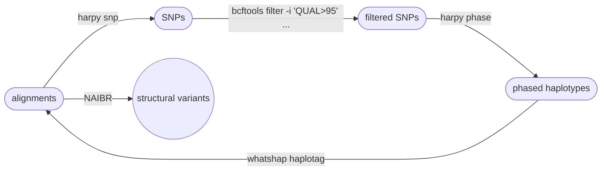
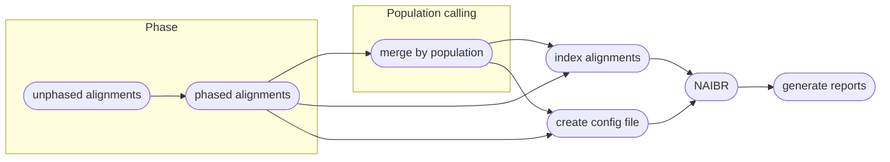

# :icon-sliders: Call Structural Variants using NAIBR
(like indels, insertions, duplications)

===  :icon-checklist: You will need
- at least 4 cores/threads available
- sequence alignments, in `.bam` format
- genome assembly in FASTA format
- (optional) phased VCF file
- (optional) sample grouping file ([see below](#pooled-sample-variant-calling))
==- :icon-file: sample grouping file
This file is optional and only useful if you want variant calling to happen on a per-population level.
- takes the format of sample\<*tab*\>group
    - spaces can be used as delimeters too
- the groups can be numbers or text (_i.e._ meaningful population names)
- you can comment out lines with `#` for Harpy to ignore them
- create with `harpy popgroup -d <samplefolder>` or manually
- if created with `harpy popgroup`, all the samples will be assigned to group `pop1`
    - make sure to edit the second column to reflect your data correctly.

``` example file for --populations
sample1 pop1
sample2 pop1
sample3 pop2
sample4 pop1
sample5 pop3
#sample6    pop4
```

!!!warning known quirk
There's an unusual error on the Snakemake side of things that happens when the name of a sample and population are identical.
It has been unclear how to resolve this issue, so to protect yourself, it's best to make sure the population names are different
from the sample names. A simple fix would be to use underscores (`_`) to differentiate the population name.
!!!
===

After reads have been aligned, _e.g._ with `harpy align`, you can use those alignment files
(`.bam`) to call structural variants in your data using NAIBR. While our testing shows that
NAIBR tends to find known inversions that LEVIATHAN misses, the program requires haplotype 
**phased** bam files as input. That means the alignments have a `PS` or `HP` tag that indicate
which haplotype the read/alignment belongs to. If you used the `EMA` aligner, then the alignments
should already have that information (yay!). If your alignments don't have phasing tags (e.g. aligned with BWA),
then you will need to do a little extra work for NAIBR to work best with your data. This process is described below.

```bash usage
harpy sv naibr OPTIONS... INPUTS...
```

```bash examples
# input bams already phased
harpy sv naibr --threads 20 --genome genome.fasta Align/bwa

# input bams require phasing
harpy sv naibr --threads 20 --genome genome.fasta --vcf Variants/data.vcf.gz Align/bwa
```

## :icon-terminal: Running Options
In addition to the [common runtime options](/commonoptions.md), the `harpy sv naibr` module is configured using these command-line arguments:

| argument         | short name | type          | default | required | description                                        |
|:-----------------|:----------:|:--------------|:-------:|:--------:|:---------------------------------------------------|
| `INPUTS`         |            | file/directory paths  |         | **yes**  | Files or directories containing [input BAM files](/commonoptions.md#input-arguments)     |
| `--genome`       |    `-g`    | file path     |         | **yes** | Genome assembly for phasing bam files     |
| `--vcf`          |    `-v`    | file path     |         | **conditionally** | Phased vcf file for phasing bam files     |
| `--molecule-distance` |  `-m` | integer       |  100000 |    no             | Base-pair distance threshold to separate molecules |
| `--populations`  |    `-p`    | file path     |         |    no             | Tab-delimited file of sample\<*tab*\>group         |
| `--extra-params` |    `-x`    | string        |         |    no             | Additional naibr arguments, in quotes              |

### Molecule distance
The `--molecule-distance` option is used to let the program determine how far apart alignments on a contig with the same
barcode can be from each other and still considered as originating from the same DNA molecule. See 
[haplotag data](/haplotagdata/#barcode-thresholds) for more information on what this value does.

### Single-sample variant calling
When **not** using a population grouping file via `--populations`, variants will be called per-sample. 
Due to the nature of structural variant VCF files, there isn't an entirely fool-proof way 
of combining the variants of all the samples into a single VCF file, therefore the output will be a VCF for every sample.

### Pooled-sample variant calling
With the inclusion of a population grouping file via `--populations`, Harpy will merge the bam files of all samples within a 
population and call variants on these alignment pools. Preliminary work shows that this way identifies more variants and with fewer false 
positives. **However**, individual-level information gets lost using this approach, so you will only be able to assess 
group-level variants, if that's what your primary interest is.

!!! a little lifehack
If you have a small number of samples (~10 or fewer) that you are interested in comparing the results of structural variant calling for,
you can provide a sample grouping file via `--populations` where each sample is its own population and Harpy will output a report
comparing "populations" as usual. Keep in mind that if there are too many samples, the formatting of the reports might not render
it too well.
!!!

### optional vcf file
In order to get the best variant calling performance out of NAIBR, it requires _phased_ bam files as input. 
The `--vcf` option is optional and not used by NAIBR. However, to use `harpy sv naibr` with
bam files that are not phased, you will need to include `--vcf`, which Harpy uses with 
`whatshap haplotag` to phase your input BAM files prior to variant calling. See the [whatshap documentation](https://whatshap.readthedocs.io/en/latest/guide.html#whatshap-haplotag)
for more details on that process.

#### a phased input --vcf
This file can be in vcf/vcf.gz/bcf format and most importantly **it must be phased haplotypes**. There are various
ways to haplotype SNPs, but you can use `harpy phase` to phase your SNPs into haplotypes using the haplotag barcode
information. The resulting phased VCF file can then be used as input here. For reasons unclear to us, we have found
NAIBR to have better detection of known structural variants when using BWA alignments that have been back-phased with
a phased VCF file than using alignments that were phased when mapped with EMA. That makes this process longer and more
circuitous (see the workflow diagram), but the results were noticeably better.



----

## :icon-git-pull-request: NAIBR workflow
+++ :icon-git-merge: details
[Naibr](https://github.com/raphael-group/NAIBR) is a variant caller that uses linked read barcode information 
to call structural variants (indels, inversions, etc.) exclusively, meaning it does not call SNPs. The original 
authors of Naibr have not been updating or improving it, so Harpy uses [an active fork](https://github.com/pontushojer/NAIBR)
of it that is available on [Bioconda](https://anaconda.org/bioconda/naibr-plus) under the name `naibr-plus`.
This fork includes improved accuracy as well as quality-of-life updates.


+++ :icon-file-directory: naibr output
The `harpy sv --method naibr` module creates a `Variants/naibr` (or `naibr-pop`) 
directory with the folder structure below. `sample1` and `sample2` are generic sample 
names for demonstration purposes.
The resulting folder also includes a `workflow` directory (not shown) with workflow-relevant runtime files and information.

```
Variants/naibr/
├── sample1.bedpe
├── sample2.bedpe
├── configs
│   ├── sample1.config
│   └── sample2.config
├── filtered
│   ├── sample1.fail.bedpe
│   └── sample2.fail.bedpe
├── IGV
│   ├── sample1.reformat.bedpe
│   └── sample2.reformat.bedpe
├── logs
│   ├── sample1.log
│   └── sample2.log
├── reports
│   ├── sample1.naibr.html
│   └── sample2.naibr.html
└── vcf
    ├── sample1.vcf
    └── sample2.vcf
```

| item          | description                                                      |
|:--------------|:-----------------------------------------------------------------|
| `*.bedpe`     | structural variants identified by NAIBR                          |
| `configs/`    | the configuration files harpy generated for each sample          |
| `filtered/`   | the variants that failed NAIBR's internal filters                |
| `IGV/`        | same as the output .bedpe` files but in IGV format               |
| `logs/sample.groups`   | if provided, a copy of the file provided to `--populations` with commented lines removed  |
| `logs/*.log`  | what NAIBR writes to `stderr` during operation                   |
| `reports/`    | summary reports with interactive plots of detected SV            |
| `vcf/`        | the resulting variants, but in `.VCF` format                     |

+++ :icon-code-square: naibr parameters
By default, Harpy runs `naibr` with these parameters (excluding inputs and outputs):
```python
min_mapq = 30
min_sv   = 100000
k        = 3
```

Below is a list of all `naibr` runtime options, excluding those Harpy already uses or those made redundant by Harpy's implementation of NAIBR.
These are taken directly from the [NAIBR documentation](https://github.com/pontushojer/NAIBR#running-naibr). If adding these arguments, do so in quotes:

```
harpy sv naibr -d somedir -x "min_sv 1000 k 5"
```

``` NAIBR arguments
 -blacklist: BED-file with regions to be excluded from analysis
 -candidates: BEDPE-file with novel adjacencies to be scored by NAIBR. This will override automatic detection of candidate novel adjacencies
 -min_sv: Minimum size of a structural variant to be detected (default: lmax, i.e. the 95th percentile of the paired-end read insert size distribution)
 -k: minimum number of barcode overlaps supporting a candidate NA (default = 3)
```

+++ :icon-graph: reports
These are the summary reports Harpy generates for this workflow. You may right-click
the image and open it in a new tab if you wish to see the example in better detail.

||| Variant stats
Summarizes the count and type of structural variants and visualizes their locations on
the chromosomes. Calling variants on population-pooled samples will instead report on populations.

|||

+++
