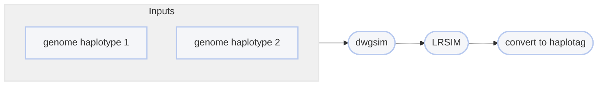

# :icon-flame: Simulate Linked Reads
Simulate linked reads from a genome

===  :icon-checklist: You will need
- two haplotypes of a reference genome in FASTA format: [!badge variant="success" text=".fasta"] [!badge variant="success" text=".fa"] [!badge variant="success" text=".fasta.gz"] [!badge variant="success" text=".fa.gz"]
    - can be created with [!badge corners="pill" text="simulate {snpindel,inversion,...}"](simulate-variants.md)
- [!badge variant="ghost" text="optional"] a file of 16-basepair barcodes to tag linked reads with
==- :icon-question: LRSIM differences
The original [LRSIM](https://github.com/aquaskyline/LRSIM) is a lengthy Perl script that, like Harpy, outsources
to various other programs (SURVIVOR, DWGSIM, samtools, msort) and acts as a workflow through these programs. The Harpy
version of LRSIM keeps only the novel LRSIM code that creates linked reads from reads simulated by DWGSIM. The
rest of LRSIM's components are reincorporated into the Snakemake workflow governing the [!badge corners="pill" text="simulate linkedreads"]module, while removing the SURVIVOR part since [!badge corners="pill" text="simulate {snpindel,...}"](simulate-variants.md) are used for that purpose.
#### Notable differences
- dependencies are expected to be on the `PATH`, not hardcoded to the folder LRSIM is running from
- `-r` parameter changed to folder prefix since Harpy uses `-g` for the haplotypes
- outputs are coded a little differently for flexibility (and use the `-r` parameter for some parts)
- SURVIVOR variant simulation functionality removed entirely
- DWGSIM, samtools, msort, and extractReads functionality moved into Harpy workflow
- uses newer version of DWGSIM
===

You may want to benchmark haplotag data on different kinds of genomic variants. To
do that, you'll need *known* variants (like those created by  [!badge corners="pill" text="simulate {snpindel,...}"](simulate-variants.md)) and
linked-read sequences. This module will create (diploid) linked-read sequences from two genome haplotypes.
To accomplish this, Harpy uses a modified version of [LRSIM](https://github.com/aquaskyline/LRSIM),
and converts the LRSIM 10X-style output into Haplotag-style reads. To simulate linked reads, use:

```bash usage
harpy simulate linkedreads OPTIONS... HAP1_GENOME HAP2_GENOME
```
```bash example
harpy simulate linkedreads -t 4 -n 2  -l 100 -p 50  data/genome.hap1.fasta data/genome.hap2.fasta
```

## :icon-terminal: Running Options
In addition to the [!badge variant="info" corners="pill" text="common runtime options"](/commonoptions.md), the  [!badge corners="pill" text="simulate linkedreads"] module is configured using these command-line arguments:

{.compact}
| argument       | short name | type        |    default    | required | description                                                                                     |
|:---------------|:----------:|:------------|:-------------:|:--------:|:------------------------------------------------------------------------------------------------|
| `HAP1_GENOME`       |            | file path |       | **yes**  | Haplotype 1 of the diploid genome to simulate reads   |
| `HAP2_GENOME`       |            | file path |       | **yes**  | Haplotype 1 of the diploid genome to simulate reads   |
| `--outer-distance`  |    `-d`    | integer   | 350   |   | Outer distance between paired-end reads (bp)                 |
| `--distance-sd`     |    `-i`    | integer   |  15   |   | Standard deviation of read-pair distance                     |
| `--barcodes`        |    `-b`    | file path |  [10X barcodes](https://github.com/aquaskyline/LRSIM/blob/master/4M-with-alts-february-2016.txt)   |        | File of linked-read barcodes to add to reads   |
| `--read-pairs`      |    `-n`    | number    |  600  |   | Number (in millions) of read pairs to simulate               |
| `--mutation-rate`   |    `-r`    | number    | 0.001 |   | Random mutation rate for simulating reads (0 - 1.0)          |
| `--molecule-length` |    `-l`    | integer   |  100  |   | Mean molecule length (kbp)                                   |
| `--patitions`       |    `-p`    | integer   |  1500 |   | Number (in thousands) of partitions/beads to generate        |
| `--molecules-per`   |    `-m`    | integer   |   10  |   | Average number of molecules per partition                    |

## Mutation Rate
The read simulation is two-part: first `dwgsim` generates forward and reverse FASTQ files from the provided genome haplotypes
(`HAP1_GENOME` and `HAP2_GENOME`), then `LRSIM` takes over and creates linked-reads from that. The `--mutation-rate`
option controls random mutation rate `dwgsim` uses when creating FASTQ files from your provided genome haplotypes. This parameter
adds SNPs/variation in addition to the error rate assumed for the Illumina platform. If you don't want any more SNPs added to the
reads beyond sequencing error, set this value to `--mutation-rate 0`.
#### Simulating a single sample
If you intend to simulate a "single individual" (i.e. use this module once), then you might want no additonal SNPs beyond the variants
you may have already introduced into the genome and set `--mutation-rate 0`.

#### Simulating multiple samples
If you intend on simulating "multiple individuals" (i.e. use this module multiple times on the same genome haplotypes),
it may make sense to set this value larger than 0 so there is some "natural" variation between your simulated individuals.

## Partitions
**TL;DR**: 10X partitions ≈ haplotag beads

The option `--partitions` refers to the reaction "bubbles" in the original 10X linked-read chemistry. The 10X
protocol involved emulsion reactions where microscopic bubbles resulting from emulsion were each their own
reaction micro-environment. Each of these "partitions" (_aka_ bubbles, etc.) was to contain a unique linked-read
barcode that would be ligated onto the sample DNA, thus creating the linked read barcoding. In an ideal situation,
there would be a single molecule per emulsion partition, which was rarely the case because it's really
difficult to achieve that. In haplotag terms, think of partitions as being synonymous with tagmentation beads. In
both 10X and haplotag simulation cases, you're controlling for how many clashing barcodes there might be where
reads that aren't from the same molecule have the same linked-read barcode. This is why linked-read software (and
corresponding Harpy modules) have an option to set the [barcode threshold](../../haplotagdata.md/#barcode-thresholds). 

## Barcodes
Barcodes, if provided, must be given as 16-basepair nucleotide sequences, one per line. If not provided,
Harpy will download the standard 10X Genomics `4M-with-alts-february-2016.txt` barcode set from the [LRSIM
repository](https://github.com/aquaskyline/LRSIM/blob/master/4M-with-alts-february-2016.txt) and use those. The barcode file should look like:
``` input.barcodes.txt
ATATGTACTCATACCA
GGATGTACTCATTCCA
TCACGTACTCATACCA
etc...
```
### 10X to Haplotag conversion
Harpy will convert the simulated 10X-style reads, where the 16-basepair barcode is at the beginning of read 1,
to haplotag format, where the barcode is coded in the sequence header under the `BX:Z` tag with the format
`AxxCxxBxxDxx`, where `xx` is a number between `00` and `96`. Using this format, a `00` would invalidate the
entire barcode due to a segment failing to be associated with a beadtag segment. In the simulated data, since
10X barcodes don't feature segments, failure to associate the first 16 bases of read 1 with barcodes provided
to `--barcodes` will appear as `BX:Z:A00C00B00D00`. The original 10X barcode (or first 16 bases of read 1)
will be removed from the sequence and stored in the `TX:Z` sequence header tag, e.g. `TX:Z:ATATGTACTCATACCA`.
The paired reverse read will also have these tags. The diagram below attempts to simplify this visually.


## Choosing parameters
LRSIM does internal calculations to determine the number of reads per molecule based on `--read-pairs`,
`--partitions`, and `--molecules-per`. Understanding how these parameters affect the resulting sequences
will help inform your decisions for those parameters:

$$
\text{Reads Per Molecule} = 0.499 + \frac{N \times 1,000,000}{\left(\frac{P \times 1,000}{H}\right) \times M \times H}
$$
$$\text{where:}\\\text{N = number of reads to simulate (in millions)}\\\text{H = number of haplotypes (fixed at 2)}\\\text{P = number of partitions (in thousands)}\\\text{M = molecules per partition}$$

### Parameter calculator
Conveniently, we provide a calculator to help you make informed decisions for these parameters:
[!embed](https://app.calconic.com/api/embed/calculator/662146310482ea001e7acea2)

## :icon-git-pull-request: Simulate Linkedreads Workflow


