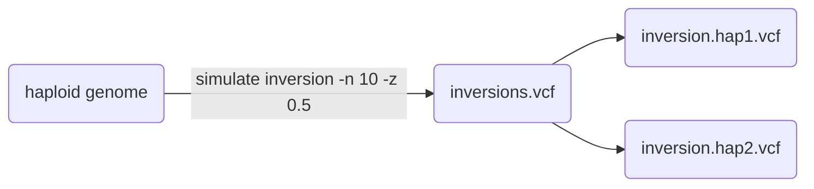
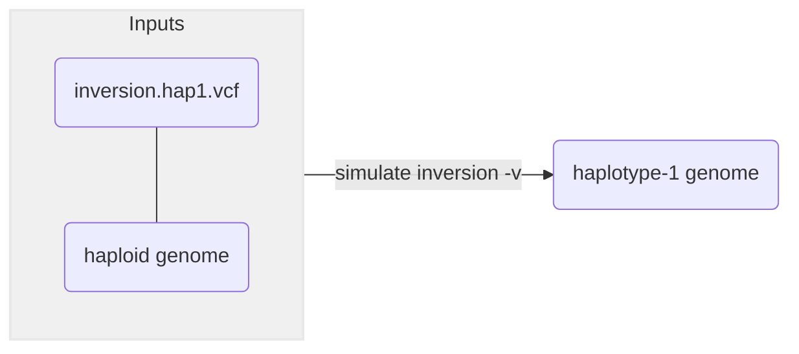
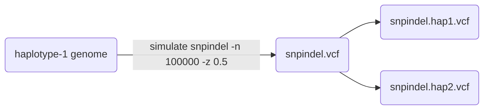
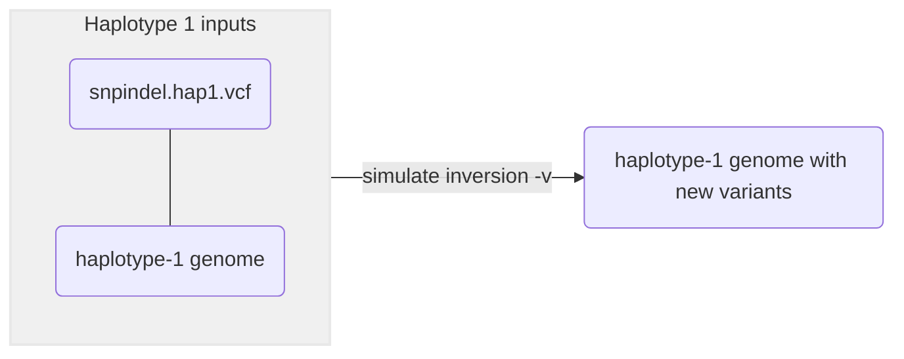
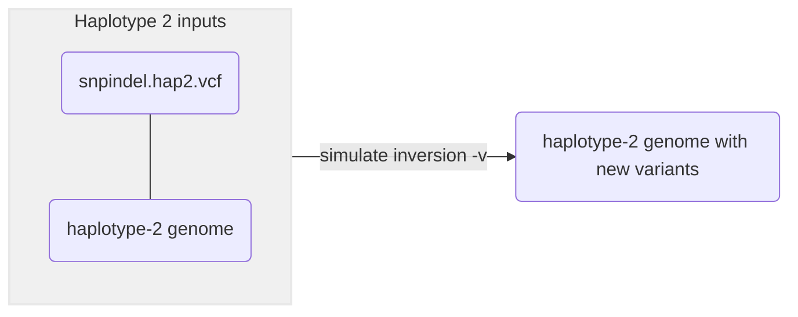

# :icon-flame: Simulate Genomic Variants
Simulate snps, indels, inversions, cnv, translocations

===  :icon-checklist: You will need
- a reference genome in fasta or gzipped fasta format
===

You may want to benchmark haplotag data on different kinds of genomic variants. To
do that, you'll need *known* variants, and typically simulations are how you achieve
that. This series of modules simulates genomic variants onto a genome, either randomly
or specific variants provided in VCF files. The simulator Harpy uses,
[simuG](https://github.com/yjx1217/simuG), can only simulate one type of
variant at a time and each variant type has their own set of parameters. This page
is divided by variant types to help you navigate the process. The general usage
for simulating variants is:

```bash usage
harpy simulate variant OPTIONS... INPUT_GENOME
```
```bash example
harpy simulate inversion -n 10 --min-size 1000 --max-size 50000  path/to/genome.fasta
```
## Modules
There are 4 submodules with very obvious names:

| submodule | what it does |
|:----------|:-------------|
|`snpindel` | simulates single nucleotide polymorphisms (snps) and insertion-deletions (indels) |
| `inversion` | simulates inversions |
| `cnv` | simulates copy number variants |
| `translocation` | simulates translocations |

## :icon-terminal: Running Options
While there are serveral differences between the submodule command line options, each has available all the
[common runtime options](/commonoptions.md) like other Harpy modules. Each requires and input genome at the
end of the command line, and each requires either a `--count` of variants to randomly simulate, or a `--vcf` of
specific variants to simulate. There are also these unifying options among the different variant types:

| argument | short name | type |  description |
| :-----|:-----|:-----|:-----|
| `INPUT_GENOME`           |    | file path  |  The haploid genome to simulate variants onto. **REQUIRED**   |
| `--prefix` | | string |  Naming prefix for output files (default: `sim.{module_name}`)|
| `--exclude-chr` | `-e` | file path | Text file of chromosomes to avoid, one per line |
| `--centromeres` | `-c` | file path | GFF3 file of centromeres to avoid |
| `--genes` | `-g` | file path |  GFF3 file of genes to avoid simulating over (see `snpindel` for caveat) |
| `--heterozygosity` | `-z` | float between [0,1] |  [% heterozygosity to simulate diploid later](#heterozygosity) (default: `0`) |
| `--randomseed` |  | integer |   Random seed for simulation |

==- snps and indels
### snpindel
!!!warning SNPs can be slow
Given software limitations, simulating many SNPs (>10,000) will be noticeably slower than the other variant types.
!!!

A single nucleotide polymorphism ("SNP") is a genomic variant at a single base position in the DNA ([source](https://www.genome.gov/genetics-glossary/Single-Nucleotide-Polymorphisms)).
An indel, is a type of mutation that involves the addition/deletion of one or more nucleotides into a segment of DNA ([insertions](https://www.genome.gov/genetics-glossary/Insertion), [deletions](https://www.genome.gov/genetics-glossary/Deletion)).
The snp and indel variants are combined in this module because `simuG` allows simulating them together. The
ratio parameters control different things for snp and indel variants and have special meanings when setting
the value to either `9999` or `0` :
- `--titv-ratio`
    - `9999`: transitions only
    - `0`: transversions only
- `--indel-ratio`
    - `9999`: insertions only
    - `0`: deletions only

| argument          | short name | type       | default |  description                                                 |
|:------------------|:----------:|:-----------|:-------:|:-------------------------------------------------------------|
| `--snp-vcf`| `-v` | file path | | VCF file of known snps to simulate |
| `--indel-vcf` | `-i` | file path | | VCF file of known indels to simulate |
| `--snp-count` | `-n` | integer | 0 | Number of random snps to simluate |
| `--indel-count` |  `-m` | integer | 0 | Number of random indels to simluate |
| `--titv-ratio` | `-r` | float  | 0.5 | Transition/Transversion ratio for snps |
| `--indel-ratio` | `-d` | float  |  1 | Insertion/Deletion ratio for indels |
| `--indel-size-alpha` | `-a` | float |  2.0 | Exponent Alpha for power-law-fitted indel size distribution|
| `--indel-size-constant` | `-l` | float | 0.5 | Exponent constant for power-law-fitted indel size distribution |
| `--snp-gene-constraints` | `-y` | string | | How to constrain randomly simulated SNPs {`noncoding`,`coding`,`2d`,`4d`} when using `--genes`|

==- inversions
### inversion
Inversions are when a section of a chromosome appears in the reverse orientation ([source](https://www.genome.gov/genetics-glossary/Inversion)).

| argument          | short name | type       | default |  description     |
|:------------------|:----------:|:-----------|:-------:|:----------------|
| `--vcf` | `-v` | file path |  |  VCF file of known inversions to simulate |
| `--count`| `-n` | integer | 0 |  Number of random inversions to simluate |
| `--min-size` | `-m` | integer | 1000 | Minimum inversion size (bp) |
| `--max-size` | `-x` | integer | 100000 | Maximum inversion size (bp) |

==- copy number variants
### cnv
A copy number variation (CNV) is when the number of copies of a particular gene varies
between individuals ([source](https://www.genome.gov/genetics-glossary/Copy-Number-Variation))
The ratio parameters control different things and have special meanings when setting
the value to either `9999` or `0` :
- `--dup-ratio`
    - `9999`: tandem duplications only
    - `0`: dispersed duplications only
- `--gain-ratio`
    - `9999`: gain only
    - `0`: loss only

| argument          | short name | type       | default |  description     |
|:------------------|:----------:|:-----------|:-------:|:----------------|
| `--vcf` | `-v` | file path | | VCF file of known copy number variants to simulate |
| `--count` | `-n` | integer | 0 | Number of random cnv to simluate |
| `--min-size` | `-m` | integer |  1000 | Minimum cnv size (bp) |
| `--max-size`|   `-x` | integer |100000 | Maximum cnv size (bp) |
| `--max-copy` |  `-y` | integer | 10 | Maximum number of copies |
| `--dup-ratio` | `-d` | float |  1 | Tandem/Dispersed duplication ratio |
| `--gain-ratio` |`-l` | float |  1 | Relative ratio of DNA gain over DNA loss |


==- translocations
### translocation
A translocation occurs when a chromosome breaks and the fragmented pieces re-attach to different chromosomes ([source](https://www.genome.gov/genetics-glossary/Translocation)). 

| argument          | short name | type       | default |  description     |
|:------------------|:----------:|:-----------|:-------:|:----------------|
| `--vcf` | `-v` | file path |  |  VCF file of known inversions to simulate |
| `--count`| `-n` | integer | 0 |  Number of random inversions to simluate |

===

## Simulate known variants
Rather than simulating random variants, you can use a VCF file as input to any of the submodules
to have `simuG` simulate the variants (of that type) from the VCF file. This becomes particularly
handy because the modules output a VCF file of the variants that were introduced, which you can
modify and reuse as you see fit (see [heterozygosity](#heterozygosity)). Using `--genes`, 
`--centromeres`, or `--exclude-chr` would still avoid creating variants in those regions as with
random simulation, except with SNPs, where you would have to specify the contraints for using 
`--genes` as per usual.

## Heterozygosity
Each submodule has a `--heterozygosity` parameter where you can specify the heterozygosity of
an intended diploid genome, should you use the resulting VCF(s) to simulate variants again.
 This **does not** create a diploid genome for you, rather, it
takes the output VCF from `simuG` and creates two new VCF files (`{prefix}.hap1.vcf`,
`{prefix}.hap2.vcf`) that have their variants shuffled between the two haplotypes to
achieve the desired heterozygosity. You can then use the two resulting VCF files to
[simulate known variants](#simulate-known-variants) onto a genome and create a diploid genome!
A simplified workflow is provided below to explain that in better context. 

==- How the paramater is actually used
To understand how heterozygosity is created from the `simuG` VCF output, consider a genome
with 5 variants added to it, here represented as a column labelled `h1` with `1` being the presence
of a variant (the ALT allele).
```
h1
1
1
1
1
1
```
If we were to simulate those same variants onto the genome again, it would create a homozygote
at every position (`h2` is the second haplotype):
```
h1 h2
1  1
1  1
1  1
1  1
1  1
```
However, if we omit some of the variants on `h2` to create 40% heterozygosity (2/5),
we would now have heterozygotes, except the ALT allele for the heterozygote would
only every be on the first haplotype `h1`:
```
h1 h2
1  1
1  1
1  1
1     <- heterozygote with ALT on h1
1     <- heterozygote with ALT on h1
```
It would probably be more biologically sound to then make sure that the ALT allele
in the heterozygote can appear in either haplotype:
```
h1 h2
1  1
1  1
1  1
   1  <- heterozygote with ALT on h2
1     <- heterozygote with ALT on h1
```
Within Harpy, a heterozygous variant has a 50% chance of being assigned to one of the haplotypes.
So that's the logic behind the `--heterozygosity` parameter and why it ouputs 3 VCF files:
1. the VCF `simuG` outputs of variants added to the genome
2. haplotype 1 of that VCF file with some of the variants
3. haplotype 2 of that VCF file with some of the variants

Knowing that, you can then have a workflow to start with a haploid assembly and create
a diploid assembly with simulated variants.
==-

## Simulate Diploid Assembly
Here is a simple but realistic workflow of creating a diploid assembly with simulated variants.
If you haven't already, please read the sections about [simulating known variants](#simulate-known-variants)
and [heterozygosity](#heterozygosity). The idea here is that due to the limitations of `simuG`, we can
only simulate one type of variant at a time and we will take advantage of the VCF files created by
the `--heterozygosity` parameter to simulate known variants from random ones! The basic idea is such:

#### Step 1
Simulate random variants onto your haploid assembly with `--heterozygosity` (`-z`) set above `0`.
We aren't interested in the resulting genome, but rather the positions of the variants `simuG` created.

#### Step 2
Use the resulting hap1 and hap2 VCF files to simulate those same variants, but shuffled
into homozygotes and heterozygotes, onto the original haploid genome, creating two haplotype
genomes. 

#### Step 3
Use the one of the new genome haplotypes for simulating other kinds of variants. 
Again, use `--heterozygosity` (`-z`) with a value greater than `0`. Like [**Step 1**](#step-1),
we're only interested in the haplotype VCF files (positions of variants) and not the resulting
genome.

#### Step 4
Use the resulting haplotype VCFs to simulate known variants onto the **haplotype genomes** from
[Step 2](#step-2).



#### Step 5
Repeat [**Step 3**](#step-3) and [**Step 4**](#step-4) to your heart's content.