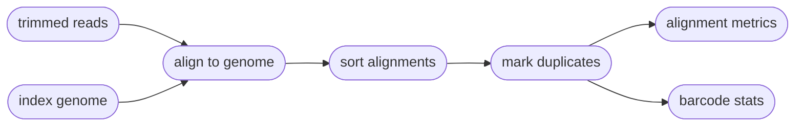
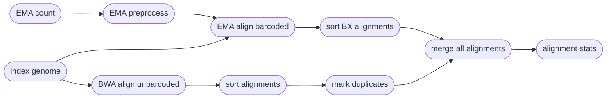

# :icon-quote: Map Reads onto a genome
===  :icon-checklist: You will need
- at least 4 cores/threads available
- a genome assembly in FASTA format
- paired-end fastq sequence file with the [proper naming convention](../haplotagdata/#naming-conventions) (gzipped recommended)
===

Once sequences have been trimmed and passed through other QC filters, they will need to
be aligned to a reference genome. This module within Harpy expects filtered reads as input,
such as those derived using `harpy trim`. You can map reads onto a genome assembly with Harpy 
using the `align` module:

```bash usage
harpy align OPTIONS...
```
```bash examples
# align with BWA
harpy align --genome genome.fasta --directory Sequences/ 

# align with EMA
harpy align --method ema --genome genome.fasta --directory Sequences/ 
```


## :icon-terminal: Running Options
In addition to the [common runtime options](../commonoptions.md), the `harpy align` module is configured using these command-line arguments:

| argument           | short name | type                  | default | required | description                                                                                     |
|:-------------------|:----------:|:----------------------|:-------:|:--------:|:------------------------------------------------------------------------------------------------|
| `--genome`         |    `-g`    | file path             |         | **yes**  | Genome assembly for read mapping                                                                |
| `--directory`            |    `-d`    | folder path           |         | **yes**  | Directory with sample sequences                                                                 |
| `--molecule-distance` |    `-l`    | integer         |  100000  |    no    | Base-pair distance threshold to separate molecules                   |
| `--ema-bins`       |    `-e`    | integer (1-1000)      |   500   |    no    | Number of barcode bins for EMA                                                                  |
| `--quality-filter` |    `-f`    | integer (0-40)        |   30    |    no    | Minimum `MQ` (SAM mapping quality) to pass filtering                                            |
| `--method`         |    `-m`    | choice [`bwa`, `ema`] |   bwa   |    no    | Which aligning software to use                                                                  |
| `--extra-params`   |    `-x`    | string                |         |    no    | Additional EMA-align/BWA arguments, in quotes                                                   |

### Molecule distance
The `--molecule-distance` option is used during the BWA alignment workflow
to assign alignments a unique Molecular Identifier `MI:i` tag based on their
 haplotag barcode and the distance threshold you specify. See 
[haplotag data](../haplotagdata/#barcode-thresholds) for more information on
what this value does. The EMA aligner will assign this value based on its own
internal heuristics, so that workflow will ignore this threshold.

## :icon-filter: Quality filtering
==- What is a $MQ$ score?
Every alignment in a BAM file has an associated mapping quality score ($MQ$) that informs you of the likelihood 
that the alignment is accurate. This score can range from 0-40, where higher numbers mean the alignment is more
likely correct. The math governing the $MQ$ score actually calculates the percent chance the alignment is ***incorrect***: 
$$
\%\ chance\ incorrect = 10^\frac{-MQ}{10} \times 100\\
\text{where }0\le MQ\le 40
$$
You can simply subtract it from 100 to determine the percent chance the alignment is ***correct***:
$$
\%\ chance\ correct = 100 - \%\ chance\ incorrect\\
\text{or} \\
\%\ chance\ correct = (1 - 10^\frac{-MQ}{10}) \times 100
$$
===
The `--quality` argument filters out alignments below a given $MQ$ threshold. The default, `30`, keeps alignments
that are at least 99.9% likely correctly mapped. Set this value to `1` if you only want alignments removed with
$MQ = 0$ (0% likely correct). You may also set it to `0` to keep all alignments for diagnostic purposes.
The plot below shows the relationship between $MQ$ score and the likelihood the alignment is correct and will serve to help you decide
on a value you may want to use. It is common to remove alignments with $MQ <30$ (<99.9% chance correct) or $MQ <40$ (<99.99% chance correct).

[!embed el="embed"](//plotly.com/~pdimens/7.embed)

----

## :icon-git-pull-request: BWA workflow
+++ :icon-git-merge: details
- default aligner
- ignores (but retains) barcode information
- fast

The [BWA MEM](https://github.com/lh3/bwa) workflow is substantially simpler and faster than the EMA workflow
 and maps all reads against the reference genome, no muss no fuss. Duplicates are marked at the end using 
 [sambamba](https://lomereiter.github.io/sambamba/). The `BX:Z` tags in the read headers are still added 
 to the alignment headers, even though barcodes are not used to inform mapping.


+++ :icon-file-directory: BWA output
The `harpy align` module creates an `Align/bwa` directory with the folder structure below. `Sample1` is a generic sample name for demonstration purposes.
```
Align/bwa
├── Sample1.bam
├── Sample1.bam.bai
├── align
│   ├── Sample1.bam
│   └── Sample1.bam.bai
├── logs
│   ├── harpy.align.log
│   └── markduplicates
│       └── Sample1.markdup.log
└── stats
    ├── bwa.stats.html
    ├── BXstats
    │   ├── Sample1.bxstats.html
    │   └── data
    │       └── Sample1.bxstats.gz
    └── coverage
        ├── Sample1.gencov.html
        └── data
            └── Sample1.gencov.gz


```

| item     | description                                                      |
|:---------|:-----------------------------------------------------------------|
| `*.bam`                             | sequence alignments for each sample                                              |
| `*.bai`                             | sequence alignment indexes for each sample                                       |
| `align/*bam*`                       | symlinks to the alignment files for snakemake purporses                          |
| `logs/harpy.align.log`              | relevant runtime parameters for the align module                                 |
| `logs/markduplicates`               | everything `sambamba markdup` writes to `stderr` during operation                |
| `stats/`                            | various counts/statistics/reports relating to sequence alignment                 |
| `stats/bwa.stats.html`              | report summarizing `samtools flagstat and stats` results across all samples from `multiqc` |
| `stats/reads.bxstats.html`          | interactive html report summarizing valid vs invalid barcodes across all samples | 
| `stats/BXstats/*.bxstats.html`      | interactive html report summarizing inferred molecule size                       | 
| `stats/coverage/*.html`             | summary plots of alignment coverage per contig                                   |
| `stats/coverage/data/*.gencov.gz`   | output from samtools bedcov from all alignments, used for plots                  |
| `stats/BXstats/`                    | reports summarizing molecule size and reads per molecule                         |
| `stats/BXstats/data/`               | tabular data containing the information used to generate the BXstats reports     |

+++ :icon-code-square: BWA parameters
By default, Harpy runs `bwa` with these parameters (excluding inputs and outputs):
```bash
bwa mem -C -R "@RG\tID:samplename\tSM:samplename"
```

Below is a list of all `bwa mem` command line arguments, excluding those Harpy already uses or those made redundant by Harpy's implementation of BWA.
These are taken directly from the [BWA documentation](https://bio-bwa.sourceforge.net/bwa.shtml).
```bwa arguments
-k INT 	Minimum seed length. Matches shorter than INT will be missed. The alignment speed is usually insensitive to this value unless it significantly deviates 20. [19]
-w INT 	Band width. Essentially, gaps longer than INT will not be found. Note that the maximum gap length is also affected by the scoring matrix and the hit length, not solely determined by this option. [100]
-d INT 	Off-diagonal X-dropoff (Z-dropoff). Stop extension when the difference between the best and the current extension score is above |i-j|*A+INT, where i and j are the current positions of the query and reference, respectively, and A is the matching score. Z-dropoff is similar to BLAST’s X-dropoff except that it doesn’t penalize gaps in one of the sequences in the alignment. Z-dropoff not only avoids unnecessary extension, but also reduces poor alignments inside a long good alignment. [100]
-r FLOAT 	Trigger re-seeding for a MEM longer than minSeedLen*FLOAT. This is a key heuristic parameter for tuning the performance. Larger value yields fewer seeds, which leads to faster alignment speed but lower accuracy. [1.5]
-c INT 	Discard a MEM if it has more than INT occurence in the genome. This is an insensitive parameter. [10000]
-P 	In the paired-end mode, perform SW to rescue missing hits only but do not try to find hits that fit a proper pair.
-A INT 	Matching score. [1]
-B INT 	Mismatch penalty. The sequence error rate is approximately: {.75 * exp[-log(4) * B/A]}. [4]
-O INT 	Gap open penalty. [6]
-E INT 	Gap extension penalty. A gap of length k costs O + k*E (i.e. -O is for opening a zero-length gap). [1]
-L INT 	Clipping penalty. When performing SW extension, BWA-MEM keeps track of the best score reaching the end of query. If this score is larger than the best SW score minus the clipping penalty, clipping will not be applied. Note that in this case, the SAM AS tag reports the best SW score; clipping penalty is not deducted. [5]
-U INT 	Penalty for an unpaired read pair. BWA-MEM scores an unpaired read pair as scoreRead1+scoreRead2-INT and scores a paired as scoreRead1+scoreRead2-insertPenalty. It compares these two scores to determine whether we should force pairing. [9]
-T INT 	Don’t output alignment with score lower than INT. This option only affects output. [30]
-a 	Output all found alignments for single-end or unpaired paired-end reads. These alignments will be flagged as secondary alignments.
-H 	Use hard clipping ’H’ in the SAM output. This option may dramatically reduce the redundancy of output when mapping long contig or BAC sequences.
```
+++ :icon-graph: reports
These are the summary reports Harpy generates for this workflow. You may right-click
the images and open them in a new tab if you wish to see the examples in better detail.
||| Depth and coverage
Reports the depth of alignments in 10kb windows.

||| BX validation
Reports the number of valid/invalid barcodes in the alignments.

||| Molecule size
Reports the inferred molecule sized based on barcodes in the alignments.

||| Alignment stats
Reports the general statistics computed by samtools `stats` and `flagstat`

|||

+++

## :icon-git-pull-request: EMA workflow
+++ :icon-git-merge: details
- leverages the BX barcode information to improve mapping
- sometimes better downstream SV detection
- slower
- marks split alignments as secondary alignments [⚠️](variants/sv.md#leviathan-workflow)
- lots of temporary files

Since [EMA](https://github.com/arshajii/ema) does extra things to account for barcode
information, the EMA workflow is a bit more complicated under the hood. Reads with 
barcodes are aligned using EMA and reads without valid barcodes are separately mapped
using BWA before merging all the alignments together again. EMA will mark duplicates
within alignments, but the BWA alignments need duplicates marked manually using 
[sambamba](https://lomereiter.github.io/sambamba/). Thankfully, you shouldn't need 
to worry about any of these details.

==- Why EMA?
The original haplotag manuscript uses BWA to map reads. The authors have since recommended
the use of EMA (EMerald Aligner) for most applications. EMA is barcode-aware,
meaning it considers sequences with identical barcodes to have originated from the same 
molecule, and therefore has higher mapping accuracy than using BWA. Here's a comparison
from the [EMA manuscript](https://www.biorxiv.org/content/10.1101/220236v1):

==-


+++ :icon-file-directory: EMA output
The `harpy align` module creates an `Align/ema` directory with the folder structure below. `Sample1` is a generic sample name for demonstration purposes.
```
Align/ema
├── Sample1.bam
├── Sample1.bam.bai
├── align
│   ├── Sample1.bam
│   └── Sample1.bam.bai
├── count
│   └── Sample1.ema-ncnt
├── logs
│   ├── harpy.align.log
│   ├── markduplicates
│   │   └── Sample1.markdup.nobarcode.log
│   └── preproc
│       └── Sample1.preproc.log
└── stats
    ├── ema.stats.html
    ├── reads.bxcounts.html
    ├── BXstats
    │   ├── Sample1.bxstats.html
    │   └── data
    │       └── Sample1.bxstats.gz
    └── coverage
        ├── Sample1.gencov.html
        └── data
            ├── Sample1.all.gencov.gz
            └── Sample1.bx.gencov.gz

```
| item                                           | description                                                                                                   |
|:-----------------------------------------------|:--------------------------------------------------------------------------------------------------------------|
| `*.bam`                                        | sequence alignments for each sample                                                                           |
| `*.bai`                                        | sequence alignment indexes for each sample                                                                    |
| `align/*bam*`                                  | symlinks to the alignment files for snakemake purporses                                                       |
| `count/`                                       | output of `ema count`                                                                                         |
| `logs/harpy.align.log`                         | relevant runtime parameters for the align module                                                              |
| `logs/markduplicates/`                         | everything `sambamba markdup` writes to `stderr` during operation on alignments with invalid/missing barcodes |
| `logs/preproc/*.preproc.log`                   | everything `ema preproc` writes to `stderr` during operation                                                  |
| `stats/`                                       | various counts/statistics/reports relating to sequence alignment                                              |
| `stats/ema.stats.html`                         | report summarizing `samtools flagstat and stats` results across all samples from `multiqc`                              |
| `stats/reads.bxstats.html`                     | interactive html report summarizing `ema count` across all samples                                            |
| `stats/coverage/*.html`                        | summary plots of alignment coverage per contig                                                                |
| `stats/coverage/data/*.all.gencov.gz`          | output from samtools bedcov from all alignments, used for plots                                               |
| `stats/coverage/data/*.bx.gencov.gz`           | output from samtools bedcov from alignments with valid BX barcodes, used for plots                            |
| `stats/BXstats/`                               | reports summarizing molecule size and reads per molecule                                                      |
| `stats/BXstats/*.bxstats.html`                 | interactive html report summarizing inferred molecule size                       | 
| `stats/BXstats/data/`                          | tabular data containing the information used to generate the BXstats reports                                  |

+++ :icon-code-square: EMA parameters
By default, Harpy runs `ema` with these parameters (excluding inputs and outputs):
```bash
ema-h align -d -p haplotag -R "@RG\tID:samplename\tSM:samplename"
```

Below is a list of all `ema align` command line arguments, excluding those Harpy already uses or those made redundant by Harpy's implementation of EMA.
These are taken directly from the [EMA documentation](https://github.com/arshajii/ema).

``` ema arguments
-d: apply fragment read density optimization [off]
-i <index>: index to follow 'BX' tag in SAM output [1]
```
+++ :icon-graph: reports
These are the summary reports Harpy generates for this workflow. You may right-click
the images and open them in a new tab if you wish to see the examples in better detail.

||| Depth and coverage
Reports the depth of alignments in 10kb windows.

||| BX validation
Reports the number of valid/invalid barcodes in the alignments.

||| Molecule size
Reports the inferred molecule sized based on barcodes in the alignments.

||| Alignment stats
Reports the general statistics computed by samtools `stats` and `flagstat`

|||

+++


