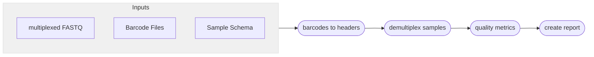

# :icon-versions: Demultiplex Raw Sequences

===  :icon-checklist: You will need
- at least 2 cores/threads available
- paired-end reads from an Illumina sequencer [!badge variant="secondary" text="gzipped recommended"]
===

When pooling samples and sequencing them in parallel on an Illumina sequencer, you will be given large multiplexed FASTQ
files in return. These files contain sequences for all of your samples and need to be demultiplexed using barcodes to 
separate the sequences for each sample into their own files (a forward and reverse file for each sample). These barcodes
should have been added during the sample DNA preparation in a laboratory. The demultiplexing strategy will vary based on the
haplotag technology you are using (read [Haplotag Types](#haplotag-types)).

```bash usage
harpy demultiplex OPTIONS... INPUT
```
```bash example
harpy demultiplex --threads 20 --samplesheet demux.schema Plate_1_S001_R1.fastq.gz
```
## :icon-terminal: Running Options
In addition to the [!badge variant="info" corners="pill" text="common runtime options"](/commonoptions.md), the [!badge corners="pill" text="demultiplex"] module is configured using these command-line arguments:

| argument          | short name | type       | default | required | description                                                                          |
|:------------------|:----------:|:-----------|:-------:|:--------:|:-------------------------------------------------------------------------------------|
| `INPUT`           |            | file path  |         | **yes**  | The forward (or reverse) multiplexed FASTQ file                                      |
| `--samplesheet`   |    `-b`    | file path  |         | **yes**  | Tab-delimited file of sample\<tab\>barcode                                           |
| `--method`        |    `-m`    | choice     | `gen1`  | **yes**  | Haplotag technology of the sequences                                                 |

## Haplotag Types
==- Generation 1 - `gen1`
- Barcode configuration: `13 + 13`
- sequencing mask: `151+13+13+151`
- Sample identifier: `Cxx` barcode
- Facility should **not** demultiplex

These are the original 13 + 13 barcodes described in Meier et al. 2021. You should request that the sequencing facility you used
do **not** demultiplex the sequences. Requires the use of [bcl2fastq](https://support.illumina.com/sequencing/sequencing_software/bcl2fastq-conversion-software.html) without `sample-sheet` and with the settings
`--use-bases-mask=Y151,I13,I13,Y151` and `--create-fastq-for-index-reads`. With Generation I beadtags, the `C` barcode is sample-specific,
meaning a single sample should have the same `C` barcode for all of its sequences.

### sample sheet
Since Generation I haplotags use a unique `Cxx` barcode per sample, that's the barcode
that will be used to identify sequences by sample. You will need to provide a simple text
file to `--samplesheet` (`-b`) with two columns, the first being the sample name, the second being
the `Cxx` barcode (e.g., `C19`). This file is to be `tab` or `space` delimited and must have **no column names**.
``` example sample sheet
Sample01    C01
Sample02    C02
Sample03    C03
Sample04    C04
```
This will result in splitting the multiplexed reads into individual file pairs `Sample01.F.fq.gz`, `Sample01.R.fq.gz`, `Sample02.F.fq.gz`, etc.

===


---
## :icon-git-pull-request: Gen I Demultiplex Workflow
+++ :icon-git-merge: details
Barcode correction and migration into the read headers is performed using [demult_fastq](https://github.com/evolgenomics/haplotagging/blob/master/demult_fastq.cpp)
(Harpy renames it to `demuxGen1`), which is distributed by the team behind haplotagging. Demultiplexing the pooled FASTQ files into
individual samples is performed in parallel and using the beloved workhorse `grep`.



+++ :icon-file-directory: demultiplexing output
The default output directory is `Demultiplex/PREFIX` with the folder structure below, where `PREFIX` is the prefix of your input file that Harpy
infers by removing the file extension and forward/reverse distinction. `Sample1` and `Sample2` are generic sample names for demonstration purposes.
The resulting folder also includes a `workflow` directory (not shown) with workflow-relevant runtime files and information.
```
Demultiplex/PREFIX
├── Sample1.F.fq.gz
├── Sample1.R.fq.gz
├── Sample2.F.fq.gz
├── Sample2.R.fq.gz
└── reports
    └── demultiplex.QC.html
```

| item | description |
|:---|:---|
| `*.F.fq.gz` | Forward-reads from multiplexed input `--file` belonging to samples from the `samplesheet` |
| `*.R.fq.gz` | Reverse-reads from multiplexed input `--file` belonging to samples from the `samplesheet` |
| `reports/demultiplex.QC.html` | phased vcf annotated with phased blocks |

+++ :icon-graph: reports
||| FASTQC metrics
This is the summary report Harpy generates for this workflow. You may right-click
the image and open it in a new tab if you wish to see the example in better detail.

|||
+++

