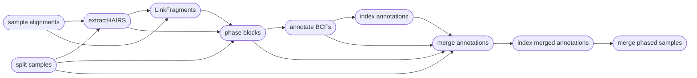

# :icon-versions: Demultiplex Raw Sequences

===  :icon-checklist: You will need
- at least 2 cores/threads available
- gzipped forward/reverse reads from an Illumina sequencer
===

When pooling samples and sequencing them in parallel on an Illumina sequencer, you will be given large multiplexed FASTQ
files in return. These files contain sequences for all of your samples and need to be demultiplexed using barcodes to 
separate the sequences for each sample into their own files (a forward and reverse file for each sample). These barcodes
should have been added during the sample DNA preparation in a laboratory. The demultiplexing strategy will vary based on the
haplotag technology you are using (read [Haplotag Types](#haplotag-types)).

```bash usage
harpy demultiplex OPTIONS... 
```
```bash example
harpy demultiplex --threads 20 --directory raw_seqs/
```

# TODO
## :icon-terminal: Running Options
| argument              | short name | type            | default | required | description                                                                                     |
|:----------------------|:----------:|:----------------|:-------:|:--------:|:------------------------------------------------------------------------------------------------|
| `--directory`         |    `-d`    | folder path     |         | **yes**  | Directory with raw sequence                                                               |
| `--method`            |    `-m`    | choice          | `gen1`  |    yes   | Haplotagging technology type                                               |
| `--threads`           |    `-t`    | integer         |    4    |    no    | Number of threads to use                                                                        |
| `--snakemake`         |    `-s`    | string          |         |    no    | Additional [Snakemake](../snakemake/#adding-snakamake-parameters) options, in quotes |
| `--quiet`             |    `-q`    | toggle          |         |    no    | Supressing Snakemake printing to console                                                        |
| `--help`              |            |                 |         |          | Show the module docstring                                                                       |

## Haplotag Types
==- Generation 1 - `gen1`
- Barcode configuration: `13 + 13`
- sequencing mask: `151+13+13+151`
- Sample identifier: `Cxx` barcode
- Facility should **not** demultiplex

These are the original 13 + 13 barcodes described in Meier et al. 2021. You should request that the sequencing facility you used
do **not** demultiplex the sequences. Requires the use of `bcl2fastq` without `sample-sheet` and with the settings
`--use-bases-mask=Y151,I13,I13,Y151` and `--create-fastq-for-index-reads`. With Generation I beadtags, the `C` barcode is sample-specific,
meaning a single sample should have the same `C` barcode for all of its sequences.
===

---
## :icon-git-pull-request: Phasing Workflow
+++ :icon-git-merge: details
Phasing is performed using [HapCut2](https://github.com/vibansal/HapCUT2). Most of the tasks cannot
be parallelized, but HapCut2 operates on a per-sample basis, so the workflow is parallelized
across all of your samples to speed things along.



+++ :icon-file-directory: phasing output
The `harpy phase` module creates an `Phasing` directory with the folder structure below. `Sample1` is a generic sample name for demonstration purposes. Harpy will also write a record of the relevant
runtime parameters in `logs/phase.params`.

```
Phase/
├── variants.phased.bcf
├── variants.phased.bcf.csi
├── annotations
│   ├── Sample1.annot.gz
│   └── Sample1.annot.gz.tbi
├── annotations_merge
│   ├── Sample1.phased.annot.bcf
│   └── Sample1.phased.annot.bcf.csi
├── extractHairs
│   ├── Sample1.unlinked.frags
│   └── logs
│       └── Sample1.unlinked.log
├── input
│   ├── header.names
│   ├── Sample1.bcf
│   └── Sample1.het.bcf
├── linkFragments
│   ├── Sample1.linked.frags
│   └── logs
│       └── Sample1.linked.log
└── phaseBlocks
    ├── Sample1.blocks
    ├── Sample1.blocks.phased.VCF
    └── logs
        └── Sample1.blocks.phased.log

```

| item | description |
|:---|:---|
| `variants.phased.bcf*` | final vcf output of HapCut2 with all samples merged into a single file (with .csi index) |
| `annotations/` | phased vcf annotated with phased blocks |
| `annotations_merge/` | merged vcf of annotated and original vcf |
| `extractHairs/` | output from `extractHairs` |
| `extractHairs/logs/` | everything HapCut2's `extractHairs` prints to `stderr` |
| `input/head.names` | extra file harpy creates to support new INFO fields in the phased VCF |
| `input/*.bcf` | vcf of a single sample from the original multi-sample input vcf |
| `input/*.het.bcf` | vcf of heterozygous loci of a single sample from the original multi-sample input vcf |
| `linkFragments/` | results from HapCut2's `linkFragments` |
| `linkFragments/logs` | everything `linkFragments` prints to `stderr` |
| `phaseBlocks/*.blocks*` | output from HapCut2 |
| `phaseBlocks/logs` | everything HapCut2 prints to `stderr` |

+++ :icon-code-square: HapCut2 parameters
By default, Harpy runs `HAPCUT2` with these parameters (excluding inputs and outputs):
```bash
HAPCUT2 --nf 1 --error_analysis_mode 1 --call_homozygous 1 --outvcf 1
```
Below is a list of all `HAPCUT2` command line options, excluding those Harpy already uses or those made redundant by Harpy's implementation of HapCut2.
These are taken directly from running `HAPCUT2 --help`.

``` hapcut2 arguments
Haplotype Post-Processing Options:
--skip_prune, --sp <0/1>:           skip default likelihood pruning step (prune SNPs after the fact using column 11 of the output). default: 0
--discrete_pruning, --dp <0/1>:     use discrete heuristic to prune SNPs. default: 0
--error_analysis_mode, --ea <0/1>:  compute switch confidence scores and print to haplotype file but don't split blocks or prune. default: 0

Advanced Options:
--max_iter, --mi <int> :            maximum number of global iterations. Preferable to tweak --converge option instead. default: 10000
--maxcut_iter, --mc <int> :         maximum number of max-likelihood-cut iterations. Preferable to tweak --converge option instead. default: 10000
```
+++
