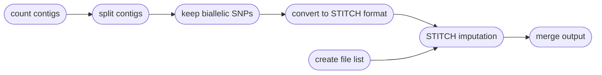

# Impute Genotypes using Sequences

|||  :icon-checklist: You will need
- a tab-delimited parameter file 
- a variant call format file (`.vcf`, `.vcf.gz`, `.bcf`)
- sequence alignments, in `.bam` format
|||

You can impute genotypes with Harpy by calling the `impute` module:
```bash
harpy impute OPTIONS...
```

## Running Options
| argument       | short name | type        |    default    | required | description                                                            |
|:---------------|:----------:|:------------|:-------------:|:--------:|:-----------------------------------------------------------------------|
| `--vcf`        |    `-v`    | file path   |               | **yes**  | Path to VCF/BCF file                                                   |
| `--directory`  |    `-d`    | folder path |               | **yes**  | Directory with sequence alignments                                     |
| `--parameters` |    `-p`    | file path   | stitch.params | **yes**  | STITCH parameter file (tab-delimited)                                  |
| `--threads`    |    `-t`    | integer     |       4       |    no    | Number of threads to use                                               |
| `--snakemake`  |    `-s`    | string      |               |    no    | Additional Snakemake options, in quotes ([more info](../snakemake.md)) |
| `--help`       |            |             |               |          | Show the module docstring                                              |

## Parameter file
Typically, one runs STITCH multiple times, exploring how results vary with
different model parameters. The solution Harpy uses for this is to have the user
provide a tab-delimited dataframe file where the columns are the 5 STITCH model 
parameters and the rows are the values for those parameters. The parameter file 
is required and can be created manually or with `harpy extra -s <filename>`.
If created using harpy, the resulting file includes largely meaningless values 
that you will need to adjust for your study. The parameter must follow a particular format:
- tab or comma delimited
- column order doesn't matter, but all 5 column names must be present
- header row present with the specific column names below
    - all column names begin with a lowercase character

| column name |  value type  |             accepted values             | description                                                           |
|:------------|:------------:|:---------------------------------------:|:----------------------------------------------------------------------|
| model       |     text     | pseudoHaploid, diploid, diploid-inbred  | The STITCH model/method to use                                        |
| useBX       | text/boolean | true, false, yes, no (case insensitive) | Whether to incorporate beadtag information                            |
| k           |   integer    |                   ≥ 1                   | Number of founder haplotypes                                          |
| s           |   integer    |                   ≥ 1                   | Number of instances of the founder haplotypes to average results over |
| nGen        |   integer    |                   ≥ 1                   | Estimated number of generations since founding                        |

### example
+++ tab-delimited
This file is tab-delimited, note the column names:
``` paramaters.txt
model   useBX   k       s       nGen
pseudoHaploid   TRUE    10      5       50
pseudoHaploid   TRUE    10      1       50
pseudoHaploid   TRUE    15      10      100
```
+++table-view
This is the table view of the tab-delimited file, shown here for clarity.

| model         | useBX | k  | s  | nGen |
|:--------------|:------|:---|:---|:-----|
| pseudoHaploid | TRUE  | 10 | 5  | 50   |
| pseudoHaploid | TRUE  | 10 | 1  | 50   |
| pseudoHaploid | TRUE  | 15 | 10 | 100  |
+++

### model
||| Which method to use
STITCH uses one of three "methods" reflecting different statistical and biological models: 
- `diploid`: the best general method with the best statistical properties
    - run time is proportional to the square of `k` and so may be slow for large, diverse populations
- `pseudoHaploid`: uses statistical approximations that makes it less accurate than `diploid` 
    - run time is proportional to `k` and may be suitable for large, diverse populations
- `diploid-inbred`: assumes all samples are completely inbred and as such uses an underlying haplotype based imputation model
    - run time is proportional to `k`

Each model assumes the samples are diploid and all methods output diploid genotypes and probabilities.
|||
### useBX
||| Use BX barcodes
The `useBX` parameter is given as a true/false. Simulations suggest including linked-read information isn't helpful
in species with short haploblocks (it might makes things worse). So, it's worth trying both options if you aren't
sure about the length of haplotype blocks in your species.
|||

### k
||| Number ancestral haplotypes
The `k` parameter is the number of ancestral haplotypes in the model. Larger K allows for more accurate imputation for 
large samples and coverages, but takes longer and accuracy may suffer with lower coverage. There's value in in trying a
few values of `k` and assess performance using either external validation, or the distribution of quality scores 
(_e.g._ mean / median INFO score). The best `k` gives you the best performance (accuracy, correlation or quality score distribution)
within computational constraints, while also ensuring `k` is not too large given your sequencing coverage (_e.g._ try to ensure 
that each ancestral haplotype gets at least a certain average \_X of coverage, like 10X, given your number of samples and average depth).
|||

### s
||| Number of ancestral haplotypes to average over
The `s` parameter controls the number of sets of ancestral haplotypes used and which final results are averaged over. 
This may be useful for wild or large populations, like humans. The `s` value should affect RAM and run time in a near-linearly.
|||

### nGen
||| Recombination rate between samples
The `nGen` parameter controls recombination rate between the sequenced samples and the ancestral haplotypes. 
It's probably fine to set it to $ \frac {4 \times Ne} {k} $ given some estimate of effective population size ${Ne}$ .
If you think your population can be reasonably approximated as having been founded some number of generations 
ago or reduced to $2 \times k$ that many generations ago, use that generation time estimate. STITCH should be fairly 
robust to misspecifications of this parameter.
|||

----
## STITCH Workflow
[STITCH](https://github.com/rwdavies/STITCH) is a genotype imputation software developed for use in
the R programming language. It has quite a few model parameters that can be tweaked, but HARPY only
focuses on a small handful that have the largest impact on the quality of the results. Imputation is
performed on a per-contig (or chromosome) level, so Harpy automatically iterates over the contigs
present in the input variant call file. Using the magic of Snakemake, Harpy will automatically
iterate over these model parameters.

