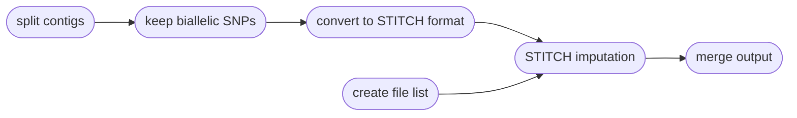

# :icon-workflow: Impute Genotypes using Sequences

===  :icon-checklist: You will need
- a tab-delimited parameter file 
- a variant call format file (`.vcf`, `.vcf.gz`, `.bcf`)
- sequence alignments, in `.bam` format
==- :icon-codescan: Curation of input VCF file
STITCH needs the input VCF to meet specific criteria:
1. Biallelic SNPs only
2. VCF is sorted by position
3. No duplicate positions
4. No duplicate sample names

Harpy will automatically extract biallelic SNPs and sort the input VCF file (1 and 2), but it will not
do any further assessments for your input VCF file regarding duplicate sample names or positions. Please
curate your input VCF to meet criteria 3 and 4 prior to running the `impute` module.  
===

After variants have been called, you may want to impute missing genotypes to get the
most from your data. Harpy uses `STITCH` to impute genotypes, a haplotype-based
method that is linked-read aware. Imputing genotypes requires a variant call file 
**containing SNPs**, such as that produced by `harpy variants`. You can impute genotypes with Harpy using the `impute` module:
```bash usage
harpy impute OPTIONS...
```

```bash example
# create stitch parameter file 'stitch.params'
harpy extra -s stitch.params 

# run imputation
harpy impute --threads 20 --vcf Variants/mpileup/variants.raw.bcf --directory Align/ema --parameters stitch.params
```

## :icon-terminal: Running Options
In addition to the [common runtime options](../commonoptions.md), the `harpy impute` module is configured using these command-line arguments:

| argument       | short name | type        |    default    | required | description                                                                                     |
|:---------------|:----------:|:------------|:-------------:|:--------:|:------------------------------------------------------------------------------------------------|
| `--vcf`        |    `-v`    | file path   |               | **yes**  | Path to VCF/BCF file                                                                            |
| `--directory      `  |    `-d`    | folder path |               | **yes**  | Directory with sequence alignments                                                              |
| `--parameters` |    `-p`    | file path   | stitch.params | **yes**  | STITCH parameter file (tab-delimited)                                                           |

## :icon-file: Parameter file
Typically, one runs STITCH multiple times, exploring how results vary with
different model parameters (explained in next section). The solution Harpy uses for this is to have the user
provide a tab-delimited dataframe file where the columns are the 5 STITCH model 
parameters and the rows are the values for those parameters. The parameter file 
is required and can be created manually or with `harpy extra -s <filename>`.
If created using harpy, the resulting file includes largely meaningless values 
that you will need to adjust for your study. The parameter must follow a particular format:
- tab or comma delimited
- column order doesn't matter, but all 5 column names must be present
- header row present with the specific column names below
    - all column names begin with a lowercase character

+++example file
This file is tab-delimited, note the column names:
``` paramaters.txt
model   useBX   k       s       nGen
pseudoHaploid   TRUE    10      5       50
pseudoHaploid   TRUE    10      1       50
pseudoHaploid   TRUE    15      10      100
```
+++parameter file columns
See the section below for detailed information on each parameter. This
table serves as an overview of the parameters.

| column name |  value type  |             accepted values             | description                                                           |
|:------------|:------------:|:---------------------------------------:|:----------------------------------------------------------------------|
| model       |     text     | pseudoHaploid, diploid, diploid-inbred  | The STITCH model/method to use                                        |
| useBX       | text/boolean | true, false, yes, no (case insensitive) | Whether to incorporate beadtag information                            |
| k           |   integer    |                   ≥ 1                   | Number of founder haplotypes                                          |
| s           |   integer    |                   ≥ 1                   | Number of instances of the founder haplotypes to average results over |
| nGen        |   integer    |                   ≥ 1                   | Estimated number of generations since founding                        |

+++example file  (as a table)
This is the table view of the tab-delimited file, shown here for clarity.

| model         | useBX | k  | s  | nGen |
|:--------------|:------|:---|:---|:-----|
| pseudoHaploid | TRUE  | 10 | 5  | 50   |
| pseudoHaploid | TRUE  | 10 | 1  | 50   |
| pseudoHaploid | TRUE  | 15 | 10 | 100  |
+++

## STITCH Parameters
+++model
##### Which method to use
STITCH uses one of three "methods" reflecting different statistical and biological models: 
- `diploid`: the best general method with the best statistical properties
    - run time is proportional to the square of `k` and so may be slow for large, diverse populations
- `pseudoHaploid`: uses statistical approximations that makes it less accurate than `diploid` 
    - run time is proportional to `k` and may be suitable for large, diverse populations
- `diploid-inbred`: assumes all samples are completely inbred and as such uses an underlying haplotype based imputation model
    - run time is proportional to `k`

Each model assumes the samples are diploid and all methods output diploid genotypes and probabilities.

+++useBX
##### Use BX barcodes
The `useBX` parameter is given as a true/false. Simulations suggest including linked-read information isn't helpful
in species with short haploblocks (it might makes things worse). So, it's worth trying both options if you aren't
sure about the length of haplotype blocks in your species.

+++k
##### Number ancestral haplotypes
The `k` parameter is the number of ancestral haplotypes in the model. Larger K allows for more accurate imputation for 
large samples and coverages, but takes longer and accuracy may suffer with lower coverage. There's value in in trying a
few values of `k` and assess performance using either external validation, or the distribution of quality scores 
(_e.g._ mean / median INFO score). The best `k` gives you the best performance (accuracy, correlation or quality score distribution)
within computational constraints, while also ensuring `k` is not too large given your sequencing coverage (_e.g._ try to ensure 
that each ancestral haplotype gets at least a certain average \_X of coverage, like 10X, given your number of samples and average depth).

+++s
##### Number of ancestral haplotypes to average over
The `s` parameter controls the number of sets of ancestral haplotypes used and which final results are averaged over. 
This may be useful for wild or large populations, like humans. The `s` value should affect RAM and run time in a near-linearly.

+++nGen
##### Recombination rate between samples
The `nGen` parameter controls recombination rate between the sequenced samples and the ancestral haplotypes. 
It's probably fine to set it to $ \frac {4 \times Ne} {k} $ given some estimate of effective population size ${Ne}$ .
If you think your population can be reasonably approximated as having been founded some number of generations 
ago or reduced to $2 \times k$ that many generations ago, use that generation time estimate. STITCH should be fairly 
robust to misspecifications of this parameter.
+++

----
## :icon-git-pull-request: Imputation Workflow
+++ :icon-git-merge: details
[STITCH](https://github.com/rwdavies/STITCH) is a genotype imputation software developed for use in
the R programming language. It has quite a few model parameters that can be tweaked, but HARPY only
focuses on a small handful that have the largest impact on the quality of the results. Imputation is
performed on a per-contig (or chromosome) level, so Harpy automatically iterates over the contigs
present in the input variant call file. Using the magic of Snakemake, Harpy will automatically
iterate over these model parameters.

!!! Filtering for biallelic contigs
Since STITCH creates haplotype blocks from which it imputes genotypes, it will not work for
contigs with no biallelic SNPs (obvious reasons), or contigs with a single biallelic SNP
(need 2+ SNPs to create haplotype). Therefore, Harpy first identifies which
contigs have at least 2 biallelic SNPs, then performs imputation on only those contigs.  
!!!


+++ :icon-file-directory: imputation output
The `harpy impute` module creates an `Imputation` directory with the folder structure below. `contig1` and `contig2` 
are generic contig names from an imaginary `genome.fasta` for demonstration purposes. The directory `model1/`
is a generic name to reflect the corresponding parameter row in the stitch parameter
file, which would have explicit names in real use (e.g. `modelpseudoHaploid_useBXTrue_k10_s1_nGen50/`).

```
Impute/
├── input
│   ├── contig1.stitch
│   ├── contig2.stitch
│   ├── samples.list
│   ├── samples.names
│   └── logs
│       └── harpy.impute.log
└── model1
    ├── concat.log
    ├── variants.imputed.bcf
    ├── variants.imputed.bcf.csi
    ├── variants.imputed.html
    └── contigs
        ├── contig1
        │   ├── contig1.log
        │   ├── contig1.impute.html
        │   ├── contig1.stats
        │   ├── contig1.vcf.gz
        │   └── contig1.vcf.gz.tbi
        ├── contig2
        │   ├── contig2.log
        │   ├── contig2.impute.html
        │   ├── contig2.stats
        │   ├── contig2.vcf.gz
        │   └── contig2.vcf.gz.tbi
        └── stats
            └── impute.compare.stats

```
| item                                | description                                                               |
|:------------------------------------|:--------------------------------------------------------------------------|
| `logs/harpy.impute.log`             | relevant runtime parameters for the phase module                          |
| `input/*.stitch`                    | biallelic SNPs used for imputation                                        |
| `input/samples.list`                | list of input BAM files                                                   |
| `input/samples.names`               | list of sample names                                                      |
| `model*/concat.log`                 | output from bcftools concat to create final imputed bcf                   |
| `model*/variants.imputed.bcf`       | final bcf file of imputed genotypes                                       |
| `model*/variants.imputed.bcf.csi`   | index of `variants.imputed.bcf`                                           |
| `model*/variants.imputed.html`  | report summarizing the results of imputation                              |
| `model*/contigs/*/*.impute.html`    | summary of STITCH imputation                                              |
| `model*/contigs/*/*.log`            | what STITCH writes to `stdout` and `stderr`                               |
| `model*/contigs/*/*.vcf.gz`         | variants resulting from imputation                                        |
| `model*/contigs/*/*.vcf.gz.tbi`     | index of variant file                                                     |
| `model*/contigs/*/impute.compare.stats` | results of `bcftools stats` comparing the original to the imputed vcf |

+++ :icon-code-square: STITCH parameters
While you are expected to run STITCH using your own set of 
configurable parameters as described in the section below, Harpy 
also runs STITCH with a few fixed parameters:
```r
STITCH(
    ..., 
    bxTagUpperLimit      = 50000,
    niterations          = 40,
    switchModelIteration = 39,
    splitReadIterations  = NA
)
```
+++ :icon-graph: reports
These are the summary reports Harpy generates for this workflow. You may right-click
the images and open them in a new tab if you wish to see the examples in better detail.

||| STITCH Reports
Aggregates the various outputs of a STITCH run into a single report along with `bcftools stats`.

||| Imputation Metrics
Reports how effective STITCH was at genotype imputation.

|||

+++
