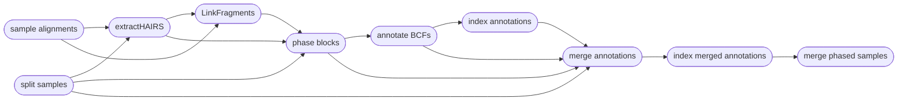

# :icon-stack: Phase SNPs into Haplotypes

===  :icon-checklist: You will need
- at least 2 cores/threads available
- a vcf/bcf file of genotypes
- sequence alignments, in `.bam` format
===

You may want to phase your genotypes into haplotypes, as haplotypes tend to be more informative
than unphased genotypes (higher polymorphism, captures relationship between genotypes). Phasing
genotypes into haplotypes requires alignment files, such as those produced by `harpy align` and
a variant call file, such as those produced by `harpy variants` or `harpy impute`. **Phasing only
works on SNP data**, and will not work for structural variants produced by `LEVIATHAN`. You can 
phase genotypes into haplotypes with Harpy using the `phase` module:

```bash usage
harpy phase OPTIONS... 
```
```bash example
harpy phase --threads 20 --vcf Variants/variants.raw.bcf --directory Align/ema 
```

## :icon-terminal: Running Options
In addition to the [common runtime options](../commonoptions.md), the `harpy phase` module is configured using these command-line arguments:

| argument              | short name | type            | default | required | description                                                          |
|:----------------------|:----------:|:----------------|:-------:|:--------:|:---------------------------------------------------------------------|
| `--vcf`               |    `-v`    | file path       |         | **yes**  | Path to BCF/VCF file                                                 |
| `--directory`         |    `-d`    | folder path     |         | **yes**  | Directory with sequence alignments                                   |
| `--genome           ` |    `-g`    | file path       |         |    no    | Path to genome if wanting to also use reads spanning indels          |
| `--molecule-distance` |    `-m`    | integer         |  50000  |    no    | Base-pair distance dilineating separate molecules                    |
| `--prune-threshold`   |    `-p`    | integer (0-100) |    7    |    no    | PHRED-scale (%) threshold for pruning low-confidence SNPs            |
| `--ignore-bx`         |    `-b`    | toggle          |         |    no    | Ignore haplotag barcodes for phasing                                 |
| `--vcf-samples`       |            |  toggle         |         |    no    | [Use samples present in vcf file](#prioritize-the-vcf-file) for imputation rather than those found the directory    |
| `--extra-params`      |    `-x`    | string          |         |    no    | Additional Hapcut2 arguments, in quotes                              |

### Prioritize the vcf file
Sometimes you want to run imputation on all the samples present in the `--directory`, but other times you may want
to only impute the samples present in the `--vcf` file. By default, Harpy assumes you want to use all the samples
present in the `--directory` and will inform you of errors when there is a mismatch between the sample files
present and those listed in the `--vcf` file. You can instead use the `--vcf-samples` flag if you want Harpy to build a workflow
around the samples present in the `--vcf` file. When using this toggle, Harpy will inform you when samples in the `--vcf` file
are missing from the provided `--directory`.  

The molecule distance and pruning thresholds are considered the most impactful parameters
for running HapCut2.

### Molecule distance
The molecule distance refers to the base-pair distance dilineating separate molecules.
In other words, when two alignments on a single contig share the same barcode, how far
away from each other are we willing to say they were and still consider them having 
originated from the same DNA molecule rather than having the same barcodes by chance.
Feel free to play around with this number if you aren't sure. A larger distance means
you are allowing the program to be more lenient in assuming two alignments with the
same barcode originated from the same DNA molecule. The HapCut2 default is `20000` (20kbp),
but Harpy's default is more lenient with `50000` (50kbp). Unless you have strong evidence
in favor of it, a distance above `200000` (200kbp) would probably do more harm than good.
See [haplotag data](../haplotagdata/#barcode-thresholds) for a more thorough explanation.

### Pruning threshold
The pruning threshold refers to a PHRED-scale value between 0-1 (a percentage) for removing
low-confidence SNPs from consideration. With Harpy, you configure this value as an integer 
between 0-100, which gets converted to a floating point value between 0-1 internally
(_i.e._ `-p 7` is equivalent to a 0.07 threshold, aka 7%).

---
## :icon-git-pull-request: Phasing Workflow
+++ :icon-git-merge: details
Phasing is performed using [HapCut2](https://github.com/vibansal/HapCUT2). Most of the tasks cannot
be parallelized, but HapCut2 operates on a per-sample basis, so the workflow is parallelized
across all of your samples to speed things along.



+++ :icon-file-directory: phasing output
The `harpy phase` module creates an `Phase` directory with the folder structure below. `Sample1` is a generic sample name for demonstration purposes.
If using the `--ignore-bx` option, the output directory will be named `Phase.noBX` instead.

```
Phase/
├── variants.phased.bcf
├── variants.phased.bcf.csi
├── annotations
│   ├── Sample1.annot.gz
│   └── Sample1.annot.gz.tbi
├── annotations_merge
│   ├── Sample1.phased.annot.bcf
│   └── Sample1.phased.annot.bcf.csi
├── extractHairs
│   ├── Sample1.unlinked.frags
│   └── logs
│       └── Sample1.unlinked.log
├── input
│   ├── header.names
│   ├── Sample1.bcf
│   └── Sample1.het.bcf
├── linkFragments
│   ├── Sample1.linked.frags
│   └── logs
│       └── Sample1.linked.log
├── logs
│   └── harpy.phase.log
├── reports
│   ├── blocks.summary.gz
│   └── phase.html
└── phaseBlocks
    ├── Sample1.blocks
    ├── Sample1.blocks.phased.VCF
    └── logs
        └── Sample1.blocks.phased.log

```

| item | description |
|:---|:---|
| `variants.phased.bcf*` | final vcf output of HapCut2 with all samples merged into a single file (with .csi index) |
| `annotations/` | phased vcf annotated with phased blocks |
| `annotations_merge/` | merged vcf of annotated and original vcf |
| `extractHairs/` | output from `extractHairs` |
| `extractHairs/logs/` | everything HapCut2's `extractHairs` prints to `stderr` |
| `input/head.names` | extra file harpy creates to support new INFO fields in the phased VCF |
| `input/*.bcf` | vcf of a single sample from the original multi-sample input vcf |
| `input/*.het.bcf` | vcf of heterozygous loci of a single sample from the original multi-sample input vcf |
| `linkFragments/` | results from HapCut2's `linkFragments` |
| `linkFragments/logs` | everything `linkFragments` prints to `stderr` |
| `logs/harpy.phase.log` | relevant runtime parameters for the phase module |
| `reports/blocks.summary.gz` | summary information of all the samples' block files |
| `reports/phase.html` | report of haplotype phasing results |
| `phaseBlocks/*.blocks*` | output from HapCut2 |
| `phaseBlocks/logs` | everything HapCut2 prints to `stderr` |

+++ :icon-code-square: HapCut2 parameters
By default, Harpy runs `HAPCUT2` with these parameters (excluding inputs and outputs):
```bash
HAPCUT2 --nf 1 --error_analysis_mode 1 --call_homozygous 1 --outvcf 1
```
Below is a list of all `HAPCUT2` command line options, excluding those Harpy already uses or those made redundant by Harpy's implementation of HapCut2.
These are taken directly from running `HAPCUT2 --help`.

``` hapcut2 arguments
Haplotype Post-Processing Options:
--skip_prune, --sp <0/1>:           skip default likelihood pruning step (prune SNPs after the fact using column 11 of the output). default: 0
--discrete_pruning, --dp <0/1>:     use discrete heuristic to prune SNPs. default: 0

Advanced Options:
--max_iter, --mi <int> :            maximum number of global iterations. Preferable to tweak --converge option instead. default: 10000
--maxcut_iter, --mc <int> :         maximum number of max-likelihood-cut iterations. Preferable to tweak --converge option instead. default: 10000
```
+++ :icon-graph: reports
These are the summary reports Harpy generates for this workflow. You may right-click
the image and open it in a new tab if you wish to see the example in better detail.

Under development!

+++
