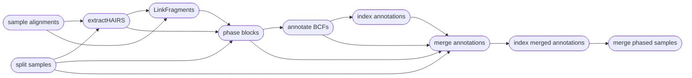

# Phasing Haplotypes

|||  :icon-checklist: You will need
- at least 2 cores/threads available
- a vcf/bcf file of genotypes
- alignment files in `.bam` format
|||

You may want to phase your genotypes into haplotypes, as haplotypes tend to be more informative
than unphased genotypes (higher polymorphism, captures relationship between genotypes). Phasing
genotypes into haplotypes requires alignment files, such as those produced by `harpy align` and
a variant call file, such as those produced by `harpy variants` or `harpy impute`. Phasing only
works on SNP data, and will not work for structural variants produced by `LEVIATHAN`. You can phase genotypes into haplotypes with Harpy using the `phase` module:
```bash
harpy phase OPTIONS... 
```

## Running Options
| argument              | short name | type            | default | required | description                                                             |
|:----------------------|:----------:|:----------------|:-------:|:--------:|:------------------------------------------------------------------------|
| `--vcf`               |    `-v`    | file path       |         | **yes**  | Path to BCF/VCF file                                                    |
| `--dir`               |    `-d`    | folder path     |         | **yes**  | Directory with sequence alignments                                      |
| `--molecule-distance` |    `-m`    | integer         |  20000  |    no    | Base-pair distance dilineating separate molecules                       |
| `--prune-threshold`   |    `-p`    | integer (0-100) |    7    |    no    | PHRED-scale (%) threshold for pruning low-confidence SNPs               |
| `--extra-params`      |    `-x`    | string          |         |    no    | Additional Hapcut2 parameters, in quotes                                |
| `--threads`           |    `-t`    | integer         |    4    |    no    | Number of threads to use                                                |
| `--snakemake`         |    `-s`    | string          |         |    no    | Additional Snakemake options, in quotes ([more info](../snakemake.md))  |
| `--help`              |            |                 |         |          | Show the module docstring                                               |


The molecule distance is and pruning thresholds are considered the most impactful parameters
for running HapCut2, therefore they are directly configurable from the command. The molecule distance
refers to the base-pair distance dilineating separate molecules. Feel free to play around with this number 
if you do not know the distance, as it's not clear how impactful this can be on the results. The pruning 
threshold refers to a PHRED-scale value between 0-1 (a percentage) for removing low-confidence SNPs from consideration. 
With Harpy, you configure this value as an integer between 0-100, which gets converted to a floating point
value between 0-1 internally (_i.e._ `-p 7` is equivalent to 0.07 threshold).

---
## HapCut2 Workflow
Phasing is performed using [HapCut2](https://github.com/vibansal/HapCUT2). Most of the tasks cannot
be parallelized, but HapCut2 operates on a per-sample basis, so the workflow is parallelized
across all of your samples to speed things along.

