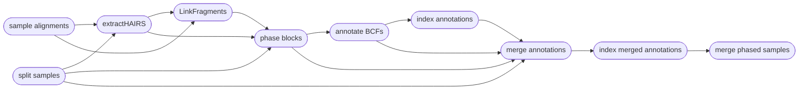

# Phasing Haplotypes

===  :icon-checklist: You will need
- at least 2 cores/threads available
- a vcf/bcf file of genotypes
- sequence alignments, in `.bam` format
===

You may want to phase your genotypes into haplotypes, as haplotypes tend to be more informative
than unphased genotypes (higher polymorphism, captures relationship between genotypes). Phasing
genotypes into haplotypes requires alignment files, such as those produced by `harpy align` and
a variant call file, such as those produced by `harpy variants` or `harpy impute`. **Phasing only
works on SNP data**, and will not work for structural variants produced by `LEVIATHAN`. You can phase genotypes into haplotypes with Harpy using the `phase` module:

```bash usage
harpy phase OPTIONS... 
```
```bash example
harpy phase --threads 20 --vcf Variants/variants.raw.bcf --dir Alignments/ema 
```


## Running Options
| argument              | short name | type            | default | required | description                                                             |
|:----------------------|:----------:|:----------------|:-------:|:--------:|:------------------------------------------------------------------------|
| `--vcf`               |    `-v`    | file path       |         | **yes**  | Path to BCF/VCF file                                                    |
| `--dir`               |    `-d`    | folder path     |         | **yes**  | Directory with sequence alignments                                      |
| `--molecule-distance` |    `-m`    | integer         |  20000  |    no    | Base-pair distance dilineating separate molecules                       |
| `--prune-threshold`   |    `-p`    | integer (0-100) |    7    |    no    | PHRED-scale (%) threshold for pruning low-confidence SNPs               |
| `--extra-params`      |    `-x`    | string          |         |    no    | Additional Hapcut2 arguments, in quotes                                |
| `--threads`           |    `-t`    | integer         |    4    |    no    | Number of threads to use                                                |
| `--snakemake`         |    `-s`    | string          |         |    no    | Additional Snakemake options, in quotes ([more info](../getstarted.md/#adding-additional-snakamake-parameters))  |
| `--help`              |            |                 |         |          | Show the module docstring                                               |


==- HapCut2 arguments
Below is a list of all `HapCut2` command line options, excluding those Harpy already uses or those made redundant by Harpy's implementation of HapCut2.
These are taken directly from running `hapcut2 --help`.

``` hapcut2 arguments
Haplotype Post-Processing Options:
--skip_prune, --sp <0/1>:           skip default likelihood pruning step (prune SNPs after the fact using column 11 of the output). default: 0
--discrete_pruning, --dp <0/1>:     use discrete heuristic to prune SNPs. default: 0
--error_analysis_mode, --ea <0/1>:  compute switch confidence scores and print to haplotype file but don't split blocks or prune. default: 0

Advanced Options:
--max_iter, --mi <int> :            maximum number of global iterations. Preferable to tweak --converge option instead. default: 10000
--maxcut_iter, --mc <int> :         maximum number of max-likelihood-cut iterations. Preferable to tweak --converge option instead. default: 10000
```
===

The molecule distance is and pruning thresholds are considered the most impactful parameters
for running HapCut2, therefore they are directly configurable from the command. The molecule distance
refers to the base-pair distance dilineating separate molecules. Feel free to play around with this number 
if you do not know the distance, as it's not clear how impactful this can be on the results. The pruning 
threshold refers to a PHRED-scale value between 0-1 (a percentage) for removing low-confidence SNPs from consideration. 
With Harpy, you configure this value as an integer between 0-100, which gets converted to a floating point
value between 0-1 internally (_i.e._ `-p 7` is equivalent to 0.07 threshold).

---
## Phasing Workflow
+++ description
Phasing is performed using [HapCut2](https://github.com/vibansal/HapCUT2). Most of the tasks cannot
be parallelized, but HapCut2 operates on a per-sample basis, so the workflow is parallelized
across all of your samples to speed things along.



+++ phasing output
The `harpy phase` module creates an `Phasing` directory with the folder structure below. `Sample1` is a generic sample name for demonstration purposes.

```
Phasing/
├── variants.phased.bcf
├── variants.phased.bcf.csi
├── annotations
│   ├── Sample1.annot.gz
│   └── Sample1.annot.gz.tbi
├── annotations_merge
│   ├── Sample1.phased.annot.bcf
│   └── Sample1.phased.annot.bcf.csi
├── extractHairs
│   ├── Sample1.unlinked.frags
│   └── logs
│       └── Sample1.unlinked.log
├── input
│   ├── header.names
│   ├── Sample1.bcf
│   └── Sample1.het.bcf
├── linkFragments
│   ├── Sample1.linked.frags
│   └── logs
│       └── Sample1.linked.log
└── phaseBlocks
    ├── Sample1.blocks
    ├── Sample1.blocks.phased.VCF
    └── logs
        └── Sample1.blocks.phased.log

```

| item | description |
|:---|:---|
| `variants.phased.bcf*` | final vcf output of HapCut2 with all samples merged into a single file (with .csi index) |
| `annotations/` | phased vcf annotated with phased blocks |
| `annotations_merge/` | merged vcf of annotated and original vcf |
| `extractHairs/` | output from `extractHairs` |
| `extractHairs/logs/` | everything HapCut2's `extractHairs` prints to `stderr` |
| `input/head.names` | extra file harpy creates to support new INFO fields in the phased VCF |
| `input/*.bcf` | vcf of a single sample from the original multi-sample input vcf |
| `input/*.het.bcf` | vcf of heterozygous loci of a single sample from the original multi-sample input vcf |
| `linkFragments/` | results from HapCut2's `linkFragments` |
| `linkFragments/logs` | everything `linkFragments` prints to `stderr` |
| `phaseBlocks/*.blocks*` | output from HapCut2 |
| `phaseBlocks/logs` | everything HapCut2 prints to `stderr` |
+++
