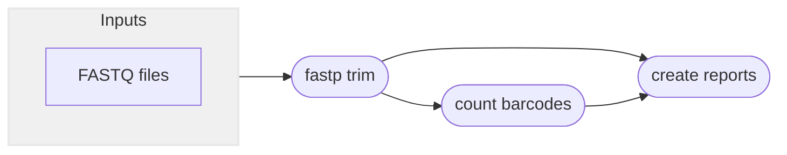

# :icon-codescan-checkmark: Quality Trim Sequences
===  :icon-checklist: You will need
- at least 2 cores/threads available
- paired-end fastq sequence files [!badge variant="secondary" text="gzip recommended"]
===

Raw sequences are not suitable for downstream analyses. They have sequencing adapters,
index sequences, regions of poor quality, etc. The first step of any genetic sequence
analyses is to remove these adapters and trim poor quality data. You can remove adapters
and quality trim sequences using the [!badge corners="pill" text="qc"]` module:

```bash usage
harpy qc OPTIONS... INPUTS...
```

```bash example
harpy qc --threads 20 Sequences_Raw/ 
```

## :icon-terminal: Running Options
In addition to the [!badge variant="info" corners="pill" text="common runtime options"](/commonoptions.md), the [!badge corners="pill" text="qc"] module is configured using these command-line arguments:

{.compact}
| argument         | short name | type        | default | required | description                                                                                     |
|:-----------------|:----------:|:------------|:-------:|:-------:|:------------------------------------------------------------------------------------------------|
| `INPUTS`         |            | file/directory paths  |         | **yes**  | Files or directories containing [input FASTQ files](/commonoptions.md#input-arguments)     |
| `--max-length`   |    `-l`    | integer     |   150   |    no   | Maximum length to trim sequences down to                                                        |
| `--extra-params` |    `-x`    | string      |         |    no   | Additional fastp arguments, in quotes                                                           |

---
## :icon-git-pull-request: QC Workflow
+++ :icon-git-merge: details
[Fastp](https://github.com/OpenGene/fastp) is an ultra-fast all-in-one adapter remover, deduplicator, 
and quality trimmer. Harpy uses it to remove adapters, low-quality bases, and trim sequences down to a particular
length (default 150bp). Harpy uses the fastp overlap analysis to identify adapters for removal and a sliding window
approach (`--cut-right`) to identify low quality bases. The workflow is quite simple.



+++ :icon-file-directory: qc output
The default output directory is `QC` with the folder structure below. `Sample1` and `Sample2` are generic sample names for demonstration purposes. 
The resulting folder also includes a `workflow` directory (not shown) with workflow-relevant runtime files and information.
```
QC/
├── Sample1.R1.fq.gz
├── Sample1.R2.fq.gz
├── Sample2.R1.fq.gz
├── Sample2.R2.fq.gz
├── reports
│   ├── Sample1.html
│   ├── Sample2.html
│   ├── summary.bx.valid.html
│   └── trim.report.html
└── logs
    ├── err
    │   ├── Sample1.log
    │   └── Sample2.log
    └── json
        ├── Sample1.fastp.json
        └── Sample2.fastp.json
```
{.compact}
| item                            | description                                                                        |
|:--------------------------------|:-----------------------------------------------------------------------------------|
| `*.R1.fq.gz`                    | quality trimmed forward reads of the samples                                       |
| `*.R1.fq.gz`                    | quality trimmed reverse reads of the samples                                       |
| `logs/`                         | all debug/diagnostic files that aren't the trimmed reads `fastp` creates           |
| `logs/err`                      | what fastp prints to `stderr` when running                                         |
| `reports/*.html`                | interactive html reports `fastp` creates from quality trimming                     |
| `reports/trim.report.html`      | a report generated by `multiqc` summarizing the quality trimming results           |
| `reports/summary.bx.valid.html` | a report detailing valid vs invalid barcodes and the segments causing invalidation |
| `logs/json`                     | json representation of the data `fastp` uses to create the html reports            |

+++ :icon-code-square: fastp parameters
By default, Harpy runs `fastp` with these parameters (excluding inputs and outputs):
```bash
fastp --trim_poly_g --cut_right --detect_adapter_for_pe
```

The list of all `fastp` command line options is quite extensive and would
be cumbersome to print here. See the list of options in the [fastp documentation](https://github.com/OpenGene/fastp).

+++ :icon-graph: reports

These are the summary reports Harpy generates for this workflow. You may right-click
the images and open them in a new tab if you wish to see the examples in better detail.

||| fastp reports
Reports of all QC activities performed by fastp (fastp creates this)

||| Trimming and QC
Aggregates the metrics FASTP generates for every sample during QC.

||| BX validation
Reports the number of valid/invalid barcodes in the sequences and the segments contributing to invalidation.

|||

+++
