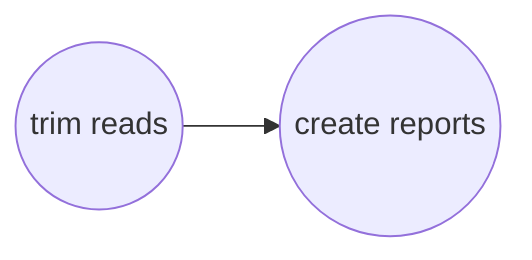

# Quality Trimming Sequence Data
You can remove adapters and quality trim sequences using:
```bash
harpy trim OPTIONS... 
```
|||  :icon-checklist: You will need
- at least 2 cores/threads available
- b/gzipped fastq sequence files
    - paired-end files
    - file extension is either `.fastq.gz` or `.fq.gz` (do not mix)
    - forward-reverse is noted as either `.1.`/`.2.` **or** `.F.`/`.R.` (do no mix)
        - _e.g._ `samplename.F.fq.gz` and `samplename.R.fq.gz`
        - _e.g._ `samplename.1.fq.gz` and `samplename.2.fq.gz`
        - or the same but ending with `.fastq.gz`, but don't mix and match
|||

## Running Options
| argument         | short name | type        | default | required | description                              |
|:-----------------|:----------:|:------------|:-------:|:--------:|:-----------------------------------------|
| `--dir`          |    `-d`    | folder path |         | **yes**  | Directory with sequence alignments       |
| `--max-length`   |    `-l`    | integer     |   150   |    no    | Maximum length to trim sequences down to |
| `--extra-params` |    `-x`    | string      |         |    no    | Additional Hapcut2 parameters, in quotes |
| `--threads`      |    `-t`    | integer     |    4    |    no    | Number of threads to use                 |
| `--snakemake`    |    `-s`    | string      |         |    no    | Additional Snakemake options, in quotes  |
| `--help`         |            |             |         |          | Show the module docstring                |

---
## Fastp Workflow
[Fastp](https://github.com/OpenGene/fastp) is an ultra-fast all-in-one adapter remover, deduplicator, 
and quality trimmer. Harpy uses it to remove adapters, low-quality bases, and trim sequences down to a particular
length (default 150bp). Harpy uses the fastp overlap analysis to identify adapters for removal and a sliding window
approach (`--cut-right`) to identify low quality bases. The workflow is quite simple.

