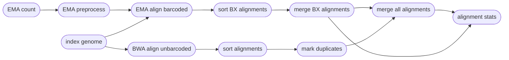
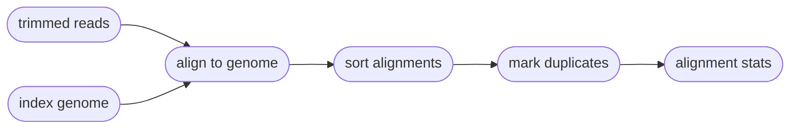

# Mapping Reads onto a Reference Genome
===  :icon-checklist: You will need
- at least 4 cores/threads available
- a genome assembly in FASTA format
- paired-end b/gzipped fastq sequence files
===

Once sequences have been trimmed and passed through other QC filters, they will need to
be aligned to a reference genome. This module within Harpy expects filtered reads as input,
such as those derived using `harpy trim`. You can map reads onto a genome assembly with Harpy 
using the `align` module:
```bash
harpy align OPTIONS...
```

## Running Options
| argument         | short name | type        | default | required | description                                                            |
|:-----------------|:----------:|:------------|:-------:|:--------:|:-----------------------------------------------------------------------|
| `--genome`       |    `-g`    | file path   |         | **yes**  | Genome assembly for read mapping                                       |
| `--dir`          |    `-d`    | folder path |         | **yes**  | Directory with sample sequences                                        |
| `--ema-bins`     |    `-e`    | integer     |   500   |    no    | Number of barcode bins for EMA                                         |
| `--proximity`    |    `-p`    | integer     |   250   |    no    | Alignment window merging proximity (bp) for coverage calculations      |
| `--bwa`          |    `-b`    | toggle      |         |    no    | Use BWA MEM instead of EMA                                             |
| `--extra-params` |    `-x`    | string      |         |    no    | Additional EMA-align/BWA parameters, in quotes                         |
| `--threads`      |    `-t`    | integer     |    4    |    no    | Number of threads to use                                               |
| `--snakemake`    |    `-s`    | string      |         |    no    | Additional Snakemake options, in quotes ([more info](../getstarted.md/#adding-additional-snakamake-parameters)) |
| `--help`         |            |             |         |          | Show the module docstring                                              |

!!!info
The `--proximity` flag is for the genomic alignment coverage calculations, which occurs after sequence alignment. It therefore does not impact 
sequence alignment. The default value (`250`) means alignment intervals within 250bp will be merged and their coverages summed. If you don't
want intervals merged, set this argument as `--proximity 1` (1bp). Merging is useful for reducing file size (kilobytes vs mega/gigabytes),
which makes visualization easier downstream too. 
!!!

## FASTQ file format
There are a handful of "accepted" naming schemes for fastq file extensions, but Harpy only accepts a limited number of them, shown below.
The fastq files **must** be bgzipped or gzipped and be **consistent** with regards to the extensions and read-pair naming styles.
That is, you must only use `.fastq.gz` or only use `.fq.gz` for all files, and the same for `.R1.`/`.R2.` or `_R1.`/`_R2.` (adhere to a single row in the table below).
Notice that the read pair part differs from the [accepted fastq formats](qualitytrimming.md/#fastq-file-format) for read trimming.
=== acceptable formats

| forward-reverse notation | extension  | example forward           | example reverse          |
|:-------------------------|:-----------|:--------------------------|:-------------------------|
| `.R1` / `.R2`            | `fastq.gz` | ` samplename.R1.fastq.gz` | `samplename.R2.fastq.gz` |
| `.R1` / `.R2`            | `fq.gz`    | `samplename.R1.fq.gz`     | `samplename.R2.fq.gz`    |
| `_R1` / `_R2`            | `fastq.gz` | `samplename_R1.fastq.gz`  | `samplename_R2.fastq.gz` |
| `_R1` / `_R2`            | `fq.gz`    | `samplename_R1.fq.gz`     | `samplename_R2.fq.gz`    |

===

----

## EMA workflow
=== EMA details
- **recommended**
- leverages the BX barcode information to improve mapping
- slower
- lots of temporary files
===

Since [EMA](https://github.com/arshajii/ema) does extra things to account for barcode information, the EMA workflow is a bit more complicated under the hood. Reads with barcodes are aligned using EMA and reads without valid barcodes are separately mapped using BWA before merging all the alignments together again. EMA will mark duplicates within alignments, but the BWA alignments need duplicates marked manually using [sambamba](https://lomereiter.github.io/sambamba/). Thankfully, you shouldn't need to worry about any of these details.

==- Why EMA?
The original haplotag manuscript uses BWA to map reads, but the authors have since then recommended the use of EMA (EMerald Aligner) for most applications. EMA is barcode-aware, meaning it considers sequences with identical barcodes to have originated from the same molecule, and therefore has higher mapping accuracy than using BWA. Here's a comparison from the [EMA manuscript](https://www.biorxiv.org/content/10.1101/220236v1):

==-


### ema output
The `harpy align` module creates an `Alignments/ema` directory with the folder structure below. `Sample1` is a generic sample name for demonstration purposes.
```
Alignments/ema
├── Sample1.bam
├── Sample1.bam.bai
├── count
│   ├── Sample1.ema-ncnt
├── preproc
│   └── logs
│       ├── Sample1.preproc.log
└── stats
    ├── beadtag.report.html
    ├── markduplicates
    │   ├── Sample1.markdup.nobarcode.log
    ├── moleculesize
    │   ├── Sample1.molsize
    │   ├── Sample1.molsize.hist
    ├── readsperbx
    │   ├── Sample1.readsperbx
    ├── samtools_flagstat
    │   ├── alignment.flagstat.html
    │   ├── Sample1.flagstat
    │   ├── Sample1.nobarcode.flagstat
    └── samtools_stats
        ├── alignment.stats.html
        ├── Sample1.nobarcode.stats
        └── Sample1.stats
```
| item                                           | description                                                                                |
|:-----------------------------------------------|:-------------------------------------------------------------------------------------------|
| `*.bam`                                        | sequence alignments for each sample                                                        |
| `*.bai`                                        | sequence alignment indexes for each sample                                                 |
| `count/`                                       | output of `ema count`                                                                      |
| `preproc/logs`                                 | everything `ema preproc` wrote to `stderr` during operation                                |
| `stats/`                                       | various counts/statistics/reports relating to sequence alignment                           |
| `stats/beadtag.report.html`                    | interactive html report summarizing `ema count` across all samples                         |
| `stats/markduplicates`                         | everything `sambamba markdup` writes to `stderr` during operation on unbarcoded alignments |
| `stats/moleculesize/*.molsize`                 | molecule lengths as inferred from BX tags                                                  |
| `stats/moleculesize/*.molsize.hist`            | molecule lengths as inferred from BX tags, binned as a histogram                           |
| `stats/readsperbx`                             | inferred number of alignments per BX barcode                                               |
| `stats/samtools_flagstat/*flagstat`            | results of `samtools flagstat` on all alignments for a sample                              |
| `stats/samtools_flagstat/*.nobarcode.flagstat` | results of `samtools flagstat` on alignments that had no/invalid BX barcodes               |
| `stats/samtools_flagstat/*html`                | report summarizing `samtools flagstat` results across all samples from `multiqc`           |
| `stats/samtools_stats/*`                       | same as `samtools_flagstat` except for the results of `samtools stats`                     |


## BWA workflow
=== BWA details
- ignores barcode information
- might be preferred depending on experimental design
- faster
- no temporary files
===

The [BWA MEM](https://github.com/lh3/bwa) workflow is substantially simpler than the EMA workflow and maps all reads against the reference genome, no muss no fuss. Duplicates are marked at the end using [sambamba](https://lomereiter.github.io/sambamba/). The `BX:Z` tags in the read headers are still added to the alignment headers, even though barcodes are not used to inform mapping.


### bwa output
The `harpy align --bwa` module creates an `Alignments/bwa` directory with the folder structure below. `Sample1` and `Sample2` are generic sample names for demonstration purposes.