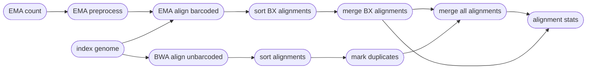

# :icon-quote: Mapping Reads onto a genome
===  :icon-checklist: You will need
- at least 4 cores/threads available
- a genome assembly in FASTA format
- paired-end b/gzipped fastq sequence files
==- :icon-stop: FASTQ file names
There are a handful of "accepted" naming schemes for fastq file extensions, but Harpy only accepts a limited number of them, shown below.
The fastq files **must** be bgzipped or gzipped and be **consistent** with regards to the extensions and read-pair naming styles.
That is, you must only use `.fastq.gz` or only use `.fq.gz` for all files, and the same for `.R1.`/`.R2.` or `_R1.`/`_R2.` (adhere to a single row in the table below).
Notice that the read pair part differs from the accepted fastq names for read trimming.

#### :icon-check-circle: acceptable fastq names

| forward-reverse notation | extension  | example forward           | example reverse          |
|:-------------------------|:-----------|:--------------------------|:-------------------------|
| `.R1` / `.R2`            | `fastq.gz` | ` samplename.R1.fastq.gz` | `samplename.R2.fastq.gz` |
| `.R1` / `.R2`            | `fq.gz`    | `samplename.R1.fq.gz`     | `samplename.R2.fq.gz`    |
| `_R1` / `_R2`            | `fastq.gz` | `samplename_R1.fastq.gz`  | `samplename_R2.fastq.gz` |
| `_R1` / `_R2`            | `fq.gz`    | `samplename_R1.fq.gz`     | `samplename_R2.fq.gz`    |

===

Once sequences have been trimmed and passed through other QC filters, they will need to
be aligned to a reference genome. This module within Harpy expects filtered reads as input,
such as those derived using `harpy trim`. You can map reads onto a genome assembly with Harpy 
using the `align` module:

```bash usage
harpy align OPTIONS...
```
```bash examples
# align with EMA
harpy align --genome genome.fasta --dir Sequences/ 

# align with BWA
harpy align --bwa --genome genome.fasta --dir Sequences/ 
```


## :icon-terminal: Running Options
| argument           | short name | type             | default | required | description                                                                                                     |
|:-------------------|:----------:|:-----------------|:-------:|:--------:|:----------------------------------------------------------------------------------------------------------------|
| `--genome`         |    `-g`    | file path        |         | **yes**  | Genome assembly for read mapping                                                                                |
| `--dir`            |    `-d`    | folder path      |         | **yes**  | Directory with sample sequences                                                                                 |
| `--ema-bins`       |    `-e`    | integer (1-1000) |   500   |    no    | Number of barcode bins for EMA                                                                                  |
| `--quality-filter` |    `-q`    | integer (0-40)   |    20   |    no    | Minimum `MQ` (SAM mapping quality) to pass filtering                                                            |
| `--bwa`            |    `-b`    | toggle           |         |    no    | Use BWA MEM instead of EMA                                                                                      |
| `--extra-params`   |    `-x`    | string           |         |    no    | Additional EMA-align/BWA arguments , in quotes                                                                  |
| `--threads`        |    `-t`    | integer          |    4    |    no    | Number of threads to use                                                                                        |
| `--snakemake`      |    `-s`    | string           |         |    no    | Additional Snakemake options, in quotes ([more info](../getstarted.md/#adding-additional-snakamake-parameters)) |
| `--help`           |            |                  |         |          | Show the module docstring                                                                                       |

==- :icon-code-square: EMA arguments
Below is a list of all `ema align` command line arguments, excluding those Harpy already uses or those made redundant by Harpy's implementation of EMA.
These are taken directly from the [EMA documentation](https://github.com/arshajii/ema).

``` ema arguments
-d: apply fragment read density optimization [off]
-i <index>: index to follow 'BX' tag in SAM output [1]
```
==- :icon-code-square: BWA arguments
Below is a list of all `bwa mem` command line arguments, excluding those Harpy already uses or those made redundant by Harpy's implementation of BWA.
These are taken directly from the [BWA documentation](https://bio-bwa.sourceforge.net/bwa.shtml).
```bwa arguments
-k INT 	Minimum seed length. Matches shorter than INT will be missed. The alignment speed is usually insensitive to this value unless it significantly deviates 20. [19]
-w INT 	Band width. Essentially, gaps longer than INT will not be found. Note that the maximum gap length is also affected by the scoring matrix and the hit length, not solely determined by this option. [100]
-d INT 	Off-diagonal X-dropoff (Z-dropoff). Stop extension when the difference between the best and the current extension score is above |i-j|*A+INT, where i and j are the current positions of the query and reference, respectively, and A is the matching score. Z-dropoff is similar to BLAST’s X-dropoff except that it doesn’t penalize gaps in one of the sequences in the alignment. Z-dropoff not only avoids unnecessary extension, but also reduces poor alignments inside a long good alignment. [100]
-r FLOAT 	Trigger re-seeding for a MEM longer than minSeedLen*FLOAT. This is a key heuristic parameter for tuning the performance. Larger value yields fewer seeds, which leads to faster alignment speed but lower accuracy. [1.5]
-c INT 	Discard a MEM if it has more than INT occurence in the genome. This is an insensitive parameter. [10000]
-P 	In the paired-end mode, perform SW to rescue missing hits only but do not try to find hits that fit a proper pair.
-A INT 	Matching score. [1]
-B INT 	Mismatch penalty. The sequence error rate is approximately: {.75 * exp[-log(4) * B/A]}. [4]
-O INT 	Gap open penalty. [6]
-E INT 	Gap extension penalty. A gap of length k costs O + k*E (i.e. -O is for opening a zero-length gap). [1]
-L INT 	Clipping penalty. When performing SW extension, BWA-MEM keeps track of the best score reaching the end of query. If this score is larger than the best SW score minus the clipping penalty, clipping will not be applied. Note that in this case, the SAM AS tag reports the best SW score; clipping penalty is not deducted. [5]
-U INT 	Penalty for an unpaired read pair. BWA-MEM scores an unpaired read pair as scoreRead1+scoreRead2-INT and scores a paired as scoreRead1+scoreRead2-insertPenalty. It compares these two scores to determine whether we should force pairing. [9]
-T INT 	Don’t output alignment with score lower than INT. This option only affects output. [30]
-a 	Output all found alignments for single-end or unpaired paired-end reads. These alignments will be flagged as secondary alignments.
-H 	Use hard clipping ’H’ in the SAM output. This option may dramatically reduce the redundancy of output when mapping long contig or BAC sequences.
```
===

## :icon-filter: Quality filtering
==- What is a $MQ$ score?
Every alignment in a BAM file has an associated mapping quality ($MQ$) score that informs you of the likelihood 
that the alignment is accurate. This score can range from 0-40, where higher numbers mean the alignment is more
likely correct. The math governing the $MQ$ score actually calculates the percent chance the alignment is ***incorrect***: 
$$
\%\ chance\ incorrect = 10^\frac{-MQ}{10} \times 100\\
\text{where }0\le MQ\le 40
$$
You can simply subtract it from 100 to determine the percent chance the alignment is ***correct***:
$$
\%\ chance\ correct = 100 - \%\ chance\ incorrect\\
\text{or} \\
\%\ chance\ correct = (1 - 10^\frac{-MQ}{10}) \times 100
$$
===
The `--quality` argument filters out alignments below a given $MQ$ threshold. The default, `20`, keeps alignments
that are at least 99% likely accurately mapped (100 - 1% incorrect). Set this value to `1` if you only want alignments with
$MQ = 0$ removed (100% likely incorrect). You may also set it to `0` to keep all alignments for diagnostic purposes.
The plot below shows the relationship between $MQ$ score and the likelihood the alignment is wrong and will serve to help you decide
on a value you may want to use. It is common to filter out alignments with $MQ <20$ (<99% chance correct) or $MQ <30$ (<99.9% chance correct).

[!embed el="embed"](//plotly.com/~pdimens/7.embed)

----

## :icon-git-pull-request: EMA workflow
+++ :icon-git-merge: details
- **recommended**
- leverages the BX barcode information to improve mapping
- better downstream SV detection
- slower
- lots of temporary files

Since [EMA](https://github.com/arshajii/ema) does extra things to account for barcode information, the EMA workflow is a bit more complicated under the hood. Reads with barcodes are aligned using EMA and reads without valid barcodes are separately mapped using BWA before merging all the alignments together again. EMA will mark duplicates within alignments, but the BWA alignments need duplicates marked manually using [sambamba](https://lomereiter.github.io/sambamba/). Thankfully, you shouldn't need to worry about any of these details.

==- Why EMA?
The original haplotag manuscript uses BWA to map reads, but the authors have since then recommended the use of EMA (EMerald Aligner) for most applications. EMA is barcode-aware, meaning it considers sequences with identical barcodes to have originated from the same molecule, and therefore has higher mapping accuracy than using BWA. Here's a comparison from the [EMA manuscript](https://www.biorxiv.org/content/10.1101/220236v1):

==-


+++ :icon-file-directory: EMA output
The `harpy align` module creates an `Alignments/ema` directory with the folder structure below. `Sample1` is a generic sample name for demonstration purposes.
```
Alignments/ema
├── Sample1.bam
├── Sample1.bam.bai
├── barcoded
│   └── Sample1.barcoded.bam
├── count
│   └── Sample1.ema-ncnt
├── preproc
│   └── logs
│       └── Sample1.preproc.log
└── stats
    ├── reads.bxstats.html
    ├── coverage
    │   ├── Sample1.gencov.html
    │   └── data
    │       ├── Sample1.all.gencov.gz
    │       └── Sample1.bx.gencov.gz
    ├── markduplicates
    │   └── Sample1.markdup.nobarcode.log
    ├── moleculesize
    │   ├── Sample1.molsize
    │   └── Sample1.molsize.hist
    ├── readsperbx
    │   └── Sample1.readsperbx
    ├── samtools_flagstat
    │   ├── alignment.flagstat.html
    │   ├── Sample1.flagstat
    │   └── Sample1.nobarcode.flagstat
    └── samtools_stats
        ├── alignment.stats.html
        ├── Sample1.nobarcode.stats
        └── Sample1.stats
```
| item                                           | description                                                                                |
|:-----------------------------------------------|:-------------------------------------------------------------------------------------------|
| `*.bam`                                        | sequence alignments for each sample                                                        |
| `*.bai`                                        | sequence alignment indexes for each sample                                                 |
| `barcoded/*.bam`                               | sequence alignments for each sample, containing only alignments with valid BX barcodes     |
| `count/`                                       | output of `ema count`                                                                      |
| `preproc/logs/`                                | everything `ema preproc` wrote to `stderr` during operation                                |
| `stats/`                                       | various counts/statistics/reports relating to sequence alignment                           |
| `stats/reads.bxstats .html`                    | interactive html report summarizing `ema count` across all samples                         |
| `stats/coverage/*.html`                        | summary plots of alignment coverage per contig                                             |
| `stats/coverage/data/*.all.gencov.gz`             | output from bedtools gencov from all alignments, used for plots                            |
| `stats/coverage/data/*.bx.gencov.gz`              | output from bedtools gencov from alignments with valid BX barcodes, used for plots         |
| `stats/markduplicates/`                        | everything `sambamba markdup` writes to `stderr` during operation on alignments with invalid/missing barcodes |
| `stats/moleculesize/*.molsize`                 | molecule lengths as inferred from BX tags                                                  |
| `stats/moleculesize/*.molsize.hist`            | molecule lengths as inferred from BX tags, binned as a histogram                           |
| `stats/readsperbx/`                            | inferred number of alignments per BX barcode                                               |
| `stats/samtools_flagstat/*flagstat`            | results of `samtools flagstat` on all alignments for a sample                              |
| `stats/samtools_flagstat/*.nobarcode.flagstat` | results of `samtools flagstat` on alignments that had no/invalid BX barcodes               |
| `stats/samtools_flagstat/*html`                | report summarizing `samtools flagstat` results across all samples from `multiqc`           |
| `stats/samtools_stats/*`                       | same as `samtools_flagstat` except for the results of `samtools stats`                     |
+++


## :icon-git-pull-request: BWA workflow
+++ :icon-git-merge: details
- ignores barcode information
- might be preferred depending on experimental design
- faster
- substantially fewer temporary files


The [BWA MEM](https://github.com/lh3/bwa) workflow is substantially simpler than the EMA workflow and maps all reads against the reference genome, no muss no fuss. Duplicates are marked at the end using [sambamba](https://lomereiter.github.io/sambamba/). The `BX:Z` tags in the read headers are still added to the alignment headers, even though barcodes are not used to inform mapping.


+++ :icon-file-directory: BWA output
The `harpy align --bwa` module creates an `Alignments/bwa` directory with the folder structure below. `Sample1` is a generic sample name for demonstration purposes.
```
Alignments/bwa
├── Sample1.bam
├── Sample1.bam.bai
└── stats
    ├── coverage
    │   ├── Sample1.gencov.html
    │   └── data
    │       └── Sample1.gencov.gz
    ├── markduplicates
    │   └── Sample1.markdup.log
    ├── samtools_flagstat
    │   ├── alignment.flagstat.html
    │   ├── Sample1.flagstat
    │   └── Sample1.nobarcode.flagstat
    └── samtools_stats
        ├── alignment.stats.html
        ├── Sample1.nobarcode.stats
        └── Sample1.stats
```

| item                                           | description                                                                                |
|:-----------------------------------------------|:-------------------------------------------------------------------------------------------|
| `*.bam`                                        | sequence alignments for each sample                                                        |
| `*.bai`                                        | sequence alignment indexes for each sample                                                 |
| `stats/`                                       | various counts/statistics/reports relating to sequence alignment                           |
| `stats/coverage/*.html`                        | summary plots of alignment coverage per contig                                             |
| `stats/coverage/data/*.gencov.gz`                 | output from bedtools gencov from all alignments, used for plots                            |
| `stats/markduplicates`                         | everything `sambamba markdup` writes to `stderr` during operation  |
| `stats/samtools_flagstat/*flagstat`            | results of `samtools flagstat` on all alignments for a sample                              |
| `stats/samtools_flagstat/*.nobarcode.flagstat` | results of `samtools flagstat` on alignments that had no/invalid BX barcodes               |
| `stats/samtools_flagstat/*html`                | report summarizing `samtools flagstat` results across all samples from `multiqc`           |
| `stats/samtools_stats/*`                       | same as `samtools_flagstat` except for the results of `samtools stats`                     |

+++