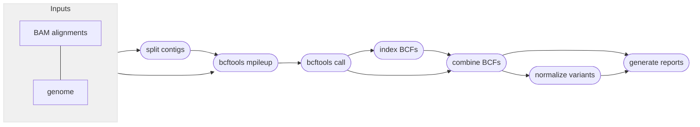
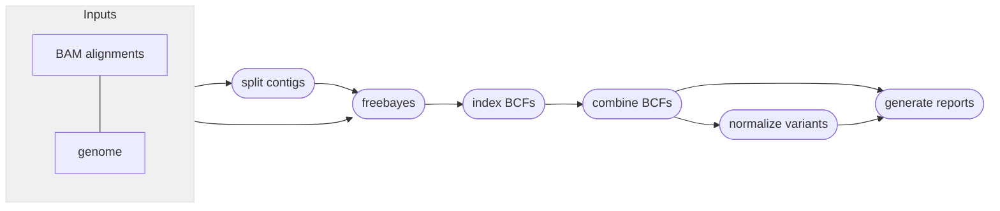

# :icon-sliders: Call SNPs and small indels

===  :icon-checklist: You will need
- at least 4 cores/threads available
- a genome assembly in FASTA format
- indexed sequence alignments, in `.bam` format and indexes in `.bam.bai` format
- sample grouping file (optional)
==- :icon-file: sample grouping file
This file is optional and useful if you want variant calling to happen on a per-population level.
- takes the format of sample\<*tab*\>group
    - spaces can be used as delimeters too
- the groups can be numbers or text (_i.e._ meaningful population names)
- you can comment out lines with `#` for Harpy to ignore them
- create with `harpy popgroup <samplefolder>` or manually
- if created with `harpy popgroup`, all the samples will be assigned to group `pop1`, so make sure to edit the second column to reflect your data correctly.

``` example file for --populations
sample1 pop1
sample2 pop1
sample3 pop2
sample4 pop1
sample5 pop3
#sample5 pop4
```

!!!warning known quirk
There's an unusual error on the Snakemake side of things that happens when the name of a sample and population are identical.
It has been unclear how to resolve this issue, so to protect yourself, it's best to make sure the population names are different
from the sample names. A simple fix would be to use underscores (`_`) to differentiate the population name.
!!!
===

After reads have been aligned, _e.g._, with `harpy align`, you can use those alignment files
(`.bam`) to call variants in your data. Harpy can call SNPs and small indels using 
[bcftools mpileup](#snp-calling-workflow) or with [freebayes](#snp-calling-workflow). 
You can call SNPs with the ` harpy snp` module:

```bash usage
harpy snp method OPTIONS... INPUTS...
```

```bash examples
# call s with mpileup
harpy snp mpileup --threads 20 --genome genome.fasta Align/bwa

# call variants with freebayes
harpy snp freebayes --threads 20 --genome genome.fasta Align/bwa
```

## :icon-terminal: Running Options
In addition to the [common runtime options](../commonoptions.md), the `harpy snp` module is configured using these command-line arguments:

| argument         | short name | type                            | default | required | description                                         |
|:-----------------|:----------:|:--------------------------------|:-------:|:--------:|:----------------------------------------------------|
| `INPUTS`           |            | file/directory paths  |         | **yes**  | Files or directories containing [input BAM files](/commonoptions.md#input-arguments)   |
| `--genome`       |    `-g`    | file path                       |         | **yes**  | Genome assembly for variant calling                 |
| `--windowsize`   |    `-w`    | integer                         |  50000  |    no    | Interval size for parallel variant calling          |
| `--populations`  |    `-p`    | file path                       |         |    no    | Tab-delimited file of sample\<*tab*\>group            |
| `--ploidy`       |    `-x`    | integer                         |    2    |    no    | Ploidy of samples                                   |
| `--extra-params` |    `-x`    | string                          |         |    no    | Additional mpileup/freebayes arguments, in quotes   |

### windowsize
To speed things along, Harpy will call variants in parallel on different contig
intervals, then merge everything at the end. You can control the level of parallelization by using
the `--windowsize` option, which by default is 50 kbp. A smaller window would allow for more parallelization,
but it's likely anything below 20 kbp will give diminishing returns. 

### populations
Grouping samples changes the way the variant callers computes certain statistics when calling variants. If you
have reason to believe there is a biologically meaningful grouping scheme to your samples, then you should include
it.

----
## :icon-git-pull-request: SNP calling workflow
+++ :icon-git-merge: details
The workflow is parallelized over genomic intervals (`--windowsize`). All intermediate outputs are removed, leaving 
you only the raw variants file (in `.bcf` format), the index of that file, and some stats about it.

### mpileup
The `mpileup` and `call` modules from [bcftools](https://samtools.github.io/bcftools/bcftools.html) (formerly samtools) 
are used to call variants from alignments. 



### freebayes
[Freebayes](https://github.com/freebayes/freebayes) is a very popular variant caller that uses local haplotype assemblies to
call SNPs and small indels. Like mpileup, this method is ubiquitous in bioinformatics and very easy to use. 



+++ :icon-file-directory: snp output
The default output directory is `SNP/mpileup` or `SNP/freebayes`(depending on workflow) with the folder structure below.
Below, `contig1` and `contig2` are generic contig names from an imaginary `genome.fasta` for demonstration purposes.
The resulting folder also includes a `workflow` directory (not shown) with workflow-relevant runtime files and information.
```
SNP/method
├── variants.normalized.bcf
├── variants.normalized.bcf.csi
├── variants.raw.bcf
├── variants.raw.bcf.csi
├── logs
│   ├── contig1.call.log   # mpileup only
│   ├── contig1.METHOD.log
│   ├── contig2.call.log   # mpileup only
│   ├── contig2.METHOD.log
│   ├── sample.groups
│   ├── samples.files
│   └── samples.names
└── reports
    ├── contig1.stats
    ├── contig2.stats
    ├── variants.normalized.html
    ├── variants.normalized.stats
    ├── variants.raw.html
    └── variants.raw.stats
```
| item                      | description                                                                                    |
|:--------------------------|:-----------------------------------------------------------------------------------------------|
| `variants.raw.bcf`        | vcf file produced from variant calling, contains all samples and loci                          |
| `variants.normalized.bcf` | left-aligned (parsimonious) variants with multiallelic sites decomposed and duplicates removed |
| `variants.*.bcf.csi`      | index file for `variants.*.bcf`                                                                |
| `logs/*.call.log`         | what `bcftools call` writes to `stderr`                                                        |
| `logs/*.METHOD.log`       | what `bcftools mpileup` or `freebayes` writes to `stderr`                                      |
| `logs/sample.groups`      | if provided, a copy of the file provided to `--populations` with commented lines removed       |
| `logs/samples.files`      | list of alignment files used for variant calling                                               |
| `logs/samples.names`      | list of sample names associated with alignment files used for variant calling                  |
| `reports/*.stats`         | output of `bcftools stats`                                                                     |
| `reports/variants.*.html` | report summarizing variants                                                                    |

+++ :icon-code-square: mpileup parameters
By default, Harpy runs `mpileup` with these parameters (excluding inputs and outputs):
```bash
bcftools mpileup --region contigname:START-END --annotate AD --output-type b
```

The mpileup module of samtools has *a lot* of command line options. Listing them all here would be difficult to read, therefore please
refer to the [mpileup documentation](http://www.htslib.org/doc/samtools-mpileup.html#OPTIONS) to explore ways to configure your mpileup run.

+++ :icon-code-square: freebayes parameters
By default, Harpy runs `freebayes` with these parameters (excluding inputs and outputs):
```bash
freebayes -f genome.fasta -L bam.list -p ploidy
```

Freebayes has *a lot* of command line options. Listing them all here would be difficult to read, therefore please
refer to the [freebayes documentation](https://github.com/freebayes/freebayes#usage) to explore ways to configure your freebayes run.
+++ :icon-graph: reports
These are the summary reports Harpy generates for this workflow. You may right-click
the image and open it in a new tab if you wish to see the example in better detail.

||| Variant stats

Summarizes information provided by `bcftools stats` on the called SNPs and indels.


|||

+++
