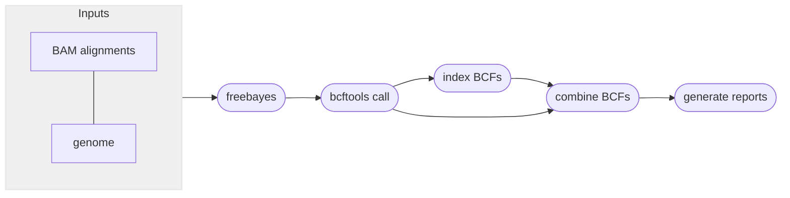
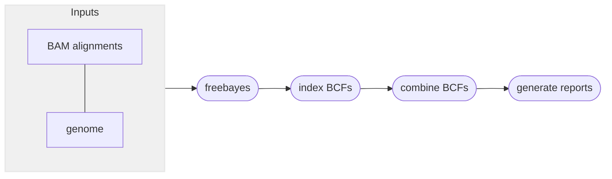

# :icon-sliders: Call SNPs and small indels

===  :icon-checklist: You will need
- at least 4 cores/threads available
- sequence alignments, in BAM format: [!badge variant="success" text=".bam"]
- genome assembly in FASTA format: [!badge variant="success" text=".fasta"] [!badge variant="success" text=".fa"] [!badge variant="success" text=".fasta.gz"] [!badge variant="success" text=".fa.gz"]
- [!badge variant="ghost" text="optional"] sample grouping file
==- :icon-file: sample grouping file [!badge variant="ghost" text="optional"]
This file is optional and useful if you want variant calling to happen on a per-population level.
- takes the format of sample[!badge variant="ghost" text="tab"]group
    - spaces can be used as delimeters too
- the groups can be numbers or text (_i.e._ meaningful population names)
- you can comment out lines with `#` for Harpy to ignore them
- create with [!badge corners="pill" text="harpy popgroup"](othermodules.md/#popgroup) or manually
- if created with [!badge corners="pill" text="harpy popgroup"](othermodules.md/#popgroup), all the samples will be assigned to group `pop1`, so make sure to edit the second column to reflect your data correctly.

``` example file for --populations
sample1 pop1
sample2 pop1
sample3 pop2
sample4 pop1
sample5 pop3
#sample5 pop4
```

!!!warning known quirk
There's an unusual error on the Snakemake side of things that happens when the name of a sample and population are identical.
It has been unclear how to resolve this issue, so to protect yourself, it's best to make sure the population names are different
from the sample names. A simple fix would be to use underscores (`_`) to differentiate the population name.
!!!
===

After reads have been aligned, _e.g._, with [!badge corners="pill" text="harpy align"](Align/bwa.md), you can use those alignment files
(`.bam`) to call variants in your data. Harpy can call SNPs and small indels using 
[bcftools mpileup](#snp-calling-workflow) or with [freebayes](#snp-calling-workflow). 
You can call SNPs with the [!badge corners="pill" text="snp"] module:

```bash usage
harpy snp method OPTIONS... INPUTS...
```

```bash examples
# call variants with mpileup
harpy snp mpileup --threads 20 --genome genome.fasta Align/bwa

# call variants with freebayes
harpy snp freebayes --threads 20 --genome genome.fasta Align/bwa
```

## :icon-terminal: Running Options
In addition to the [!badge variant="info" corners="pill" text="common runtime options"](../commonoptions.md), the [!badge corners="pill" text="snp"] module is configured using these command-line arguments:

{.compact}
| argument         | short name | type                            | default | required | description                                         |
|:-----------------|:----------:|:--------------------------------|:-------:|:--------:|:----------------------------------------------------|
| `INPUTS`           |            | file/directory paths  |         | **yes**  | Files or directories containing [input BAM files](/commonoptions.md#input-arguments)   |
| `--genome`       |    `-g`    | file path                       |         | **yes**  | Genome assembly for variant calling                 |
| `--regions`      |    `-r`    | integer/file path/string        |  50000  |    no    | Regions to call variants on ([see below](#regions))             |
| `--populations`  |    `-p`    | file path                       |         |    no    | Tab-delimited file of sample\<*tab*\>group          |
| `--ploidy`       |    `-x`    | integer                         |    2    |    no    | Ploidy of samples                                   |
| `--extra-params` |    `-x`    | string                          |         |    no    | Additional mpileup/freebayes arguments, in quotes   |

### regions
The `--regions` (`-r`) option lets you specify the genomic regions you want to call variants on. Keep in mind that
`mpileup` uses 1-based positions for genomic intervals, whereas `freebayes` uses 0-based positions. Harpy will perform
variant calling in parallel over these invervals and they can be specified in three ways:

=== Option 1: Call variants over entire genome
!!!info
**input**: an integer to make fixed-size genomic intervals

**example**: `harpy snp -r 25000 -g genome.fasta data/mapped`
!!!

This is the default method (`-r 50000`), where Harpy will create 50 kbp non-overlapping genomic intervals across
the entire genome. Intervals towards the end of contigs that are shorter than the specified interval
size are still used. These invervals look like:
```
chromosome_1    1   50000
chromosome_1    50001 100000
chromosome_1    100001  121761    <- reached the end of the contig
```

==- Option 2: Call variants on exactly one genomic interval
!!!info
**input**: a single region in the format `contig:start-end`

**example**: `harpy snp -r chrom1:2000-15000 -g genome.fasta data/mapped`
!!!

Following the `mpileup` and `freebayes` format, you can specify a single genomic interval of interest
to call variants on. This interval must be in the format `contig:start-end` where:
- `contig` is the exact name of a contig in the supplied genome
- `start` is an integer specifying the start position of the interval for that `contig`
- `end` is an integer specifying the end position of the interval for that `contig`

==- Option 3: Call variants on specific genomic intervals
!!!info
**input**: a tab (or space) delimited file of contigs and positions

**example**: `harpy snp -r data/positions.txt -g genome.fasta data/mapped`
!!!

A BED-like file of `contig<whitespace>start<whitespace>end` can be provided to call variants
on only specific genomic intervals. This file will look like:
```
chromosome_1    1   45000
chromosome_1    723123 999919
chromosome_5    22421   564121
```
===

### populations
Grouping samples changes the way the variant callers computes certain statistics when calling variants. If you
have reason to believe there is a biologically meaningful grouping scheme to your samples, then you should include
it.

## :icon-filter: Filtering Variants
The discussion around filtering SNPs and indels is _massive_ and many researchers go about it differently, each very
opinionated as to why their method is the best. As a starting point, have a look at how the authors of `HTSlib` give [a
technical overview of variant filtering](http://www.htslib.org/workflow/filter.html). It's a dense read, but does offer
insights and considerations for SNP/indel filtering. Here are some of the basic things to be mindful of for variant filtering:

==- using bcftools to filter
The best and fastest way to filter variants is to use [bcftools](https://samtools.github.io/bcftools/bcftools.html#expressions),
which has a bit of a learning curve, but its power is unmatched. Filtering can be achieved using either `bcftools view` or `bcftools filter`
and the filtering expression can either be `-i` to **include** sites or `-e` to **exclude** sites matching the expression: 
```bash
# bcftools view approach
bcftools view -i 'EXPRESSION' input.vcf > output.vcf
bcftools view -e 'EXPRESSION' input.vcf > output.vcf

# bcftools filter approach
bcftools filter -i 'EXPRESSION' input.vcf > output.vcf
bcftools filter -e 'EXPRESSION' input.vcf > output.vcf
```
In either case, you can add `-Ob` to output a compressed `bcf` (recommended) file instead of an uncompressed `vcf` file (default). The
[EXPRESSION](https://samtools.github.io/bcftools/bcftools.html#expressions) is extremely flexible and multiple expressions can be chained
with `||` (OR) and `&&` (AND).
```bash filtering expression examples
# -e to EXCLUDE
bcftools view -Ob -e 'QUAL <= 10 || DP > 35 || MQBZ < -3 || RPBZ < -3 || RPBZ > 3 || FORMAT/SP > 32 || SCBZ > 3' in.vcf > out.bcf

# -i to INCLUDE, this example would result in the same output as the -e example
bcftools filter -Ob -i 'QUAL > 10 || DP <= 35 || MQBZ >= -3 || RPBZ >= -3 || RPBZ <= 3 || FORMAT/SP <= 32 || SCBZ <= 3' in.vcf > out.bcf
```
===

#### genotype quality (QUAL)
You will obviously want higher quality genotype calls to remove false positives. The HTSlib guide suggests at least `50` (e.g. `-i 'QUAL>=50'`),
but we typically filter much higher at `90` or more (e.g. `-i 'QUAL>=90'`).

#### read depth (DP)
Variant sites with too few reads backing up the genotype might be false positives, although this may not hold true for very
low-coverage data. Conversely, a maximum cut off is important because sites with very high read depths (relative to the distribution of read depth)
are likely repetitive ones mapping to multiple parts of the genome. You could used fixed values for these thresholds that make sense for your data.
One scalable approach is to define the thresholds as quantiles, such as the `0.01` and `0.99` quantiles of read depths, which would remove the
sites with the lowest 1% and highest 1% read depths. These are example quantiles and they don't need to be symmetric. It would be best to
plot the distribution of site depths to assess what makes sense for your data. Unfortunately, `bcftools` does not have internal routines to calculate
quantiles

#### minor allele frequency (MAF)
It's usually advisable to set a minor allele frequency threshold with which to remove sites below that threshold. The reasoning
is that if a MAF is too low, it might be because of incorrectly called genotypes in a very small handful of individuals (e.g. one or two). The MAF threshold is again dependent on your data, although it's
fairly common to use `0.05` (e.g. `-i 'MAF>0.05'`) to `0.10` (e.g. `-i 'MAF>0.10'`).

#### missing data (F_MISSING)
Missing data is, frankly, not terribly useful. The amount of missing data you're willing to tolerate will depend on your study, but
it's common to remove sites with >20% missing data (e.g. `-e 'F_MISSING>0.2'`). This can be as strict (or lenient) as you want; it's not uncommon to see very
conservative filtering at 10% or 5% missing data. **However**, you can impute missing genotypes to recover
missing data! Harpy can leverage linked-read information to impute genotypes with the [!badge corners="pill" text="impute"](impute.md)
module. You should try to impute genotypes first before filtering out sites based on missingness.


----
## :icon-git-pull-request: SNP calling workflow
+++ :icon-git-merge: details
The workflow is parallelized over genomic intervals (`--`). All intermediate outputs are removed, leaving 
you only the raw variants file (in `.bcf` format), the index of that file, and some stats about it.

### mpileup
The `mpileup` and `call` modules from [bcftools](https://samtools.github.io/bcftools/bcftools.html) (formerly samtools) 
are used to call variants from alignments. 



### freebayes
[Freebayes](https://github.com/freebayes/freebayes) is a very popular variant caller that uses local haplotype assemblies to
call SNPs and small indels. Like mpileup, this method is ubiquitous in bioinformatics and very easy to use. 



+++ :icon-file-directory: snp output
The default output directory is `SNP/mpileup` or `SNP/freebayes`(depending on workflow) with the folder structure below.
Below, `contig1` and `contig2` are generic contig names from an imaginary `genome.fasta` for demonstration purposes.
The resulting folder also includes a `workflow` directory (not shown) with workflow-relevant runtime files and information.
```
SNP/method
├── variants.raw.bcf
├── variants.raw.bcf.csi
├── logs
│   ├── contig1.call.log   # mpileup only
│   ├── contig1.METHOD.log
│   ├── contig2.call.log   # mpileup only
│   ├── contig2.METHOD.log
│   ├── sample.groups
│   ├── samples.files
│   └── samples.names
└── reports
    ├── contig1.stats
    ├── contig2.stats
    ├── variants.raw.html
    └── variants.raw.stats
```
{.compact}
| item                      | description                                                                                    |
|:--------------------------|:-----------------------------------------------------------------------------------------------|
| `variants.raw.bcf`        | vcf file produced from variant calling, contains all samples and loci                          |
| `variants.*.bcf.csi`      | index file for `variants.*.bcf`                                                                |
| `logs/*.call.log`         | what `bcftools call` writes to `stderr`                                                        |
| `logs/*.METHOD.log`       | what `bcftools mpileup` or `freebayes` writes to `stderr`                                      |
| `logs/sample.groups`      | if provided, a copy of the file provided to `--populations` with commented lines removed       |
| `logs/samples.files`      | list of alignment files used for variant calling                                               |
| `logs/samples.names`      | list of sample names associated with alignment files used for variant calling                  |
| `reports/*.stats`         | output of `bcftools stats`                                                                     |
| `reports/variants.*.html` | report summarizing variants                                                                    |

+++ :icon-code-square: mpileup parameters
By default, Harpy runs `mpileup` with these parameters (excluding inputs and outputs):
```bash
bcftools mpileup --region contigname:START-END --annotate AD --output-type b --ploidy ploidy
```

The mpileup module of samtools has *a lot* of command line options. Listing them all here would be difficult to read, therefore please
refer to the [mpileup documentation](http://www.htslib.org/doc/samtools-mpileup.html#OPTIONS) to explore ways to configure your mpileup run.

+++ :icon-code-square: freebayes parameters
By default, Harpy runs `freebayes` with these parameters (excluding inputs and outputs):
```bash
freebayes -f genome.fasta -r contigname:START-END -L bam.list -p ploidy
```

Freebayes has *a lot* of command line options. Listing them all here would be difficult to read, therefore please
refer to the [freebayes documentation](https://github.com/freebayes/freebayes#usage) to explore ways to configure your freebayes run.
+++ :icon-graph: reports
These are the summary reports Harpy generates for this workflow. You may right-click
the image and open it in a new tab if you wish to see the example in better detail.

||| Variant stats

Summarizes information provided by `bcftools stats` on the called SNPs and indels.


|||

+++
