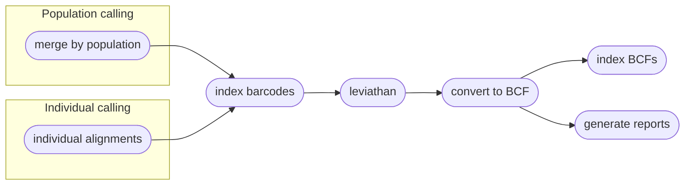

# Calling Variants
|||  :icon-checklist: You will need
- at least 4 cores/threads available
- a genome assembly in FASTA format
- alignment files
- sample grouping file ([see below](#sample-grouping-file))
|||

After reads have been aligned, e.g. with `harpy align`, you can use those alignment files
(`.bam`) to call variants in your data. Harpy can call variants using `bcftools mpileup`,
which calls SNPs and indels primarily, or with `LEVIATHAN`, which only calls structural variants (SV)
such as inversions and duplications. You can call variants with Harpy using the `variants` module:
```bash
harpy variants OPTIONS... 
```

## Running Options
| argument         | short name | type        | default | required | description                                                            |
|:-----------------|:----------:|:------------|:-------:|:--------:|:-----------------------------------------------------------------------|
| `--genome`       |    `-g`    | file path   |         | **yes**  | Genome assembly for variant calling                                    |
| `--dir`          |    `-d`    | folder path |         | **yes**  | Directory with sequence alignments                                     |
| `--populations`  |    `-p`    | file path   |         |    no    | Tab-delimited file of sample\<tab\>group                               |
| `--ploidy`       |    `-x`    | integer     |    2    |    no    | Ploidy of samples                                                      |
| `--leviathan`    |    `-l`    | toggle      |         |    no    | Call variants with Leviathan instead of bcftools                       |
| `--extra-params` |    `-x`    | string      |         |    no    | Additional mpileup/Leviathan parameters, in quotes                     |
| `--threads`      |    `-t`    | integer     |    4    |    no    | Number of threads to use                                               |
| `--snakemake`    |    `-s`    | string      |         |    no    | Additional Snakemake options, in quotes ([more info](../getstarted.md/#adding-additional-snakamake-parameters)) |
| `--help`         |            |             |         |          | Show the module docstring                                              |

### sample grouping file
This file is entirely optional and useful if you want variant calling to happen on a per-population level.
- takes the format of sample\<tab\>group
- the groups can be numbers or text (_i.e._ meaningful population names)
- create with `harpy extra -p <samplefolder>` or manually
- if created with `harpy extra -p`, all the samples will be assigned to group `1`, so make sure to edit the second column to reflect your data correctly.
- the file looks like:
``` popgroups.txt
sample1 1
sample2 1
sample3 2
sample4 1
sample5 3
```

----
## Workflows
### bcftools mpileup
The `mpileup` and `call` modules from [bcftools](https://samtools.github.io/bcftools/bcftools.html) (formerly samtools) 
are used to call variants from alignments. This is a tried-and-true method and one of methods featured in other variant
callers, such as that provided in [ANGSD](http://www.popgen.dk/angsd/index.php/Genotype_Likelihoods), which is why Harpy
uses it by default. To speed things along, Harpy will parallelize `mpileup` to call variants separately on different contigs, 
then merge everything at the end. This would mean that a more fragmented assembly would probably run faster than a 
chromosome-scale one, but you're more likely to have fewer variants detected. All intermediate outputs are removed, leaving 
you only the raw variants file (in `.bcf` format), the index of that file, and some basic stats about it.


### Leviathan
[Leviathan](https://github.com/morispi/LEVIATHAN) is an alternative variant caller that uses linked read barcode information 
to call structural variants (indels, inversions, etc.) exclusively, meaning it does not call SNPs. Harpy first uses [LRez](https://github.com/morispi/LRez) to index the barcodes 
in the alignments, then it calls variants using Leviathan.

#### Individual-level variant calling
When not using a population grouping file via `--populations`, variants will be called per-sample. 
Due to the nature of Structural Variant (SV) VCF files, there isn't an entirely fool-proof way 
of combining the variants of all the samples into a single VCF file, therefore the output will be a VCF for every sample.

#### Population-level variant calling
With the inclusion of a population grouping file via `--populations`, Harpy will merge the bam files of all samples within a 
population and call SV's on these alignment pools. Preliminary work shows that this way identifies more variants and fewer false 
positives. **However**, individual-level information gets lost using this approach, so you will only be able to assess 
population-level variants, if that's what your primary interest is. 

!!!warning Potential barcode clashing
If pooling by population, be mindful of potential sources of barcode clashing. For example, Gen I haplotagging uses 4-segment beadtags,
`AXXCXXBXXDXX`, where `A`, `B`, `C`, and `D` can range from `1`-`96`, but the `C` barcode is specific for a sample (i.e. it does not change within
a sample). If your samples were sequenced across different lanes (i.e. were not prepared on the same plate in the laboratory), a common method to
reduce artifactual sequencing bias, then there's a possibility multiple samples within a population might have the same `C` barcode due to laboratory
preparation. If you have samples within a population with clashing `C` barcodes, you will need to replace the `C` part of the barcode in the BAM headers
to make sure each sample has a unique `C`, otherwise it might confuse Leviathan.
!!!

