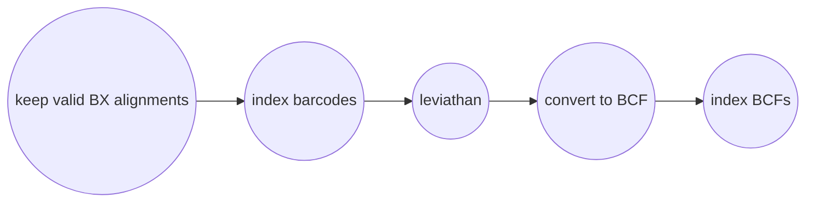

# Calling Variants
You can call variants with Harpy by calling the `variants` module:
```bash
harpy variants OPTIONS... 
```
|||  :icon-checklist: You will need
- at least 4 cores/threads available
- a genome assembly in FASTA format
- alignment files
- sample grouping file ([see below](variantcalling.md/#sample-grouping-file))
|||

## Running Options
| argument         | short name | type                  | default | required | description                                        |
|:-----------------|:----------:|:----------------------|:-------:|:--------:|:---------------------------------------------------|
| `--genome`       |    `-g`    | file path             |         | **yes**  | Genome assembly for variant calling                |
| `--dir`          |    `-d`    | folder path           |         | **yes**  | Directory with sequence alignments                 |
| `--populations`  |    `-p`    | file path             |         |    no    | Tab-delimited file of sample\<tab\>group           |
| `--ploidy`       |    `-x`    | integer               |    2    |    no    | Ploidy of samples                                  |
| `--leviathan`    |    `-l`    | toggle                |         |    no    | Call variants with Leviathan instead of bcftools   |
| `--extra-params` |    `-x`    | string                |         |    no    | Additional mpileup/Leviathan parameters, in quotes |
| `--threads`      |    `-t`    | integer               |    4    |    no    | Number of threads to use                           |
| `--snakemake`    |    `-s`    | string                |         |    no    | Additional Snakemake options, in quotes            |
| `--help`         |            |                       |         |          | Show the module docstring                          |

### sample grouping file
This file is entirely optional and useful if you want variant calling to happen on a per-population level.
- takes the format of sample\<tab\>group
- create with `harpy init -p <samplefolder>` or manually
- if created with `harpy init -p`, all the samples will be assigned to group `1`, so make sure to edit the second column to reflect your data correctly.
- the file looks like:
``` popgroups.txt
sample1 1
sample2 1
sample3 2
sample4 1
sample5 3
```
----
## Workflows
### bcftools mpileup
The `mpileup` and `call` modules from [bcftools](https://samtools.github.io/bcftools/bcftools.html) (formerly samtools) 
are used to call variants from alignments. This is a tried-and-true method and one of methods featured in other variant
callers, such as that provided in [ANGSD](http://www.popgen.dk/angsd/index.php/Genotype_Likelihoods), which is why Harpy
uses it by default. To speed things along, Harpy will parallelize `mpileup` to call variants separately on different contigs, 
then merge everything at the end. This would mean that a more fragmented assembly would probably run faster than a 
chromosome-scale one, but you're more likely to have fewer variants detected. All intermediate outputs are removed, leaving 
you only the raw variants file (in `.bcf` format), the index of that file, and some basic stats about it.


### Leviathan
[Leviathan](https://github.com/morispi/LEVIATHAN) is an alternative variant caller that uses linked read barcode information to call structural variants (indels, etc.). 
Harpy first uses [LRez](https://github.com/morispi/LRez) to index the barcodes in the alignments, then
it calls variants for individual samples using Leviathan. Due to the nature of Structural Variant (SV) 
VCF files, there isn't an entirely fool-proof way of combining the variants of all the samples into a 
single VCF file, therefore the output will be a VCF for every sample. It's unclear what Leviathan does with invalid
barcodes and until that gets clarified, Harpy will preprocess alignments to keep
only alignments with a complete barcode (no `00` beadtags, [read more below](#barcode-validation)).



!!!info 
#### Barcode Validation
Haplotag beadtags are stored in fastq read headers with the `BX:Z` tag, and
this information is retained in the alignment (.bam) files. When demultiplexing,
unresolved beadtag sections are encoded as `00`, for example the `A00` in 
`A00C15B22D76`. The haplotag toggle in `EMA` recognizes this and considers those
barcodes invalid. However, `Leviathan` doesn't have this behavior documented, so 
we don't know if invalid barcodes are ignored, or if `Leviathan` (or `LRez`) 
treats `00` as valid. If not, this would be a problem because it may be incorrectly
associating alignments with molecules that are actually undetermined. As a 
precaution, we only keep alignments with complete `AxxCxxBxxDxx` barcodes.
There is an [open Issue](https://github.com/morispi/LEVIATHAN/issues/8)
on the Leviathan repository addressing that.
!!!