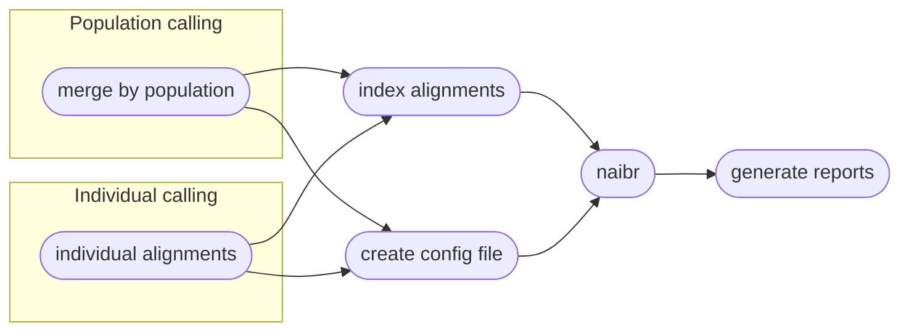
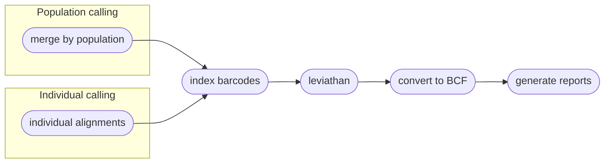

# :icon-sliders: Calling Variants
===  :icon-checklist: You will need
- at least 4 cores/threads available
- a genome assembly in FASTA format
- sequence alignments, in `.bam` format
- sample grouping file ([see below](#sample-grouping-file))
===

After reads have been aligned, _e.g._ with `harpy align`, you can use those alignment files
(`.bam`) to call variants in your data. Harpy can call variants using `bcftools mpileup`,
which calls SNPs and indels primarily, or with `LEVIATHAN`, which only calls structural variants (SV)
such as inversions and duplications. You can call variants with Harpy using the `variants` module:

```bash usage
harpy variants OPTIONS... 
```

```bash examples
# call variants with mpileup
harpy variants --threads 20 --genome genome.fasta --dir Align/ema

# call structural variants with LEVIATHAN
harpy variants --threads 20 --genome genome.fasta --dir Align/ema --method leviathan
```

## :icon-terminal: Running Options
| argument         | short name | type                            | default | required | description                                                                                     |
|:-----------------|:----------:|:--------------------------------|:-------:|:--------:|:------------------------------------------------------------------------------------------------|
| `--genome`       |    `-g`    | file path                       |         | **yes**  | Genome assembly for variant calling                                                             |
| `--dir`          |    `-d`    | folder path                     |         | **yes**  | Directory with sequence alignments                                                              |
| `--populations`  |    `-p`    | file path                       |         |    no    | Tab-delimited file of sample\<tab\>group                                                        |
| `--ploidy`       |    `-x`    | integer                         |    2    |    no    | Ploidy of samples                                                                               |
| `--method`       |    `-l`    | choice [`mpileup`, `naibr`, `leviathan`] | mpileup |    no    | Which variant caller to use                                                                     |
| `--extra-params` |    `-x`    | string                          |         |    no    | Additional mpileup/Leviathan arguments, in quotes                                               |
| `--threads`      |    `-t`    | integer                         |    4    |    no    | Number of threads to use                                                                        |
| `--snakemake`    |    `-s`    | string                          |         |    no    | Additional [Snakemake](../snakemake/#adding-snakamake-parameters) options, in quotes |
| `--quiet`        |    `-q`    | toggle                          |         |    no    | Supressing Snakemake printing to console                                                        |
| `--help`         |            |                                 |         |          | Show the module docstring                                                                       |


### :icon-file: sample grouping file
This file is entirely optional and useful if you want variant calling to happen on a per-population level.
- takes the format of sample\<tab\>group
- the groups can be numbers or text (_i.e._ meaningful population names)
- create with `harpy extra -p <samplefolder>` or manually
- if created with `harpy extra -p`, all the samples will be assigned to group `pop1`, so make sure to edit the second column to reflect your data correctly.
- the file looks like:
``` popgroups.txt
sample1 pop1
sample2 pop1
sample3 pop2
sample4 pop1
sample5 pop3
```

!!!warning known quirk
There's an unusual error on the Snakemake side of things that happens when the name of a sample and population are identical.
It has been unclear how to resolve this issue, so to protect yourself, it's best to make sure the population names are different
from the sample names. A simple fix would be to use underscores (`_`) to differentiate the population name.
!!!

----
### :icon-git-pull-request: mpileup workflow
+++ :icon-git-merge: details
The `mpileup` and `call` modules from [bcftools](https://samtools.github.io/bcftools/bcftools.html) (formerly samtools) 
are used to call variants from alignments. This is a tried-and-true method and one of methods featured in other variant
callers, such as that provided in [ANGSD](http://www.popgen.dk/angsd/index.php/Genotype_Likelihoods), which is why Harpy
uses it by default. To speed things along, Harpy will parallelize `mpileup` to call variants separately on different contigs, 
then merge everything at the end. This would mean that a more fragmented assembly would probably run faster than a 
chromosome-scale one, but you're more likely to have fewer variants detected. All intermediate outputs are removed, leaving 
you only the raw variants file (in `.bcf` format), the index of that file, and some basic stats about it.


+++ :icon-file-directory: mpileup output
The `harpy variants` module creates a `Variants/mpileup` directory with the folder structure below. `contig1` and `contig2` are generic contig names from an imaginary `genome.fasta` for demonstration purposes. 
Harpy will also write a record of the relevant runtime parameters in `logs/variants.params`.
```
Variants/mpileup
├── variants.normalized.bcf
├── variants.normalized.bcf.csi
├── variants.raw.bcf
├── variants.raw.bcf.csi
├── logs
│   ├── contig1.call.log
│   ├── contig1.mpileup.log
│   ├── contig2.call.log
│   ├── contig2.mpileup.log
│   ├── samples.files
│   └── samples.names
└── stats
    ├── contig1.stats
    ├── contig2.stats
    ├── variants.normalized.html
    ├── variants.normalized.stats
    ├── variants.raw.html
    └── variants.raw.stats
```
| item                      | description                                                                                   |
|:--------------------------|:----------------------------------------------------------------------------------------------|
| `variants.raw.bcf`        | vcf file produced from variant calling, contains all samples and loci                         |
| `variants.normalized.bcf` | left-aligned (parsimonious) variants with multiallelic sites decomposed and duplicates removed |
| `variants.*.bcf.csi`      | index file for `variants.*.bcf`                                                               |
| `logs/*.call.log`         | what `bcftools call` writes to `stderr`                                                       |
| `logs/*.mpileup.log`      | what `bcftools mpileup` writes to `stderr`                                                    |
| `samples.files`           | list of alignment files used for variant calling                                              |
| `samples.names`           | list of sample names associated with alignment files used for variant calling                 |
| `stats/*.stats`           | output of `bcftools stats`                                                                    |
| `stats/variants.*.html`   | report summarizing variants                                                                   |

+++ :icon-code-square: mpileup parameters
By default, Harpy runs `mpileup` with these parameters (excluding inputs and outputs):
```bash
bcftools mpileup --region contigname --annotate AD --output-type b
```

The mpileup module of samtools has *a lot* of command line options. Listing them all here would be difficult to read, therefore please
refer to the [mpileup documentation](http://www.htslib.org/doc/samtools-mpileup.html#OPTIONS) to explore ways to configure your mpileup run.
+++

### :icon-git-pull-request: NAIBR workflow
+++ :icon-git-merge: details
[Naibr](https://github.com/raphael-group/NAIBR) is an alternative variant caller that uses linked read barcode information 
to call structural variants (indels, inversions, etc.) exclusively, meaning it does not call SNPs. The authors of Naibr have not been updating or improving it, so Harpy uses
[an active fork](https://github.com/pontushojer/NAIBR) of it that is available on [Bioconda](https://anaconda.org/bioconda/naibr-plus) under the name `naibr-plus`. This fork includes improved accuracy as well as quality-of-life updates.

#### Single-sample variant calling
When not using a population grouping file via `--populations`, variants will be called per-sample. 
Due to the nature of Structural Variant (SV) VCF files, there isn't an entirely fool-proof way 
of combining the variants of all the samples into a single VCF file, therefore the output will be a VCF for every sample.

#### Pooled-sample variant calling
With the inclusion of a population grouping file via `--populations`, Harpy will merge the bam files of all samples within a 
population and call SV's on these alignment pools. Preliminary work shows that this way identifies more variants and with fewer false 
positives. **However**, individual-level information gets lost using this approach, so you will only be able to assess 
group-level variants, if that's what your primary interest is. 



+++ :icon-file-directory: naibr output
The `harpy variants --method naibr` module creates a `Variants/naibr` (or `naibr-pop`) directory with the folder structure below. `sample1` and `sample2` are generic sample names for demonstration purposes.

```
Variants/naibr/
├── sample1.bedpe
├── sample2.bedpe
├── configs
│   ├── sample1.config
│   └── sample2.config
├── filtered
│   ├── sample1.fail.bedpe
│   └── sample2.fail.bedpe
├── IGV
│   ├── sample1.reformat.bedpe
│   └── sample2.reformat.bedpe
├── logs
│   ├── sample1.log
│   └── sample2.log
├── reports
│   ├── sample1.naibr.html
│   └── sample2.naibr.html
└── vcf
    ├── sample1.vcf
    └── sample2.vcf
```

| item          | description                                              |
|:--------------|:---------------------------------------------------------|
| `*.bedpe`     | structural variants identified by NAIBR                  |
| `configs/`    | the configuration files harpy generated for each sample  |
| `filtered/`   | the variants that failed NAIBR's internal filters        |
| `IGV/`        | same as the output .bedpe` files but in IGV format       |
| `logs/*.log`  | what NAIBR writes to `stderr` during operation           |
| `reports/`    | summary reports with interactive plots of detected SV    |
| `vcf/`        | the resulting variants, but in `.VCF` format             |

+++ :icon-code-square: naibr parameters
By default, Harpy runs `naibr` with these parameters (excluding inputs and outputs):
```python
min_mapq = 30
d        = 10000
min_sv   = 1000
k        = 3
```

Below is a list of all `NAIBR` runtime options, excluding those Harpy already uses or those made redundant by Harpy's implementation of NAIBR.
These are taken directly from the [NAIBR documentation](https://github.com/pontushojer/NAIBR#running-naibr). If adding these arguments, do so like:
`-x "min_sv 1000 d 50000"`
``` NAIBR arguments
 -d: The maximum distance in basepairs between reads in a linked-read (default: 10000)
 -blacklist: BED-file with regions to be excluded from analysis
 -candidates: BEDPE-file with novel adjacencies to be scored by NAIBR. This will override automatic detection of candidate novel adjacencies
 -min_sv: Minimum size of a structural variant to be detected (default: lmax, i.e. the 95th percentile of the paired-end read insert size distribution)
 -k: minimum number of barcode overlaps supporting a candidate NA (default = 3)
```
+++

### :icon-git-pull-request: LEVIATHAN workflow
+++ :icon-git-merge: details
[Leviathan](https://github.com/morispi/LEVIATHAN) is an alternative variant caller that uses linked read barcode information 
to call structural variants (indels, inversions, etc.) exclusively, meaning it does not call SNPs. Harpy first uses [LRez](https://github.com/morispi/LRez) to index the barcodes 
in the alignments, then it calls variants using Leviathan.

!!!warning EMA-mapped reads
Leviathan relies on split-read information in the sequence alignments to call variants. The EMA aligner
does not report split read alignments, instead it reports secondary alignments. It is recommended to use
BWA-generated alignments if intending to call variants with leviathan. 
!!!

#### Single-sample variant calling
When not using a population grouping file via `--populations`, variants will be called per-sample. 
Due to the nature of Structural Variant (SV) VCF files, there isn't an entirely fool-proof way 
of combining the variants of all the samples into a single VCF file, therefore the output will be a VCF for every sample.

#### Pooled-sample variant calling
With the inclusion of a population grouping file via `--populations`, Harpy will merge the bam files of all samples within a 
population and call SV's on these alignment pools. Preliminary work shows that this way identifies more variants and with fewer false 
positives. **However**, individual-level information gets lost using this approach, so you will only be able to assess 
group-level variants, if that's what your primary interest is. 


+++ :icon-file-directory: leviathan output
The `harpy variants --method leviathan` module creates a `Variants/leviathan` (or `leviathan-pop`) directory with the folder structure below. `sample1` and `sample2` are generic sample names for demonstration purposes. Harpy will also write a record of the relevant
runtime parameters in `logs/variants.params`.

```
Variants/leviathan/
├── sample1.bcf
├── sample2.bcf
├── logs
│   ├── sample1.leviathan.log
│   ├── sample1.candidates
│   ├── sample2.leviathan.log
│   └── sample2.candidates
├── reports
│   ├── sample1.SV.html
│   └── sample2.SV.html
└── stats
    ├── sample1.sv.stats
    └── sample2.sv.stats
```

| item                   | description                                              |
|:-----------------------|:---------------------------------------------------------|
| `*.bcf`                | structural variants identified by LEVIATHAN              |
| `logs/*.leviathan.log` | what LEVIATHAN writes to `stderr` during operation       |
| `logs/*candidates`     | candidate structural variants LEVIATHAN identified       |
| `reports/`             | summary reports with interactive plots of detected SV    |
| `stats/`               | results of `bcftools stats` on the vcf LEVIATHAN creates |

+++ :icon-code-square: leviathan parameters
By default, Harpy runs `leviathan` with default parameters (shown below), only modifying inputs and outputs at the command line.

Below is a list of all `leviathan` command line options, excluding those Harpy already uses or those made redundant by Harpy's implementation of LEVIATHAN.
These are taken directly from the [LEVIATHAN documentation](https://github.com/morispi/LEVIATHAN).
``` LEVIATHAN arguments
  -r, --regionSize:         Size of the regions on the reference genome to consider (default: 1000)
  -v, --minVariantSize:     Minimum size of the SVs to detect (default: same as regionSize)
  -n, --maxLinks:           Remove from candidates list all candidates which have a region involved in that much candidates (default: 1000)
  -M, --mediumSize:         Minimum size of medium variants (default: 2000)
  -L, --largeSize:          Minimum size of large variants (default: 10000)
  -s, --smallRate:          Percentile to chose as a threshold in the distribution of the number of shared barcodes for small variants (default: 99)
  -m, --mediumRate:         Percentile to chose as a threshold in the distribution of the number of shared barcodes for medium variants (default: 99)
  -l, --largeRate:          Percentile to chose as a threshold in the distribution of the number of shared barcodes for large variants (default: 99)
  -d, --duplicates:         Consider SV as duplicates if they have the same type and if their breakpoints are within this distance (default: 10)
  -s, --skipTranslocations: Skip SVs that are translocations (default: false)
  -p, --poolSize:           Size of the thread pool (default: 100000)
  -B, --nbBins:             Number of iterations to perform through the barcode index (default: 10)
  -c, --minBarcodes:        Always remove candidates that share less than this number of barcodes (default: 1)
```
+++