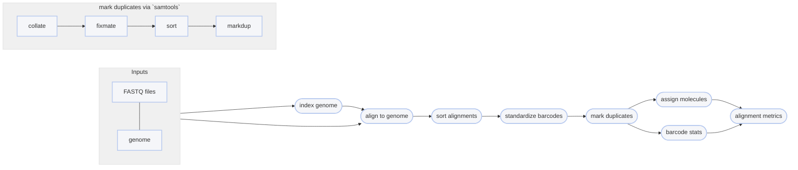

# :icon-quote: Map Reads onto a genome with BWA MEM
[!badge variant="secondary" text="linked reads"] [!badge variant="secondary" text="non-linked reads"]
===  :icon-checklist: You will need
- at least 4 cores/threads available
- a genome assembly in FASTA format: [!badge variant="success" text=".fasta"] [!badge variant="success" text=".fa"] [!badge variant="success" text=".fasta.gz"] [!badge variant="success" text=".fa.gz"] [!badge variant="secondary" text="case insensitive"]
- paired-end fastq sequence files [!badge variant="secondary" text="gzipped recommended"]
    - **sample name**: [!badge variant="success" text="a-z"] [!badge variant="success" text="0-9"] [!badge variant="success" text="."] [!badge variant="success" text="_"] [!badge variant="success" text="-"] [!badge variant="secondary" text="case insensitive"]
    - **forward**: [!badge variant="success" text="_F"] [!badge variant="success" text=".F"] [!badge variant="success" text=".1"] [!badge variant="success" text="_1"] [!badge variant="success" text="_R1_001"] [!badge variant="success" text=".R1_001"] [!badge variant="success" text="_R1"] [!badge variant="success" text=".R1"] 
    - **reverse**: [!badge variant="success" text="_R"] [!badge variant="success" text=".R"] [!badge variant="success" text=".2"] [!badge variant="success" text="_2"] [!badge variant="success" text="_R2_001"] [!badge variant="success" text=".R2_001"] [!badge variant="success" text="_R2"] [!badge variant="success" text=".R2"] 
    - **fastq extension**: [!badge variant="success" text=".fq"] [!badge variant="success" text=".fastq"] [!badge variant="secondary" text="case insensitive"]
===

Once sequences have been trimmed and passed through other QC filters, they will need to
be aligned to a reference genome. This module within Harpy expects filtered reads as input,
such as those derived using [!badge corners="pill" text="harpy qc"](../qc.md). You can map reads onto a genome assembly with Harpy 
using the [!badge corners="pill" text="align bwa"] module:

```bash usage
harpy align bwa OPTIONS... REFERENCE INPUTS...
```
```bash example
harpy align bwa genome.fasta Sequences/ 
```

## :icon-terminal: Running Options
In addition to the [!badge variant="info" corners="pill" text="common runtime options"](/common_options.md), the [!badge corners="pill" text="align bwa"] module is configured using these command-line arguments:

{.compact}
| argument              | short name | type                 | default | description                                                                                                                    |
| :-------------------- | :--------: | :------------------- | :-----: | :----------------------------------------------------------------------------------------------------------------------------- |
| `INPUTS`              |            | file/directory paths |         | [!badge variant="info" text="required"] Files or directories containing [input FASTQ files](/common_options.md#input-arguments) |
| `REFERENCE`           |            | file path            |         | [!badge variant="info" text="required"] Reference assembly for read mapping                                                       |
| `--contigs`           |            | file path or list    |         | [Contigs to plot](/common_options.md#--contigs) in the report                                                                   |
| `--extra-params`      |    `-x`    | string               |         | Additional BWA arguments, in quotes                                                                                  |
| `--molecule-distance` |    `-d`    | integer              | `100000`  | Base-pair distance threshold to separate molecules, disabled with `0`                                                                             |
| `--min-quality`       |    `-q`    | integer (0-40)       |   `30`    | Minimum `MQ` (SAM mapping quality) to pass filtering                                                                         |
| `--keep-unmapped`     |    `-u`    | toggle               |  false  | Output unmapped sequences too                                                                                                  |

### Output format
Regardless of the input linked-read format, the `align` workflows will standardize the output alignment records
such that the barcode is contained in the `BX:Z` tag and barcode validation is in the `VX:i` tag.

### Molecule distance
The `--molecule-distance` option is used during the BWA alignment workflow
to assign alignments a unique Molecular Identifier `MI:i` tag based on their
 haplotag barcode and the distance threshold you specify. See 
[haplotag data](/haplotagdata/#barcode-thresholds) for more information on
what this value does. Set this value to `0` to skip distance-based deconvolution,
which may improve detection of very large structural variants. 

## Quality filtering
The `--min-quality` argument filters out alignments below a given $MQ$ threshold. The default, `30`, keeps alignments
that are at least 99.9% likely correctly mapped. Set this value to `1` if you only want alignments removed with
$MQ = 0$ (0% likely correct). You may also set it to `0` to keep all alignments for diagnostic purposes.
The plot below shows the relationship between $MQ$ score and the likelihood the alignment is correct and will serve to help you decide
on a value you may want to use. It is common to remove alignments with $MQ <30$ (<99.9% chance correct) or $MQ <40$ (<99.99% chance correct).

==- What is the $MQ$ score?
Every alignment in a BAM file has an associated mapping quality score ($MQ$) that informs you of the likelihood 
that the alignment is accurate. This score can range from 0-40, where higher numbers mean the alignment is more
likely correct. The math governing the $MQ$ score actually calculates the percent chance the alignment is ***incorrect***: 
$$
\%\ chance\ incorrect = 10^\frac{-MQ}{10} \times 100\\
\text{where }0\le MQ\le 40
$$
You can simply subtract it from 100 to determine the percent chance the alignment is ***correct***:
$$
\%\ chance\ correct = 100 - \%\ chance\ incorrect\\
\text{or} \\
\%\ chance\ correct = (1 - 10^\frac{-MQ}{10}) \times 100
$$


===

## Marking PCR duplicates
Harpy uses `samtools markdup` to mark putative PCR duplicates by using both the `BX` tag
as a UMI (unique molecule identified) for more accurate duplicate detection. The read name
is also parsed to determine if the sequencing platform was HiSeq/NovaSeq to distinguish between
PCR and optical duplicates. Duplicate marking also uses the `-S` option to mark supplementary (chimeric)
alignments as duplicates if the primary alignment was marked as a duplicate. Duplicates get marked but **are not removed**.

----

## :icon-git-pull-request: BWA workflow
+++ :icon-git-merge: details
- default aligner
- ignores (but retains) barcode information
- fast

The [BWA MEM](https://github.com/lh3/bwa) workflow is much simpler and faster than the EMA workflow
and maps all reads against the reference genome. Duplicates are marked using `samtools markdup`.
The `BX:Z` tags in the read headers are still added to the alignment headers, even though barcodes
are not used to inform mapping. The `-m` threshold is used for alignment molecule assignment.


+++ :icon-file-directory: BWA output
The default output directory is `Align/bwa` with the folder structure below. `Sample1` is a generic sample name for demonstration purposes.
The resulting folder also includes a `workflow` directory (not shown) with workflow-relevant runtime files and information.
```
Align/bwa
├── Sample1.bam
├── Sample1.bam.bai
├── logs
│   ├── sample1.bwa.log
│   ├── sample1.markdup.log
│   │── sample1.sort.log
└── reports
    ├── barcodes.summary.html
    ├── bwa.stats.html
    ├── Sample1.html
    └── data
        ├── bxstats
        │   └── Sample1.bxstats.gz
        └── coverage
            └── Sample1.cov.gz
```
{.compact}
| item     | description                                                                                                 |
|:---------|:------------------------------------------------------------------------------------------------------------|
| `*.bam`                             | sequence alignments for each sample                                              |
| `*.bai`                             | sequence alignment indexes for each sample                                       |
| `logs/*bwa.log`                     | output of BWA during run                                                         |
| `logs/*markdup.log`                 | stats provided by `samtools markdup`                                             |
| `logs/*sort.log`                    | output of `samtools sort`                                                        |
| `reports/`                          | various counts/statistics/reports relating to sequence alignment                 |
| `reports/barcodes.summary.html`     | interactive html report summarizing barcode-specific metrics across all samples                                            |
| `reports/bwa.stats.html`            | report summarizing `samtools flagstat and stats` results across all samples from `multiqc` |
| `reports/Sample1.html`              | interactive html report summarizing BX tag metrics and alignment coverage        | 
| `reports/data/coverage/*.cov.gz`    | output from samtools cov, used for plots                                         |
| `reports/data/bxstats`              | tabular data containing the information used to generate the BX stats in reports |

+++ :icon-code-square: BWA parameters
By default, Harpy runs `bwa` with these parameters (excluding inputs and outputs):
```bash
bwa mem -C -R "@RG\tID:samplename\tSM:samplename"
```

Below is a list of all `bwa mem` command line arguments, excluding those Harpy already uses or those made redundant by Harpy's implementation of BWA.
These are taken directly from the [BWA documentation](https://bio-bwa.sourceforge.net/bwa.shtml).
```bwa arguments
-k INT 	Minimum seed length. Matches shorter than INT will be missed. The alignment speed is usually insensitive to this value unless it significantly deviates 20. [19]
-w INT 	Band width. Essentially, gaps longer than INT will not be found. Note that the maximum gap length is also affected by the scoring matrix and the hit length, not solely determined by this option. [100]
-d INT 	Off-diagonal X-dropoff (Z-dropoff). Stop extension when the difference between the best and the current extension score is above |i-j|*A+INT, where i and j are the current positions of the query and reference, respectively, and A is the matching score. Z-dropoff is similar to BLAST’s X-dropoff except that it doesn’t penalize gaps in one of the sequences in the alignment. Z-dropoff not only avoids unnecessary extension, but also reduces poor alignments inside a long good alignment. [100]
-r FLOAT 	Trigger re-seeding for a MEM longer than minSeedLen*FLOAT. This is a key heuristic parameter for tuning the performance. Larger value yields fewer seeds, which leads to faster alignment speed but lower accuracy. [1.5]
-c INT 	Discard a MEM if it has more than INT occurence in the genome. This is an insensitive parameter. [10000]
-P 	In the paired-end mode, perform SW to rescue missing hits only but do not try to find hits that fit a proper pair.
-A INT 	Matching score. [1]
-B INT 	Mismatch penalty. The sequence error rate is approximately: {.75 * exp[-log(4) * B/A]}. [4]
-O INT 	Gap open penalty. [6]
-E INT 	Gap extension penalty. A gap of length k costs O + k*E (i.e. -O is for opening a zero-length gap). [1]
-L INT 	Clipping penalty. When performing SW extension, BWA-MEM keeps track of the best score reaching the end of query. If this score is larger than the best SW score minus the clipping penalty, clipping will not be applied. Note that in this case, the SAM AS tag reports the best SW score; clipping penalty is not deducted. [5]
-U INT 	Penalty for an unpaired read pair. BWA-MEM scores an unpaired read pair as scoreRead1+scoreRead2-INT and scores a paired as scoreRead1+scoreRead2-insertPenalty. It compares these two scores to determine whether we should force pairing. [9]
-T INT 	Don’t output alignment with score lower than INT. This option only affects output. [30]
-a 	Output all found alignments for single-end or unpaired paired-end reads. These alignments will be flagged as secondary alignments.
-H 	Use hard clipping ’H’ in the SAM output. This option may dramatically reduce the redundancy of output when mapping long contig or BAC sequences.
```
+++ :icon-graph: reports
These are the summary reports Harpy generates for this workflow. You may right-click
the images and open them in a new tab if you wish to see the examples in better detail.
||| Alignment BX Information
An aggregate report of barcode-specific alignment information for all samples.

||| Molecule size and Coverage
Reports the inferred molecule sized based on barcodes in the alignments.

||| Samtools Alignment stats
Reports the general statistics computed by samtools `stats` and `flagstat`

|||

+++
