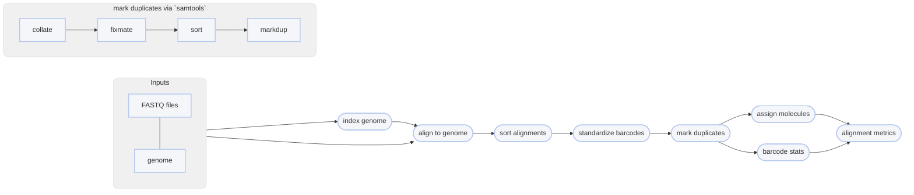

# :icon-quote: Map Reads onto a genome with strobealign

===  :icon-checklist: You will need
- at least 4 cores/threads available
- a genome assembly in FASTA format: [!badge variant="success" text=".fasta"] [!badge variant="success" text=".fa"] [!badge variant="success" text=".fasta.gz"] [!badge variant="success" text=".fa.gz"] [!badge variant="secondary" text="case insensitive"]
- paired-end fastq sequence files [!badge variant="secondary" text="gzipped recommended"]
    - **sample name**: [!badge variant="success" text="a-z"] [!badge variant="success" text="0-9"] [!badge variant="success" text="."] [!badge variant="success" text="_"] [!badge variant="success" text="-"] [!badge variant="secondary" text="case insensitive"]
    - **forward**: [!badge variant="success" text="_F"] [!badge variant="success" text=".F"] [!badge variant="success" text=".1"] [!badge variant="success" text="_1"] [!badge variant="success" text="_R1_001"] [!badge variant="success" text=".R1_001"] [!badge variant="success" text="_R1"] [!badge variant="success" text=".R1"] 
    - **reverse**: [!badge variant="success" text="_R"] [!badge variant="success" text=".R"] [!badge variant="success" text=".2"] [!badge variant="success" text="_2"] [!badge variant="success" text="_R2_001"] [!badge variant="success" text=".R2_001"] [!badge variant="success" text="_R2"] [!badge variant="success" text=".R2"] 
    - **fastq extension**: [!badge variant="success" text=".fq"] [!badge variant="success" text=".fastq"] [!badge variant="secondary" text="case insensitive"]
===

Once sequences have been trimmed and passed through other QC filters, they will need to
be aligned to a reference genome. This module within Harpy expects filtered reads as input,
such as those derived using [!badge corners="pill" text="harpy qc"](../qc.md). You can map reads onto a genome assembly with Harpy 
using the [!badge corners="pill" text="align strobe"] module:

```bash usage
harpy align strobe OPTIONS... REFERENCE INPUTS...
```
```bash example
harpy align strobe genome.fasta Sequences/ 
```

## :icon-terminal: Running Options
In addition to the [!badge variant="info" corners="pill" text="common runtime options"](/common_options.md), the [!badge corners="pill" text="align strobe"] module is configured using these command-line arguments:

{.compact}
| argument                   | type                 | default  | description                                                                                                                     |
|:---------------------------|:---------------------|:--------:|:--------------------------------------------------------------------------------------------------------------------------------|
| `REFERENCE`                | file path            |          | [!badge variant="info" text="required"] Reference genome for read mapping                                                       |
| `INPUTS`                   | file/directory paths |          | [!badge variant="info" text="required"] Files or directories containing [input FASTQ files](/common_options.md#input-arguments) |
| `--contigs`                | file path or list    |          | [Contigs to plot](/common_options.md#--contigs) in the report                                                                   |
| `--extra-params` `-x`      | string               |          | Additional EMA-align/BWA arguments, in quotes                                                                                   |
| `--ignore-bx`              | toggle               |  false   | Ignore parts of the workflow specific to linked-read sequences                                                                  |
| `--keep-unmapped` `-u`     | toggle               |  false   | Output unmapped sequences too                                                                                                   |
| `--min-quality` `-d`       | integer (0-40)       |   `30`   | Minimum `MQ` (SAM mapping quality) to pass filtering                                                                            |
| `--molecule-distance` `-m` | integer              | `100000` | Base-pair distance threshold to separate molecules, disabled with `0`                                                           |

### Molecule distance
The `--molecule-distance` option is used during the BWA alignment workflow
to assign alignments a unique Molecular Identifier `MI:i` tag based on their
 haplotag barcode and the [distance threshold](/linked_read_data.md#barcode-thresholds) you specify. Set this value to `0` to skip distance-based deconvolution,
which may improve detection of very large structural variants.

## Quality filtering
The `--min-quality` argument filters out alignments below a given $MQ$ threshold. The default, `30`, keeps alignments
that are at least 99.9% likely correctly mapped. Set this value to `1` if you only want alignments removed with
$MQ = 0$ (0% likely correct). You may also set it to `0` to keep all alignments for diagnostic purposes.
The plot below shows the relationship between $MQ$ score and the likelihood the alignment is correct and will serve to help you decide
on a value you may want to use. It is common to remove alignments with $MQ <30$ (<99.9% chance correct) or $MQ <40$ (<99.99% chance correct).

==- What is the $MQ$ score?
Every alignment in a BAM file has an associated mapping quality score ($MQ$) that informs you of the likelihood 
that the alignment is accurate. This score can range from 0-40, where higher numbers mean the alignment is more
likely correct. The math governing the $MQ$ score actually calculates the percent chance the alignment is ***incorrect***: 
$$
\%\ chance\ incorrect = 10^\frac{-MQ}{10} \times 100\\
\text{where }0\le MQ\le 40
$$
You can simply subtract it from 100 to determine the percent chance the alignment is ***correct***:
$$
\%\ chance\ correct = 100 - \%\ chance\ incorrect\\
\text{or} \\
\%\ chance\ correct = (1 - 10^\frac{-MQ}{10}) \times 100
$$


===

## Marking PCR duplicates
Harpy uses `samtools markdup` to mark putative PCR duplicates by using both the `BX` tag
as a UMI (unique molecule identified) for more accurate duplicate detection. The read name
is also parsed to determine if the sequencing platform was HiSeq/NovaSeq to distinguish between
PCR and optical duplicates. Duplicate marking also uses the `-S` option to mark supplementary (chimeric)
alignments as duplicates if the primary alignment was marked as a duplicate. Duplicates get marked but **are not removed**.

----

## :icon-git-pull-request: Strobealign workflow
+++ :icon-git-merge: details
- ignores (but retains) barcode information
- ultra-fast
- [as-good-or-better accuracy](https://github.com/ksahlin/strobealign/blob/main/evaluation.md) to BWA MEM for sequences greater than 100bp
    - accuracy may be lower for sequences less than 100bp

The [strobealign](https://github.com/lh3/strobealign) workflow is nearly identical to the BWA workflow,
the only real difference being how the input genome is indexed and that alignment is performed with
`strobealign` instead of BWA. Duplicates are marked using `samtools markdup`.
The `BX:Z` tags in the read headers are still added to the alignment headers, even though barcodes
are not used to inform mapping. The `-m` threshold is used for alignment molecule assignment.


+++ :icon-file-directory: strobealign output
The default output directory is `Align/strobealign` with the folder structure below. `Sample1` is a generic sample name for demonstration purposes.
The resulting folder also includes a `workflow` directory (not shown) with workflow-relevant runtime files and information.
```
Align/strobealign
├── Sample1.bam
├── Sample1.bam.bai
├── logs
│   ├── sample1.strobealign.log
│   ├── sample1.markdup.log
│   │── sample1.sort.log
└── reports
    ├── barcodes.summary.html
    ├── strobealign.stats.html
    ├── Sample1.html
    └── data
        ├── bxstats
        │   └── Sample1.bxstats.gz
        └── coverage
            └── Sample1.cov.gz
```
{.compact}
| item     | description                                                                                                 |
|:---------|:------------------------------------------------------------------------------------------------------------|
| `*.bam`                             | sequence alignments for each sample                                              |
| `*.bai`                             | sequence alignment indexes for each sample                                       |
| `logs/*bwa.log`                     | output of strobealign during run                                                         |
| `logs/*markdup.log`                 | stats provided by `samtools markdup`                                             |
| `logs/*sort.log`                    | output of `samtools sort`                                                        |
| `reports/`                          | various counts/statistics/reports relating to sequence alignment                 |
| `reports/barcodes.summary.html`                | interactive html report summarizing barcode-specific metrics across all samples                                            |
| `reports/strobealign.stats.html`        | report summarizing `samtools flagstat and stats` results across all samples from `multiqc` |
| `reports/Sample1.html`              | interactive html report summarizing BX tag metrics and alignment coverage        | 
| `reports/data/coverage/*.cov.gz`    | output from samtools cov, used for plots                                         |
| `reports/data/bxstats`              | tabular data containing the information used to generate the BX stats in reports |

+++ :icon-code-square: strobealign parameters
By default, Harpy runs `strobealign` with these parameters (excluding inputs and outputs):
```bash
strobealign [--use-index -r ...] -t THREADS -U -C --rg-id={sample} --rg=SM:{sample} {input.genome} {input.fastq}
```

Below is a list of all `strobealign` command line arguments, excluding those Harpy already uses or those made redundant by Harpy's implementation of it.

{.compact}
| argument  | type    | description |
| :----      | :---:  | :---------- |
| -v        | toggle  | Verbose output |
| --aemb    | toggle  | Output the estimated abundance value of contigs, the format of output file is: contig_id abundance_value |
| --eqx     | toggle  | Emit =/X instead of M CIGAR operations |
| --no-PG   | toggle  | Do not output PG header |
| --details | toggle  | Add debugging details to SAM records |
| --rg=     | [TAG:VALUE...] | Add read group metadata to SAM header (can be specified multiple times). Example: SM:samplename |
| -N        | integer  | Retain at most INT secondary alignments (is upper bounded by -M and depends on -S) [0] |
| -m        | integer  | Maximum seed length. Defaults to r - 50. For reasonable values on -l and -u, the seed length distribution is usually determined by parameters l and u. Then, this parameter is only active in regions where syncmers are very sparse. |
| -k        | integer  | Strobe length, has to be below 32. [20] |
| -l        | integer  | Lower syncmer offset from k/(k-s+1). Start sample second syncmer k/(k-s+1) + l syncmers downstream [0] |
| -u        | integer  | Upper syncmer offset from k/(k-s+1). End sample second syncmer k/(k-s+1) + u syncmers downstream [7] |
| -c        | integer  | Bitcount length between 2 and 63. [8] |
| -s        | integer  | Submer size used for creating syncmers [k-4]. Only even numbers on k-s allowed. A value of s=k-4 roughly represents w=10 as minimizer window [k-4]. It is recommended not to change this parameter unless you have a good understanding of syncmers as it will drastically change the memory usage and results with non default values. |
| -b        | integer  | No. of top bits of hash to use as bucket indices (8-31)[determined from reference size] |
| -A        | integer  | Matching score [2] |
| -B        | integer  | Mismatch penalty [8] |
| -O        | integer  | Gap open penalty [12] |
| -E        | integer  | Gap extension penalty [1] |
| -L        | integer  | Soft clipping penalty [10] |
| -f        | float  | Top fraction of repetitive strobemers to filter out from sampling [0.0002] |
| -S        | float  | Try candidate sites with mapping score at least S of maximum mapping score [0.5] |
| -M        | integer  | Maximum number of mapping sites to try [20] |
| -R        | integer  | Rescue level. Perform additional search for reads with many repetitive seeds filtered out. This search includes seeds of R*repetitive_seed_size_filter (default: R=2). Higher R than default makes strobealign significantly slower but more accurate. R <= 1 deactivates rescue and is the fastest. |


+++ :icon-graph: reports
These are the summary reports Harpy generates for this workflow. You may right-click
the images and open them in a new tab if you wish to see the examples in better detail.
||| Alignment BX Information
An aggregate report of barcode-specific alignment information for all samples.

||| Molecule size and Coverage
Reports the inferred molecule sized based on barcodes in the alignments.

||| Samtools Alignment stats
Reports the general statistics computed by samtools `stats` and `flagstat`

|||

+++
