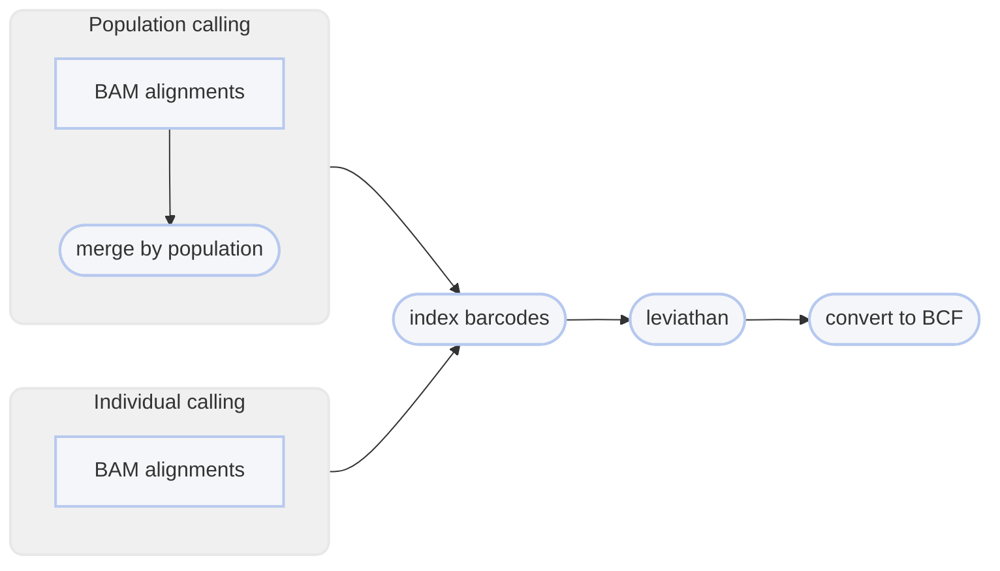

# :icon-sliders: Call Structural Variants using LEVIATHAN

===  :icon-checklist: You will need
- at least 4 cores/threads available
- sequence alignments: [!badge variant="success" text=".bam"] [!badge variant="secondary" icon=":exclamation:" text="coordinate-sorted"]
  - the `BX` tag must be the last tag in the alignment record
  - the barcode must be haplotagging ACBD or 10x/TELLseq nucleotide format (stLFR isn't recognized)
- genome assembly in FASTA format: [!badge variant="success" text=".fasta"] [!badge variant="success" text=".fa"] [!badge variant="success" text=".fasta.gz"] [!badge variant="success" text=".fa.gz"] [!badge variant="secondary" text="case insensitive"]
- [!badge variant="ghost" text="optional"] sample grouping file ([see below](#pooled-sample-variant-calling))

==- :icon-file: sample grouping file  [!badge variant="ghost" text="optional"]
This file is optional and only useful if you want variant calling to happen on a per-population level.
- takes the format of sample[!badge variant="ghost" text="tab"]group
    - spaces can be used as delimeters too
- the groups can be numbers or text (_i.e._ meaningful population names)
- you can comment out lines with `#` for Harpy to ignore them
- create with [!badge corners="pill" text="harpy template groupings"](../template.md#groupings) or manually
- if created with [!badge corners="pill" text="harpy template groupings"](../template.md#groupings), all the samples will be assigned to group `pop1`
    - make sure to edit the second column to reflect your data correctly.

``` example file for --populations
sample1 pop1
sample2 pop1
sample3 pop2
sample4 pop1
sample5 pop3
#sample 6   pop4
```

!!!warning known quirk
There's an unusual error on the Snakemake side of things that happens when the name of a sample and population are identical.
It has been unclear how to resolve this issue, so to protect yourself, it's best to make sure the population names are different
from the sample names. A simple fix would be to use underscores (`_`) to differentiate the population name.
!!!
===

After reads have been aligned, _e.g._ with [!badge corners="pill" text="align bwa"](../Align/bwa.md), you can use those alignment files
(`.bam`) to call structural variants in your data using LEVIATHAN. To make sure your data
will work seemlessly with LEVIATHAN, the alignments in the [input BAM files](/Getting_Started/common_options.md) should **end**
with a `BX:Z` tag. Use [!badge corners="pill" text="validate bam"](../validate.md) if you want to double-check file
format validity.

```bash usage
harpy sv leviathan OPTIONS... REFERENCE INPUTS...
```

```bash example | call variants with adjusted thresholds
harpy sv leviathan --threads 20 -s 90,95,95 genome.fasta Align/bwa
```

## :icon-terminal: Running Options
In addition to the [!badge variant="info" corners="pill" text="common runtime options"](/Getting_Started/common_options.md), the [!badge corners="pill" text="sv leviathan"] module is configured using these command-line arguments:

{.compact}
| argument                    |  default   | description                                                                                                                                    |
|:----------------------------|:----------:|:-----------------------------------------------------------------------------------------------------------------------------------------------|
| `INPUTS`                    |            | [!badge variant="info" text="required"] Files or directories containing [input BAM files](/Getting_Started/common_options.md#input-arguments)  |
| `REFERENCE`                 |            | [!badge variant="info" text="required"] Reference genome that was used to create alignments                                                    |
| `--contigs`                 |            | [Contigs to plot](/Getting_Started/common_options.md#--contigs) in the report                                                                  |
| `--duplicates` `-d`         |    `10`    | Consider SV of the same type as duplicates if their breakpoints are within this distance                                                       |
| `--extra-params` `-x`       |            | Additional naibr arguments, in quotes                                                                                                          |
| `--iterations` `-i`         |    `50`    | Number of iterations to perform through index (reduces memory)                                                                                 |
| `--min-barcodes` `-b`       |    `2`     | Minimum number of barcode overlaps supporting candidate SV                                                                                     |
| `--min-size` `-m`           |   `1000`   | Minimum size of SV to detect                                                                                                                   |
| `--populations` `-p`        |            | Tab-delimited file of sample\<*tab*\>group                                                                                                     |
| `--sharing-thresholds` `-s` | `99 99 99` | Percentile thresholds in the distributions of the number of shared barcodes for (small,medium,large) variants, separated by commas (no spaces) |

### Duplicates
If it feels like Leviathan is unneccesarily splitting larger variants into smaller overlapping or adjacent ones,
this parameter should help limit that from occuring.

### Barcode sharing thresholds
The default Leviathan setting of `99` for these three parameters can be too strict and omit
variants you are expecting to find (e.g. certain large inversions). If you suspect the program
is missing variants, then you may trying relaxing these thresholds (e.g. `99 95 95`).

### Single-sample variant calling
When **not** using a population grouping file via `--populations`, variants will be called per-sample. 
Due to the nature of structural variant VCF files, there isn't an entirely fool-proof way 
of combining the variants of all the samples into a single VCF file, therefore the output will be a VCF for every sample.

### Pooled-sample variant calling
With the inclusion of a population grouping file via `--populations`, Harpy will merge the bam files of all samples within a 
population and call variants on these alignment pools. Preliminary work shows that this way identifies more variants and with fewer false 
positives. **However**, individual-level information gets lost using this approach, so you will only be able to assess 
group-level variants, if that's what your primary interest is.

!!! lifehack
If you have a small number of samples (~10 or fewer) that you are interested in comparing the results of structural variant calling for,
you can provide a sample grouping file via `--populations` where each sample is its own population and Harpy will output a report
comparing "populations" as usual. Keep in mind that if there are too many samples, the formatting of the reports might not render
it too well.
!!!

----

## :icon-git-pull-request: LEVIATHAN workflow
+++ :icon-git-merge: details
[Leviathan](https://github.com/morispi/LEVIATHAN) is an alternative variant caller that uses linked read barcode information 
to call structural variants (indels, inversions, etc.) exclusively, meaning it does not call SNPs. Harpy first uses [LRez](https://github.com/morispi/LRez) to index the barcodes 
in the alignments, then it calls variants using Leviathan.


+++ :icon-file-directory: leviathan output
The default output directory is `SV/leviathan` with the folder structure below. `sample1` and `sample2` are generic sample names for demonstration purposes.
The resulting folder also includes a `workflow` directory (not shown) with workflow-relevant runtime files and information.

```
SV/leviathan
├── breakends.bedpe
├── deletions.bedpe
├── duplications.bedpe
├── inversions.bedpe
├── logs
│   ├── sample1.leviathan.log
│   ├── sample1.candidates
│   ├── sample2.leviathan.log
│   └── sample2.candidates
├── reports
│   ├── sample1.SV.html
│   ├── sample2.SV.html
│   └── data
│       ├── sample1.sv.stats
│       └── sample2.sv.stats
└── vcf
    ├── sample1.bvf
    └── sample2.bcf
```
{.compact}
| item                      | description                                                                              |
| :------------------------ | :--------------------------------------------------------------------------------------- |
| `breakends.bedpe`         | an aggregation of all the breakends identified by LEVIATHAN                              |
| `deletions.bedpe`         | an aggregation of all the deletions identified by LEVIATHAN                              |
| `duplications.bedpe`      | an aggregation of all the duplications identified by LEVIATHAN                           |
| `inversions.bedpe`        | an aggregation of all the inversions identified by LEVIATHAN                             |
| `logs/harpy.variants.log` | relevant runtime parameters for the variants module                                      |
| `logs/sample.groups`      | if provided, a copy of the file provided to `--populations` with commented lines removed |
| `logs/*candidates`        | candidate structural variants LEVIATHAN identified                                       |
| `reports/`                | summary reports with interactive plots of detected SV                                    |
| `stats/`                  | results of `bcftools stats` on the vcf LEVIATHAN creates                                 |
| `vcf/`                    | structural variants identified by LEVIATHAN                                              |

+++ :icon-code-square: leviathan parameters
Below is a list of all `leviathan` command line options, excluding those Harpy already uses or those made redundant by Harpy's implementation of LEVIATHAN.
These are taken directly from the [LEVIATHAN documentation](https://github.com/morispi/LEVIATHAN).
``` LEVIATHAN arguments
  -r, --regionSize:         Size of the regions on the reference genome to consider (default: 1000)
  -n, --maxLinks:           Remove from candidates list all candidates which have a region involved in that much candidates (default: 1000)
  -M, --mediumSize:         Minimum size of medium variants (default: 2000)
  -L, --largeSize:          Minimum size of large variants (default: 10000)
  -s, --skipTranslocations: Skip SVs that are translocations (default: false)
  -p, --poolSize:           Size of the thread pool (default: 100000)
```
+++ :icon-graph: reports
These are the summary reports Harpy generates for this workflow. You may right-click
the image and open it in a new tab if you wish to see the example in better detail.

||| Variant stats
Summarizes the count and type of structural variants and visualizes their locations on
the chromosomes. Calling variants on population-pooled samples will instead report on populations.

|||

+++
