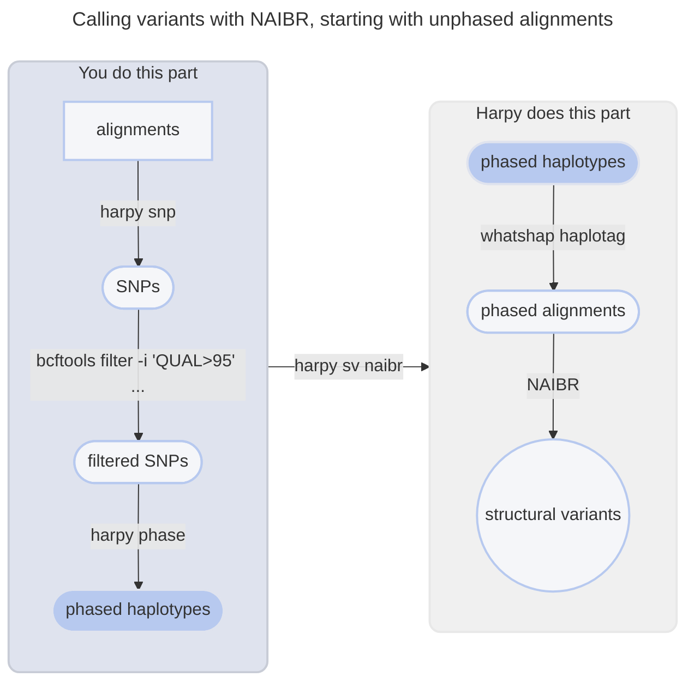
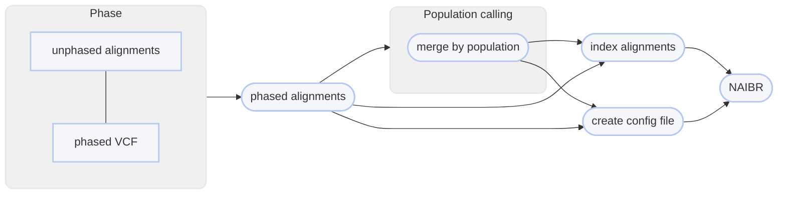

# :icon-sliders: Call Structural Variants using NAIBR

===  :icon-checklist: You will need
- at least 4 cores/threads available
- sequence alignments: [!badge variant="success" text=".bam"] [!badge variant="secondary" icon=":exclamation:" text="coordinate-sorted"]
- genome assembly in FASTA format: [!badge variant="success" text=".fasta"] [!badge variant="success" text=".fa"] [!badge variant="success" text=".fasta.gz"] [!badge variant="success" text=".fa.gz"] [!badge variant="secondary" text="case insensitive"]
- [!badge variant="ghost" text="optional"] phased VCF file
- [!badge variant="ghost" text="optional"] sample grouping file ([see below](#pooled-sample-variant-calling))
==- :icon-file: sample grouping file [!badge variant="ghost" text="optional"]
This file is optional and only useful if you want variant calling to happen on a per-population level.
- takes the format of sample[!badge variant="ghost" text="tab"]group
    - spaces can be used as delimeters too
- the groups can be numbers or text (_i.e._ meaningful population names)
- you can comment out lines with `#` for Harpy to ignore them
- create with [!badge corners="pill" text="harpy template groupings"](../other.md#groupings) or manually
- if created with [!badge corners="pill" text="harpy template groupings"](../other.md#groupings), all the samples will be assigned to group `pop1`
    - make sure to edit the second column to reflect your data correctly.

``` example file for --populations
sample1 pop1
sample2 pop1
sample3 pop2
sample4 pop1
sample5 pop3
#sample6    pop4
```

!!!warning known quirk
There's an unusual error on the Snakemake side of things that happens when the name of a sample and population are identical.
It has been unclear how to resolve this issue, so to protect yourself, it's best to make sure the population names are different
from the sample names. A simple fix would be to use underscores (`_`) to differentiate the population name.
!!!
===

After reads have been aligned, _e.g._ with [!badge corners="pill" text="align bwa"](../Align/bwa.md), you can use those alignment files
(`.bam`) to call structural variants in your data using NAIBR. While our testing shows that
NAIBR tends to find known inversions that LEVIATHAN misses, the program requires haplotype 
**phased** bam files as input. That means the alignments have a `PS` or `HP` tag that indicate
which haplotype the read/alignment belongs to. If your alignments don't have phasing tags (none of the current aligners in Harpy do this),
then you will need to do a little extra work for NAIBR to work best with your data. This process is described below.

```bash usage
harpy sv naibr OPTIONS... REFERENCE INPUTS...
```

```bash examples | calling variants when alignments are (or aren't) already phased
# input bams already phased
harpy sv naibr --threads 20 genome.fasta Align/bwa

# input bams require phasing using a phased vcf
harpy sv naibr --threads 20 --vcf Variants/data.vcf.gz genome.fasta Align/bwa
```

## :icon-terminal: Running Options
In addition to the [!badge variant="info" corners="pill" text="common runtime options"](/Getting_Started/common_options.md), the [!badge corners="pill" text="sv naibr"] module is configured using these command-line arguments:

{.compact}
| argument                   | default  | description                                                                                                                   |
|:---------------------------|:--------:|:------------------------------------------------------------------------------------------------------------------------------|
| `INPUTS`                   |          | [!badge variant="info" text="required"] Files or directories containing [input BAM files](/Getting_Started/common_options.md#input-arguments) |
| `REFERENCE`                |          | [!badge variant="info" text="required"] Genome assembly for phasing bam files                                                 |
| `--contigs`                |          | [Contigs to plot](/Getting_Started/common_options.md#--contigs) in the report                                                                 |
| `--extra-params` `-x`      |          | Additional naibr arguments, in quotes                                                                                         |
| `--min-barcodes` `-b`      |   `2`    | Minimum number of barcode overlaps supporting candidate SV                                                                    |
| `--min-quality` `-q`       |   `30`   | Minimum `MQ` (SAM mapping quality) to pass filtering                                                                          |
| `--min-size` `-m`          |  `1000`  | Minimum size of SV to detect                                                                                                  |
| `--molecule-distance` `-d` | `100000` | Base-pair distance threshold to separate molecules                                                                            |
| `--populations` `-p`       |          | Tab-delimited file of sample\<*tab*\>group                                                                                    |
| `--vcf` `-v`               |          | [!badge variant="info" text="required"] [!badge variant="secondary" text="conditional"] Phased vcf file for phasing bam files ([see below](#optional-vcf-file)) |

### Molecule distance
The `--molecule-distance` option is used to let the program determine how far apart alignments on a contig with the same
barcode can be from each other and still considered as originating from the same DNA molecule. See 
[Barcode Thresholds](/Getting_Started/linked_read_data.md#barcode-thresholds) for more information on what this value does. If you want
NAIBR to not split molecules in this manner (e.g. you might be looking for inversions greater than this threshold),
then set this number to be unreasonably high, such as the length of your largest chromosome.

### Single-sample variant calling
When **not** using a population grouping file via `--populations`, variants will be called per-sample. 
Due to the nature of structural variant VCF files, there isn't an entirely fool-proof way 
of combining the variants of all the samples into a single VCF file, therefore the output will be a VCF for every sample.

### Pooled-sample variant calling
With the inclusion of a population grouping file via `--populations`, Harpy will merge the bam files of all samples within a 
population and call variants on these alignment pools. Preliminary work shows that this way identifies more variants and with fewer false 
positives. **However**, individual-level information gets lost using this approach, so you will only be able to assess 
group-level variants, if that's what your primary interest is.

!!! a little lifehack
If you have a small number of samples (~10 or fewer) that you are interested in comparing the results of structural variant calling for,
you can provide a sample grouping file via `--populations` where each sample is its own population and Harpy will output a report
comparing "populations" as usual. Keep in mind that if there are too many samples, the formatting of the reports might not render
it too well.
!!!

### Optional vcf file
In order to get the best variant calling performance out of NAIBR, it requires **_phased_** bam files as input. 
Using `--vcf` is optional and not used by NAIBR directly. However, to use [!badge corners="pill" text="sv naibr"] with
bam files that are not phased, you will need to include a **phased VCF file** with `--vcf`, which Harpy uses with 
`whatshap haplotag` to phase your input BAM files prior to variant calling. See the [whatshap documentation](https://whatshap.readthedocs.io/en/latest/guide.html#whatshap-haplotag)
for more details on that process.

#### a phased input --vcf
This file can be in vcf/vcf.gz/bcf format and most importantly **it must be phased haplotypes**. There are various
ways to haplotype SNPs, but you can use [!badge corners="pill" text="harpy phase"](../phase.md) to phase your SNPs
into haplotypes using the haplotag barcode information. The resulting phased VCF file can then be used as input here.
Your VCF file should be [filtered in some capacity](/Getting_Started/Guides/filtering_snps.md) to keep high quality data.



----

## :icon-git-pull-request: NAIBR workflow
+++ :icon-git-merge: details
[Naibr](https://github.com/raphael-group/NAIBR) is a variant caller that uses linked read barcode information 
to call structural variants (indels, inversions, etc.) exclusively, meaning it does not call SNPs. The original 
authors of Naibr have not been updating or improving it, so Harpy uses [an active fork](https://github.com/pontushojer/NAIBR)
of it that is available on [Bioconda](https://anaconda.org/bioconda/naibr-plus) under the name `naibr-plus`.
This fork includes improved accuracy as well as quality-of-life updates.


+++ :icon-file-directory: naibr output
The default output directory is `SV/naibr` with the folder structure below. `sample1` and `sample2` are generic sample 
names for demonstration purposes.
The resulting folder also includes a `workflow` directory (not shown) with workflow-relevant runtime files and information.

```
SV/naibr
├── deletions.bedpe
├── duplications.bedpe
├── inversions.bedpe
├── bedpe
│   ├── sample1.bedpe
│   └── sample2.bedpe
├── configs
│   ├── sample1.config
│   └── sample2.config
├── filtered
│   ├── sample1.fail.bedpe
│   └── sample2.fail.bedpe
├── IGV
│   ├── sample1.reformat.bedpe
│   └── sample2.reformat.bedpe
├── logs
│   ├── sample1.log
│   └── sample2.log
├── reports
│   ├── sample1.naibr.html
│   └── sample2.naibr.html
└── vcf
    ├── sample1.vcf
    └── sample2.vcf
```

{.compact}
| item                 | description                                                |
| :------------------- | :--------------------------------------------------------- |
| `deletions.bedpe`    | an aggregation of all the deletions identified by NAIBR    |
| `duplications.bedpe` | an aggregation of all the duplications identified by NAIBR |
| `inversions.bedpe`   | an aggregation of all the inversions identified by NAIBR   |
| `bedpe/`             | structural variants identified by NAIBR                    |
| `configs/`           | the configuration files harpy generated for each sample    |
| `filtered/`          | the variants that failed NAIBR's internal filters          |
| `IGV/`               | same as the output `.bedpe` files but in IGV format        |
| `logs/*.log`         | what NAIBR writes to `stderr` during operation             |
| `reports/`           | summary reports with interactive plots of detected SV      |
| `vcf/`               | the resulting variants, but in `.VCF` format               |

+++ :icon-code-square: naibr parameters
By default, Harpy runs `naibr` with these parameters (excluding inputs and outputs):
```python
min_mapq = 30
min_sv   = 100000
k        = 2
d        = 100000
```

Below is a list of all `naibr` runtime options, excluding those Harpy already uses or those made redundant by Harpy's implementation of NAIBR.
These are taken directly from the [NAIBR documentation](https://github.com/pontushojer/NAIBR#running-naibr). If adding these arguments, do so in quotes:

```
harpy sv naibr -x "candidates duplications.bedpe" data/alignments/*
```

``` NAIBR arguments
-blacklist: BED-file with regions to be excluded from analysis
-candidates: BEDPE-file with novel adjacencies to be scored by NAIBR. This will override automatic detection of candidate novel adjacencies
```

+++ :icon-graph: reports
These are the summary reports Harpy generates for this workflow. You may right-click
the image and open it in a new tab if you wish to see the example in better detail.

||| Variant stats
Summarizes the count and type of structural variants and visualizes their locations on
the chromosomes. Calling variants on population-pooled samples will instead report on populations.

|||

+++
