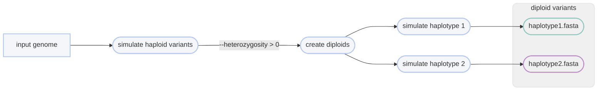

# :icon-flame: Simulate Genomic Variants
Simulate snps, indels, inversions, cnv, translocations

===  :icon-checklist: You will need
- a reference genome in FASTA format: [!badge variant="success" text=".fasta"] [!badge variant="success" text=".fa"] [!badge variant="success" text=".fasta.gz"] [!badge variant="success" text=".fa.gz"] [!badge variant="secondary" text="case insensitive"]
===

You may want to benchmark haplotag data on different kinds of genomic variants. To
do that, you'll need *known* variants, and typically simulations are how you achieve
that. This series of modules simulates genomic variants onto a genome, either randomly
or specific variants provided in VCF files. The simulator Harpy uses,
[simuG](https://github.com/yjx1217/simuG), can only simulate one type of
variant at a time and each variant type has their own set of parameters. If you are interested
in very fine-grained variation simulation, consider using [VISOR/HACk](https://davidebolo1993.github.io/visordoc/usage/usage.html#visor-hack).
This page is divided by variant types to help you navigate the process. The general usage
for simulating variants is:

```bash usage
harpy simulate variant OPTIONS... INPUT_GENOME
```
```bash example
harpy simulate inversion -n 10 --min-size 1000 --max-size 50000  path/to/genome.fasta
```
## Modules
There are 4 submodules with very obvious names:

{.compact}
| submodule                                                    | what it does                                                                      |
| :----------------------------------------------------------- | :-------------------------------------------------------------------------------- |
| [!badge corners="pill" text="snpindel"](#snpindel)           | simulates single nucleotide polymorphisms (snps) and insertion-deletions (indels) |
| [!badge corners="pill" text="inversion"](#inversion)         | simulates inversions                                                              |
| [!badge corners="pill" text="cnv"](#cnv)                     | simulates copy number variants                                                    |
| [!badge corners="pill" text="translocation"](#translocation) | simulates translocations                                                          |

## :icon-terminal: Running Options
While there are serveral differences between individual workflow options, each has available all the
[!badge variant="info" corners="pill" text="common runtime options"](/Getting_Started/Resources/common_options.md) like other Harpy modules.
Each requires and input genome at the end of the command line, and each requires either a `--count` of variants
to randomly simulate, or a `--vcf` of specific variants to simulate. There are also these unifying options among the different variant types:

{.compact}
| argument                | description                                                                                            |
|:------------------------|:-------------------------------------------------------------------------------------------------------|
| `INPUT_GENOME`          | [!badge variant="info" text="required"] The haploid genome to simulate variants onto                   |
| `--centromeres` `-c`    | GFF3 file of centromeres to avoid                                                                      |
| `--exclude-chr` `-e`    | Text file of chromosomes to avoid, one per line                                                        |
| `--genes` `-g`          | GFF3 file of genes to avoid simulating over (see `snpindel` for caveat)                                |
| `--heterozygosity` `-z` | [proportion of simulated variants to make heterozygous   ](#heterozygosity) (default: `0`)             |
| `--only-vcf`            | When used with `--heterozygosity`, will create the diploid VCFs but will not simulate a diploid genome |
| `--prefix`              | Naming prefix for output files (default: `sim.{module_name}`)                                          |
| `--randomseed`          | Random seed for simulation                                                                             |

!!!warning simulations can be slow
Given software limitations, simulating many variants **relative to the size of the input genome** will be noticeably slow.
The program slows down substantially when it becomes difficult to find new sites to create variants.
!!!

+++ 🟣 snps and indels
### snpindel
A single nucleotide polymorphism ("SNP") is a genomic variant at a single base position in the DNA ([source](https://www.genome.gov/genetics-glossary/Single-Nucleotide-Polymorphisms)).
An indel, is a type of mutation that involves the addition/deletion of one or more nucleotides into a segment of DNA ([insertions](https://www.genome.gov/genetics-glossary/Insertion), [deletions](https://www.genome.gov/genetics-glossary/Deletion)).
The snp and indel variants are combined in this module because `simuG` allows simulating them together. 

{.compact}
| argument                      | default | description                                                                                    |
|:------------------------------|:-------:|:-----------------------------------------------------------------------------------------------|
| `--indel-count` `-m`          |   `0`   | Number of random indels to simluate                                                            |
| `--indel-vcf` `-i`            |         | VCF file of known indels to simulate                                                           |
| `--indel-ratio` `-d`          |   `1`   | Insertion/Deletion ratio for indels                                                            |
| `--indel-size-alpha` `-a`     |  `2.0`  | Exponent Alpha for power-law-fitted indel size distribution                                    |
| `--indel-size-constant` `-l`  |  `0.5`  | Exponent constant for power-law-fitted indel size distribution                                 |
| `--snp-count` `-n`            |   `0`   | Number of random snps to simluate                                                              |
| `--snp-gene-constraints` `-y` |         | How to constrain randomly simulated SNPs {`noncoding`,`coding`,`2d`,`4d`} when using `--genes` |
| `--snp-vcf` `-s`              |         | VCF file of known snps to simulate                                                             |
| `--titv-ratio` `-r`           |  `0.5`  | Transition/Transversion ratio for snps                                                         |

The ratio parameters for snp and indel variants and have special meanings when setting
the value to either `0` or `9999` :

{.compact}
| ratio           | `0` meaning        | `9999` meaning    |
| :-------------- | :----------------- | :---------------- |
| `--indel-ratio` | deletions only     | insertions only   |
| `--titv-ratio`  | transversions only | transitions  only |

+++ 🔵 inversions
### inversion
Inversions are when a section of a chromosome appears in the reverse orientation ([source](https://www.genome.gov/genetics-glossary/Inversion)).

{.compact}
| argument          | default  | description                              |
|:------------------|:--------:|:-----------------------------------------|
| `--count` `-n`    |   `0`    | Number of random inversions to simluate  |
| `--max-size` `-x` | `100000` | Maximum inversion size (bp)              |
| `--min-size` `-m` |  `1000`  | Minimum inversion size (bp)              |
| `--vcf` `-v`      |          | VCF file of known inversions to simulate |

+++ 🟢 copy number variants
### cnv
A copy number variation (CNV) is when the number of copies of a particular gene varies
between individuals ([source](https://www.genome.gov/genetics-glossary/Copy-Number-Variation)).

{.compact}
| argument            | default  | description                                        |
|:--------------------|:--------:|:---------------------------------------------------|
| `--vcf` `-v`        |          | VCF file of known copy number variants to simulate |
| `--count` `-n`      |   `0`    | Number of random cnv to simluate                   |
| `--dup-ratio` `-d`  |   `1`    | Tandem/Dispersed duplication ratio                 |
| `--gain-ratio` `-l` |   `1`    | Relative ratio of DNA gain over DNA loss           |
| `--max-size` `-x`   | `100000` | Maximum cnv size (bp)                              |
| `--max-copy` `-y`   |   `10`   | Maximum number of copies                           |
| `--min-size` `-m`   |  `1000`  | Minimum cnv size (bp)                              |

The ratio parameters have special meanings when setting the value to either `0` or `9999` :

{.compact}
| ratio          | `0` meaning                 | `9999` meaning           |
| :------------- | :-------------------------- | :----------------------- |
| `--dup-ratio`  | dispersed duplications only | tandem duplications only |
| `--gain-ratio` | loss only                   | gain only                |

+++ 🟡 translocations
### translocation
A translocation occurs when a chromosome breaks and the fragmented pieces re-attach to different chromosomes ([source](https://www.genome.gov/genetics-glossary/Translocation)). 

{.compact}
| argument       | default | description                              |
|:---------------|:-------:|:-----------------------------------------|
| `--count` `-n` |   `0`   | Number of random inversions to simluate  |
| `--vcf` `-v`   |         | VCF file of known inversions to simulate |

+++

## Simulate known variants
Rather than simulating random variants, you can use a VCF file as input to any of the workflows
to have `simuG` simulate the variants (of that type) from the VCF file. This becomes particularly
handy because the modules output a VCF file of the variants that were introduced, which you can
modify and reuse as you see fit (see [heterozygosity](#heterozygosity)). Using `--genes`, 
`--centromeres`, or `--exclude-chr` would still avoid creating variants in those regions as with
random simulation, except with SNPs, where you would have to specify the contraints for using 
`--genes` as per usual.

## Heterozygosity
Each workflow has a `--heterozygosity` parameter where you can specify the heterozygosity of
the simulated variants, which creates two new VCF files (`{prefix}.hap1.vcf`,
`{prefix}.hap2.vcf`) that have their variants shuffled between the two haplotypes to
achieve the desired heterozygosity. The workflows will then use the new "diploid" variants
to generate a diploid genome-- one fasta file for each haplotype. You can disable the creation
of the diploid fasta files using `--only-vcf`, which will still create the VCF files of the variants
to your chosen heterozygosity.

==- How the paramater is actually used
To understand how heterozygosity is created from the `simuG` VCF output, consider a genome
with 5 variants added to it, here represented as a column labelled `h1` with `1` being the presence
of a variant (the ALT allele).
```
h1
1
1
1
1
1
```
If we were to simulate those same variants onto the genome again, it would create a homozygote
at every position (`h2` is the second haplotype):
```
h1 h2
1  1
1  1
1  1
1  1
1  1
```
However, if we omit some of the variants on `h2` to create 40% heterozygosity (2/5),
we would now have heterozygotes, except the ALT allele for the heterozygote would
only every be on the first haplotype `h1`:
```
h1 h2
1  1
1  1
1  1
1     <- heterozygote with ALT on h1
1     <- heterozygote with ALT on h1
```
It would probably be more biologically sound to then make sure that the ALT allele
in the heterozygote can appear in either haplotype:
```
h1 h2
1  1
1  1
1  1
   1  <- heterozygote with ALT on h2
1     <- heterozygote with ALT on h1
```
Within Harpy, a heterozygous variant has a 50% chance of being assigned to one of the haplotypes.
So that's the logic behind the `--heterozygosity` parameter and why it ouputs 3 VCF files:
1. the VCF `simuG` outputs of variants added to the genome
2. haplotype 1 of that VCF file with some of the variants
3. haplotype 2 of that VCF file with some of the variants

Knowing that, you can then have a workflow to start with a haploid assembly and create
a diploid assembly with simulated variants.
==-

## :icon-git-pull-request: Variant Simulation Workflow
