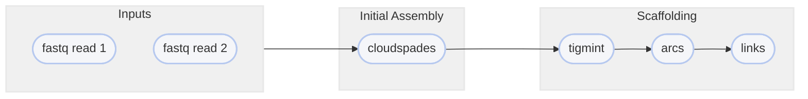

# :icon-commit: Create a Genome Assembly
[!badge variant="secondary" text="linked reads"]

===  :icon-checklist: You will need
- at least 2 cores/threads available
- paired-end reads from an Illumina sequencer in FASTQ format [!badge variant="secondary" text="gzip recommended"]
    - deconvolved with [!badge corners="pill" text="deconvolve"](deconvolve.md) (QuickDeconvolution) or equivalent [!badge variant="warning" text="IMPORTANT"]
===

If you have single-sample data, you might be interested in a genome assembly. Unlike metagenome assemblies,
a classic genome assembly assumes there is exactly one genome present in your sequences and will try to
assemble the most contiguous sequences for this one individual.

```bash usage
harpy metassembly OPTIONS... FASTQ_R1 FASTQ_R2
```

```bash example
harpy metassembly --threads 20 -u prokaryote -k 13,51,75,83 FASTQ_R1 FASTQ_R2
```

## :icon-terminal: Running Options
In addition to the [!badge variant="info" corners="pill" text="common runtime options"](/common_options.md), the [!badge corners="pill" text="assembly"]
module is configured using the command-line arguments below. Since the assembly process consists of several distinct phases,
the descriptions are provided with an extra badge to reflect which part of the assembly process they correspond to.

{.compact}
| argument              | short name |   default   | description                                                                                                                                                                                        |
| :-------------------- | :--------: | :---------: | :------------------------------------------------------------------------------------------------------------------------------------------------------------------------------------------------- |
| `FASTQ_R1`            |            |             | [!badge variant="info" text="required"] FASTQ file of forward reads                                                                                                                                |
| `FASTQ_R2`            |            |             | [!badge variant="info" text="required"] FASTQ file of reverse reads                                                                                                                                |
| `--extra-params`      |    `-x`    |             | [!badge variant="secondary" text="spades assembly"] Additional spades parameters, in quotes                                                                                                        |
| `--kmer-length`       |    `-k`    |   `auto`    | [!badge variant="secondary" text="spades assembly"] Kmer lengths to use for initial spades assembly. They must be **odd** and **<128**, separated by commas, and without spaces. (e.g. `13,23,51`) |
| `--max-memory`        |    `-r`    |   `10000`   | [!badge variant="secondary" text="spades assembly"] Maximum memory for spades to use, given in megabytes                                                                                           |
| `--arcs-extra`        |    `-y`    |             | [!badge variant="secondary" text="arcs scaffold"]  Additional ARCS parameters, in quotes and `option=arg` format                                                                                   |
| `--contig-length`     |    `-c`    |    `500`    | [!badge variant="secondary" text="arcs scaffold"]  Minimum contig length                                                                                                                           |
| `--links`             |    `-n`    |     `5`     | [!badge variant="secondary" text="arcs scaffold"]  Minimum number of links to compute scaffold                                                                                                     |
| `--min-aligned`       |    `-a`    |     `5`     | [!badge variant="secondary" text="arcs scaffold"]  Minimum aligned read pairs per barcode                                                                                                          |
| `--min-quality`       |    `-q`    |     `0`     | [!badge variant="secondary" text="arcs scaffold"]  Minimum mapping quality                                                                                                                         |
| `--mismatch`          |    `-m`    |     `5`     | [!badge variant="secondary" text="arcs scaffold"]  Maximum number of mismatches                                                                                                                    |
| `--molecule-distance` |    `-d`    |   `50000`   | [!badge variant="secondary" text="arcs scaffold"]  Distance cutoff to split molecules (bp)                                                                                                         |
| `--molecule-length`   |    `-l`    |   `2000`    | [!badge variant="secondary" text="arcs scaffold"]  Minimum molecule length (bp)                                                                                                                    |
| `--seq-identity`      |    `-i`    |    `98`     | [!badge variant="secondary" text="arcs scaffold"]  Minimum sequence identity                                                                                                                       |
| `--span`              |    `-s`    |    `20`     | [!badge variant="secondary" text="arcs scaffold"]  Minimum number of spanning molecules to be considered assembled                                                                                 |
| `--organism-type`     |    `-u`    | `eukaryote` | [!badge variant="secondary" text="report"]         Organism type for assembly report: `eukaryote`,`prokaryote`, or `fungus`                                                                        |


## :icon-tag: Deconvolved Inputs
For linked-read assemblies, the barcodes need to be deconvolved in the sequence data, meaning that
barcodes that are shared by reads that originate from different molecules need to have unique barcode
IDs. Deconvolution often takes the form of adding a hyphenated integer to the end of a barcode so that software
can recognize that they are different from each other. For example: two sequences from different molecules
sharing the [linked read] barcode `A03C45B11D91` would have one of them recoded as `A03C45B11D91-1`. Software
like [QuickDeconvolution](https://github.com/RolandFaure/QuickDeconvolution), which is used by [!badge corners="pill" text="deconvolve"](deconvolve.md) will parse
your fastq input files and perform this deconvolution.

## :icon-git-pull-request: Assembly Workflow
+++ :icon-git-merge: details
Initial assembly is performed with [cloudspades](https://github.com/ablab/spades/tree/cloudspades-ismb),
followed by [tigmint](https://github.com/bcgsc/tigmint), [arcs](https://github.com/bcgsc/arcs),
[links](https://github.com/bcgsc/links) to scaffold the contig-level assembly.



+++ :icon-file-directory: assembly output
The default output directory is `Assembly` with the folder structure below. Using `--skip-reports`
will skip the QUAST/BUSCO analysis as well. The file structure below isn't exhaustive and serves
to highlight the general structure and most important outputs.
```
Metassembly/
├── busco
│   ├── short_summary.*.txt
│   └── run_*_odb10
├── quast
│   ├── report.*
│   └── predicted_genes
├── reports
│   └── assembly.metrics.html
├── scaffold
├── spades
│   └── contigs.fasta
└── scaffolds.fasta
```
{.compact}
| item                            | description                                                                   |
| :------------------------------ | :---------------------------------------------------------------------------- |
| `busco/`                        | directory with results from the BUSCO analysis                                |
| `busco/short_summary.*.txt`     | text file summarizing BUSCO analysis                                          |
| `busco/run_*_odb10`             | directory with results from the BUSCO analysis for the specific organism type |
| `scaffold/`                     | directory with the tigmint/arcs/links output                                  |
| `scaffolds.fasta`               | the resulting scaffolded assembly                                             |
| `spades/`                       | directory with the SPADES output                                              |
| `spades/contigs.fasta`          | the resulting primary assembly                                                |
| `quast/`                        | directory with results from the QUAST analysis                                |
| `quast/report*`                 | resulting QUAST report in various formats                                     |
| `quast/predicted_genes/`        | GLIMMER gene-finding output                                                   |
| `reports/assembly.metrics.html` | aggregate and generalization of QUAST and BUSCO results                       |

+++ :icon-code-square: SPADES parameters
By default, Harpy runs `spades` with these parameters (excluding inputs and outputs):
```bash
spades.py -t threads -m mem -k k --gemcode1-1 FQ_R1 --gemcode1-2 FQ_R2
```
See the [SPADES documentation](http://ablab.github.io/spades/running.html) for a list of all available command line options.

+++ :icon-graph: reports
These are the summary reports Harpy generates for this workflow. You may right-click
the image and open it in a new tab if you wish to see the example in better detail.

|||Aggregated Report
Aggregates QUAST and BUSCO analyses.

||| QUAST Report
This is the report produced by QUAST

|||
+++
