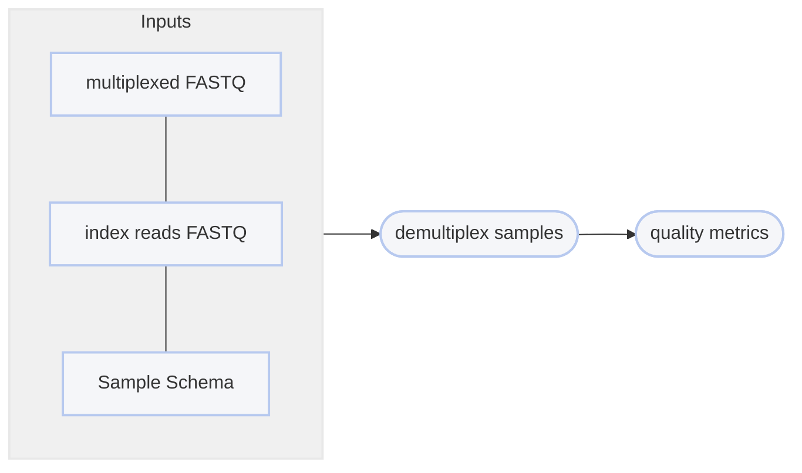

# :icon-versions: Demultiplex Raw Sequences

===  :icon-checklist: You will need
- at least 2 cores/threads available
- paired-end reads from an Illumina sequencer in FASTQ format [!badge variant="secondary" text="gzip recommended"]
===

When pooling samples and sequencing them in parallel on an Illumina sequencer, you will be given large multiplexed FASTQ
files in return. These files contain sequences for all of your samples and need to be demultiplexed using barcodes to 
separate the sequences for each sample into their own files (a forward and reverse file for each sample). These barcodes
should have been added during the sample DNA preparation in a laboratory. The demultiplexing strategy will vary based on the
haplotag technology you are using (read [Haplotag Types](#haplotag-types)).

```bash usage
harpy demultiplex METHOD OPTIONS... R1_FQ R2_FQ I1_FQ I2_FQ
```
```bash example using wildcards
harpy demultiplex gen1 --threads 20 --schema demux.schema Plate_1_S001_R*.fastq.gz Plate_1_S001_I*.fastq.gz
```
## :icon-terminal: Running Options
In addition to the [!badge variant="info" corners="pill" text="common runtime options"](/commonoptions.md), the [!badge corners="pill" text="demultiplex gen1"] module is configured using these command-line arguments:

{.compact}
| argument   | short name | description                                                      |
| :--------- | :--------: | :--------------------------------------------------------------- |
| `R1_FQ`    |            | [!badge variant="info" text="required"] The forward multiplexed FASTQ file                               |
| `R2_FQ`    |            | [!badge variant="info" text="required"] The reverse multiplexed FASTQ file                               |
| `I1_FQ`    |            | [!badge variant="info" text="required"] The forward FASTQ index file provided by the sequencing facility |
| `I2_FQ`    |            | [!badge variant="info" text="required"] The reverse FASTQ index file provided by the sequencing facility |
| `--keep-unknown`   |     `-u`    | Keep reads that could not be demultiplexed                                                   |
| `--qxrx`   |     `-q`    | Include the `QX:Z` and `RX:Z` tags in the read header                                                    |
| `--schema` |    `-s`    | [!badge variant="info" text="required"] Tab-delimited file of sample\<tab\>barcode                       |

### Keeping Unknown Samples
It's not uncommon that some sequences cannot be demultiplexed due to sequencing errors at the ID location. Use `--keep-unknown` to
have Harpy still separate those reads from the original multiplex. Those reads will be labelled `_unknown_sample.R*.fq.gz` 

### Keep QX and RX tags
Using `--qx-rx`, you can opt-in to retain the `QX:Z` (barcode PHRED scores) and `RX:Z` (nucleotide barcode)
tags in the sequence headers. These tags aren't used by any subsequent analyses, but may be useful for your own diagnostics. 

## Haplotag Types[!badge variant="secondary" text="gzip recommended"]
==- Generation 1 - `gen1`
- Barcode configuration: `13 + 13`
- sequencing mask: `151+13+13+151`
- Sample identifier: `Cxx` barcode
- Facility should **not** demultiplex

These are the original 13 + 13 barcodes described in Meier et al. 2021. You should request that the sequencing facility you used
do **not** demultiplex the sequences. Requires the use of [bcl2fastq](https://support.illumina.com/sequencing/sequencing_software/bcl2fastq-conversion-software.html) without `sample-sheet` and with the settings
`--use-bases-mask=Y151,I13,I13,Y151` and `--create-fastq-for-index-reads`. With Generation I beadtags, the `C` barcode is sample-specific,
meaning a single sample should have the same `C` barcode for all of its sequences.

### Demultiplexing Schema
Generation I haplotags typically use a unique `Cxx` barcode per sample-- that's the barcode segment
that will be used to identify sequences by sample. However, any of the 4 segments (`A`,`B`,`C`,`D`) are valid, so long as the schema only features a single segment.
You will need to provide a simple text file to `--schema` (`-s`) with two columns, the first being the sample name, the second being
the identifying segment barcode (e.g., `C19`). This file is to be `tab` or `space` delimited and must have **no column names**.
``` example sample sheet
Sample01    C01
Sample02    C02
Sample03    C03
Sample04    C04
```
This will result in splitting the multiplexed reads into individual file pairs `Sample01.F.fq.gz`, `Sample01.R.fq.gz`, `Sample02.F.fq.gz`, etc.
A sample can have multiple barcodes, but a barcode **cannot** have multiple samples:

+++ duplicate samples [!badge variant="success" text="valid"]
```
Sample01    D01
Sample02    D02
Sample03    D03
Sample03    D21
```

+++ duplicate barcodes [!badge variant="danger" text="invalid"]
```
Sample01    C01
Sample02    C02
Sample03    C02
```
+++  multiple segments [!badge variant="danger" text="invalid"]
```
Sample01    C01
Sample02    D02
Sample03    C03
```
+++
===


---
## :icon-git-pull-request: Gen I Demultiplex Workflow
+++ :icon-git-merge: details
Barcode correction and migration into the read headers is performed using [demult_fastq](https://github.com/evolgenomics/haplotagging/blob/master/demult_fastq.cpp)
(Harpy renames it to `demuxGen1`), which is distributed by the team behind haplotagging. Demultiplexing the pooled FASTQ files into
individual samples is performed in parallel and using the beloved workhorse `grep`.



+++ :icon-file-directory: demultiplexing output
The default output directory is `Demultiplex` with the folder structure below. `Sample1` and `Sample2` are
generic sample names for demonstration purposes. The resulting folder also includes a `workflow` directory
(not shown) with workflow-relevant runtime files and information.
```
Demultiplex/
├── Sample1.F.fq.gz
├── Sample1.R.fq.gz
├── Sample2.F.fq.gz
├── Sample2.R.fq.gz
└── reports
    └── demultiplex.QC.html
```
{.compact}
| item                          | description                                                                               |
| :---------------------------- | :---------------------------------------------------------------------------------------- |
| `*.F.fq.gz`                   | Forward-reads from multiplexed input `--file` belonging to samples from the `samplesheet` |
| `*.R.fq.gz`                   | Reverse-reads from multiplexed input `--file` belonging to samples from the `samplesheet` |
| `reports/demultiplex.QC.html` | phased vcf annotated with phased blocks                                                   |

+++ :icon-graph: reports
||| FASTQC metrics
This is the summary report Harpy generates for this workflow. You may right-click
the image and open it in a new tab if you wish to see the example in better detail.

|||
+++

