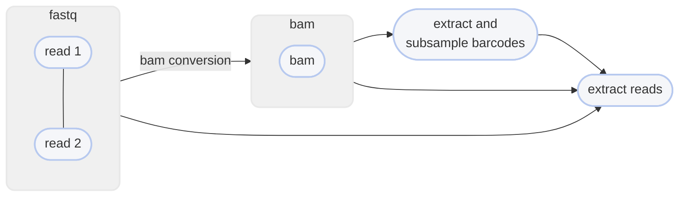

# :icon-fold-down: Downsample data by barcode

===  :icon-checklist: You will need
- One of either:
  - one alignment file [!badge variant="success" text=".bam"] [!badge variant="success" text=".sam"] [!badge variant="secondary" text="case insensitive"]
  - one set of paired-end reads in FASTQ format [!badge variant="success" text=".fq"] [!badge variant="success" text=".fastq"] [!badge variant="secondary" text="gzip recommended"] [!badge variant="secondary" text="case insensitive"]
- Barcodes in a SAM tag (e.g. `BX:Z:`) for both BAM and FASTQ inputs
  - See [Section 1 of the SAM Spec here](https://samtools.github.io/hts-specs/SAMtags.pdf) for details
===

While downsampling (subsampling) FASTQ and BAM files is relatively simple with tools such as `awk`, `samtools`, `seqtk`, `seqkit`, etc.,
[!badge corners="pill" text="downsample"] allows you to downsample a BAM file (or paired-end FASTQ) _by barcodes_. That means you can
keep all the reads associated with `d` number of barcodes or `-d` fraction of barcodes (e.g. `-d 0.5` will downsample to 50% of all barcodes).

```bash usage
# BAM file
harpy downsample OPTIONS... BAM

# FASTQ files
harpy downsample OPTIONS... FASTQ1 FASTQ2
```

```bash example
# BAM file
harpy downsample -d 1000 -b BC -i 0.3 -p sample1.sub1000 sample1.bam

# FASTQ files
harpy downsample -d 1000 -i 0 -p sample1.sub1000 sample1.F.fq.gz sample1.R.fq.gz
```

## :icon-terminal: Running Options
In addition to the [!badge variant="info" corners="pill" text="common runtime options"](/Getting_Started/common_options.md), the [!badge corners="pill" text="downsample"]
module is configured using the command-line arguments below.

{.compact}
| argument             |    default    | description                                                                                          |
|:---------------------|:-------------:|:-----------------------------------------------------------------------------------------------------|
| `INPUT`              |               | [!badge variant="info" text="required"] One BAM file or both read files from a paired-end FASTQ pair |
| `--barcode-tag` `-b` |     `BX`      | SAM tag that contains the barcode                                                                    |
| `--downsample` `-d`  |               | [!badge variant="info" text="required"] Number/fraction of barcodes to downsample to                          |
| `--invalid` `-i`     |      `1`      | Proportion of invalid barcodes to potentially sample                                                 |
| `--prefix` `-p`      | `downsampled` | Prefix for output files                                                                              |
| `--random-seed`      |               | Random seed for sampling [!badge variant="secondary" text="optional"]                                |

## invalid barcodes
The `--invalid` options determines what proportion of invalid barcodes appear in the barcode
pool that gets subsampled. The `--invalid` proportion doesn't necessarily reflect how many
end up getting sampled, rather what proportion will be considered for sampling. The proportions equate to:
- `0`: invalid barcodes are skipped altogether
- `1`: all invalid barcodes appear in the barcode pool that gets subsampled
- `0`<`i`<`1`: that proportion of barcodes appear in the barcode pool that gets subsampled

----
## :icon-git-pull-request: Downsample Workflow
