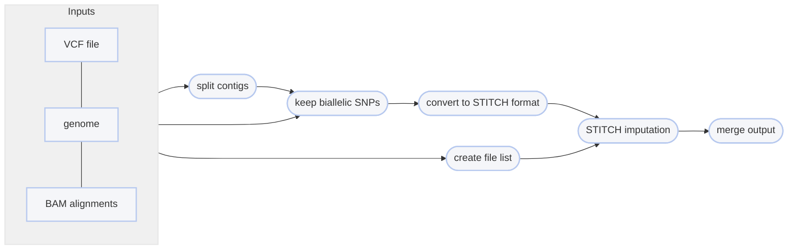

# :icon-project: Impute Genotypes using Sequences

===  :icon-checklist: You will need
- at least 4 cores/threads available
- a tab-delimited [parameter file](#parameter-file) 
- sequence alignments: [!badge variant="success" text=".bam"] [!badge variant="secondary" text="coordinate-sorted"]
    - **sample names**: [!badge variant="success" text="a-z"] [!badge variant="success" text="0-9"] [!badge variant="success" text="."] [!badge variant="success" text="_"] [!badge variant="success" text="-"] [!badge variant="secondary" text="case insensitive"]
- a variant call format file: [!badge variant="success" text=".vcf"] [!badge variant="success" text=".vcf.gz"] [!badge variant="success" text=".bcf"]
==- :icon-codescan: Curation of input VCF file
To work well with STITCH, Harpy needs the input variant call file to meet specific criteria.
Where labelled with [!badge variant="secondary" text="automatic"], Harpy will perform those curation steps on your input
variant call file. Where labelled with [!badge variant="warning" text="manual"], you will need to perform these curation
tasks yourself prior to running the [!badge corners="pill" text="impute"] module. 

#### Variant call file criteria

1. [!badge variant="secondary" text="automatic"] Biallelic SNPs only
2. [!badge variant="secondary" text="automatic"] VCF is sorted by position
3. [!badge variant="warning" text="manual"] No duplicate positions
    - ```bash example to remove duplicate positions
        bcftools norm -D in.vcf -o out.vcf
        ```
4. [!badge variant="warning" text="manual"] No duplicate sample names
    - ```bash count the occurrence of samples
        bcftools query -l file.bcf | sort | uniq -c
        ```
    - you will need to remove duplicate samples how you see fit
===

After variants have been called, you may want to impute missing genotypes to get the
most from your data. Harpy uses `STITCH` to impute genotypes, a haplotype-based
method that is linked-read aware. Imputing genotypes requires a variant call file 
**containing SNPs**, such as that produced by [!badge corners="pill" text="harpy snp"](snp.md) and preferably [filtered in some capacity](/blog/filtering_snps.md).
You can impute genotypes with Harpy using the [!badge corners="pill" text="impute"] module:
```bash usage
harpy impute OPTIONS... INPUTS...
```

```bash example
# create the parameter file 'stitch.params'
harpy imputeparams -o stitch.params 

# run imputation
harpy impute --threads 20 --vcf Variants/mpileup/variants.raw.bcf --parameters stitch.params Align/ema
```

## :icon-terminal: Running Options
In addition to the [!badge variant="info" corners="pill" text="common runtime options"](/commonoptions.md), the [!badge corners="pill" text="impute"] module is configured using these command-line arguments:

{.compact}
| argument         | short name | default | description                                                                                                                  |
| :--------------- | :--------: | :-----: | :--------------------------------------------------------------------------------------------------------------------------- |
| `INPUTS`         |            |         | [!badge variant="info" text="required"] Files or directories containing [input BAM files](/commonoptions.md)                 |
| `--extra-params` |    `-x`    |         | Extra arguments to add to the STITCH R function, provided in quotes and R syntax                                             |
| `--parameters`   |    `-p`    |         | [!badge variant="info" text="required"] STITCH [parameter file](#parameter-file) (tab-delimited)                             |
| `--vcf`          |    `-v`    |         | [!badge variant="info" text="required"] Path to VCF/BCF file                                                                 |
| `--vcf-samples`  |            |         | Use samples present in vcf file for imputation rather than those found the directory ([see below](#prioritize-the-vcf-file)) |

### Extra STITCH parameters
You may add [additional parameters](https://github.com/rwdavies/STITCH/blob/master/Options.md) to STITCH by way of the 
`--extra-params` (or `-x`) option. Since STITCH is a function in the R language, the parameters you add must be in R 
syntax (e.g. `regionStart=0`, `populations=c("GBA","CUE")`). The argument should be wrapped in quotes (like in other Harpy modules),
however, if your additional parameters require the use of quotes (like the previous example), then wrap the `-x` argument 
in **single quotes**. Otherwise, the format should take the form of `"arg1=value, arg2=value2"`. Example:
```bash
harpy impute -v file.vcf -p stitch.params -t 15 -x 'regionStart=20, regionEnd=500' Align/ema
```

### Prioritize the vcf file
Sometimes you want to run imputation on all the samples present in the `INPUTS`, but other times you may want
to only impute the samples present in the `--vcf` file. By default, Harpy assumes you want to use all the samples
present in the `INPUTS` and will inform you of errors when there is a mismatch between the sample files
present and those listed in the `--vcf` file. You can instead use the `--vcf-samples` flag if you want Harpy to build a workflow
around the samples present in the `--vcf` file. When using this toggle, Harpy will inform you when samples in the `--vcf` file
are missing from the provided `INPUTS`.   

## :icon-file: Parameter file
Typically, one runs STITCH multiple times, exploring how results vary with
different model parameters (explained in next section). The solution Harpy uses for this is to have the user
provide a tab-delimited dataframe file where the columns are the 6 STITCH model 
parameters and the rows are the values for those parameters. The parameter file 
is required and can be created manually or with [!badge corners="pill" text="harpy imputeparams"](other.md/#imputeparams).
If created using harpy, the resulting file includes largely meaningless values 
that you will need to adjust for your study. The parameter must follow a particular format:
- tab or comma delimited
- column order doesn't matter, but all 7 column names must be present
- header row present with the specific column names below

+++example file
This file is tab-delimited, note the column names:
``` paramaters.txt
name    model   usebx   bxlimit   k       s       nGen
model1    diploid   TRUE    50000    10      5       50
model2    diploid   TRUE    50000   15      10      100
waffles    pseudoHaploid   TRUE    50000   10      1       50
```
+++example file (as a table)
This is the table view of the tab-delimited file, shown here for clarity.

{.compact}
| name    | model         | useBX | bxlimit | k   | s   | nGen |
| :------ | :------------ | :---- | :------ | :-- | :-- | :--- |
| model1  | diploid       | TRUE  | 50000   | 10  | 5   | 50   |
| model2  | diploid       | TRUE  | 50000   | 15  | 10  | 100  |
| waffles | pseudoHaploid | TRUE  | 50000   | 10  | 1   | 50   |

+++parameter file columns
See the section below for detailed information on each parameter. This
table serves as an overview of the parameters.

{.compact}
| column name |               accepted values                | description                                                                                     |
| :---------- | :------------------------------------------: | :---------------------------------------------------------------------------------------------- |
| name        |      alphanumeric (a-z, 0-9) and `-_.`       | Arbitrary name of the parameter set, used to name outputs                                       |
| model       | `pseudoHaploid`, `diploid`, `diploid-inbred` | The STITCH model/method to use  [!badge variant="secondary" text="case sensitive"]              |
| usebx       |         `true`, `false`, `yes`, `no`         | Whether to incorporate beadtag information [!badge variant="secondary" text="case insensitive"] |
| bxlimit     |                     ≥ 1                      | Distance between identical BX tags at which to consider them different molecules                |
| k           |                     ≥ 1                      | Number of founder haplotypes                                                                    |
| s           |                     ≥ 1                      | Number of instances of the founder haplotypes to average results over                           |
| nGen        |                     ≥ 1                      | Estimated number of generations since founding                                                  |

+++

## STITCH Parameters
+++model
##### Which method to use
STITCH uses one of three "methods" reflecting different statistical and biological models: 
- `diploid`: the best general method with the best statistical properties
    - run time is proportional to the square of `k` and so may be slow for large, diverse populations
- `pseudoHaploid`: uses statistical approximations that makes it less accurate than `diploid` 
    - run time is proportional to `k` and may be suitable for large, diverse populations
- `diploid-inbred`: assumes all samples are completely inbred and as such uses an underlying haplotype based imputation model
    - run time is proportional to `k`

Each model assumes the samples are diploid and all methods output diploid genotypes and probabilities.

+++usebx
##### Use BX barcodes
The `useBX` parameter is given as a true/false. Simulations suggest including linked-read information isn't helpful
in species with short haploblocks (it might makes things worse). So, it's worth trying both options if you aren't
sure about the length of haplotype blocks in your species.

+++bxlimit
The `bxlimit` parameter is an integer that informs STITCH when alignments with the same barcode on the same contig
should be considered as originating from different molecules. This is a common consideration for linked-read analyses
and 50kb (`50000`) is often a reasonable default. A lower value is considered more strict (fewer reads per moleucle)
and a higher value is considered more generous (more reads per molecule). You can/should change this value if you 
have evidence that 50kb isn't appropriate. See [haplotag data](/haplotagdata/#barcode-thresholds) for a more thorough explanation.

+++k
##### Number ancestral haplotypes
The `k` parameter is the number of ancestral haplotypes in the model. Larger K allows for more accurate imputation for 
large samples and coverages, but takes longer and accuracy may suffer with lower coverage. There's value in in trying a
few values of `k` and assess performance using either external validation, or the distribution of quality scores 
(_e.g._ mean / median INFO score). The best `k` gives you the best performance (accuracy, correlation or quality score distribution)
within computational constraints, while also ensuring `k` is not too large given your sequencing coverage (_e.g._ try to ensure 
that each ancestral haplotype gets at least a certain average \_X of coverage, like 10X, given your number of samples and average depth).

+++s
##### Number of ancestral haplotypes to average over
The `s` parameter controls the number of sets of ancestral haplotypes used and which final results are averaged over. 
This may be useful for wild or large populations, like humans. The `s` value should affect RAM and run time in a near-linearly.

!!!
For the time being, it's probably best to set this value to `1` due to [this inconsistent issue](https://github.com/rwdavies/STITCH/issues/98#issuecomment-2248700697).
!!!

+++nGen
##### Recombination rate between samples
The `nGen` parameter controls recombination rate between the sequenced samples and the ancestral haplotypes. 
It's probably fine to set it to $ \frac {4 \times Ne} {k} $ given some estimate of effective population size ${Ne}$ .
If you think your population can be reasonably approximated as having been founded some number of generations 
ago or reduced to $2 \times k$ that many generations ago, use that generation time estimate. STITCH should be fairly 
robust to misspecifications of this parameter.
+++

----
## :icon-git-pull-request: Imputation Workflow
+++ :icon-git-merge: details
[STITCH](https://github.com/rwdavies/STITCH) is a genotype imputation software developed for use in
the R programming language. It has quite a few model parameters that can be tweaked, but HARPY only
focuses on a small handful that have the largest impact on the quality of the results. Imputation is
performed on a per-contig (or chromosome) level, so Harpy automatically iterates over the contigs
present in the input variant call file. Using the magic of Snakemake, Harpy will automatically
iterate over these model parameters.

!!! Filtering for biallelic contigs
Since STITCH creates haplotype blocks from which it imputes genotypes, it will not work for
contigs with no biallelic SNPs (obvious reasons), or contigs with a single biallelic SNP
(need 2+ SNPs to create haplotype). Therefore, Harpy first identifies which
contigs have at least 2 biallelic SNPs, then performs imputation on only those contigs.  
!!!


+++ :icon-file-directory: impute output
The default output directory is `Impute` with the folder structure below. `contig1` and `contig2` 
are generic contig names from an imaginary `genome.fasta` for demonstration purposes. The directory `modelname`
is a placeholder for whatever `name` you gave that parameter set in the parameter file's `name` column.
The resulting folder also includes a `workflow` directory (not shown) with workflow-relevant runtime files and information.

```
Impute/
└── modelname
    ├── modelname.bcf
    ├── modelname.bcf.csi
    ├── contigs
    │    ├── contig1.vcf.gz
    │    ├── contig1.vcf.gz.tbi
    │    ├── contig2.vcf.gz
    │    └── contig2.vcf.gz.tbi
    ├── logs
    └── reports
        ├── data
        ├── contig1.modelname.html
        ├── contig2.modelname.html
        └── modelname.html

```
{.compact}
| item                                 | description                                  |
| :----------------------------------- | :------------------------------------------- |
| `modelname/modelname.bcf`            | final bcf file of imputed genotypes          |
| `modelname/modelname.bcf.csi`        | index of `modelname.bcf`                     |
| `modelname/reports/modelname.html`   | report summarizing the results of imputation |
| `modelname/reports/*.modelname.html` | summary of STITCH imputation (per contig)    |
| `modelname/contigs/*.vcf.gz`         | variants resulting from imputation           |
| `modelname/contigs/*.vcf.gz.tbi`     | index of variant file                        |

+++ :icon-code-square: STITCH parameters
While you are expected to run STITCH using your own set of 
configurable parameters as described in the section below, Harpy 
also runs STITCH with a few fixed parameters:
```r
STITCH(
    ..., 
    bxTagUpperLimit      = 50000,
    niterations          = 40,
    switchModelIteration = 39,
    splitReadIterations  = NA
)
```
+++ :icon-graph: reports
These are the summary reports Harpy generates for this workflow. You may right-click
the images and open them in a new tab if you wish to see the examples in better detail.

||| STITCH Reports
Aggregates the various outputs of a STITCH run into a single report along with `bcftools stats`.

||| Imputation Metrics
Reports how effective STITCH was at genotype imputation.

|||

+++
