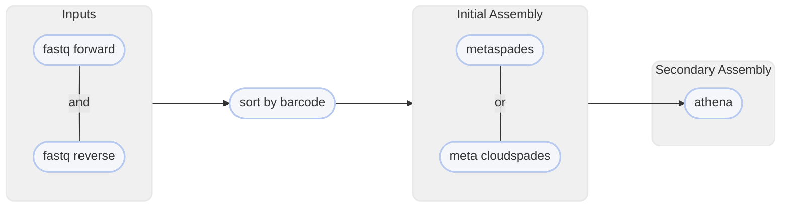

# :icon-workflow: Create a Metagenome Assembly

===  :icon-checklist: You will need
- at least 2 cores/threads available
- paired-end reads from an Illumina sequencer in FASTQ format [!badge variant="secondary" text="gzip recommended"]
    - deconvolved with [!badge corners="pill" text="deconvolve"](deconvolve.md) (QuickDeconvolution) or equivalent [!badge variant="warning" text="IMPORTANT"]
===

If you have mixed-sample data, you might be interested in a metagenome assembly, also known as a metassembly. Unlike
a single-sample assembly, a metassembly assumes there are multiple genomes present in your sequences and will try to
assemble the most contiguous sequences for multi-sample (or multi-species) data.

```bash usage
harpy metassembly OPTIONS... FASTQ_R1 FASTQ_R2
```

```bash example
harpy metassembly --threads 20 -u prokaryote -k 13,51,75,83 FASTQ_R1 FASTQ_R2
```

## :icon-terminal: Running Options
In addition to the [!badge variant="info" corners="pill" text="common runtime options"](/Getting_Started/common_options.md), the [!badge corners="pill" text="metassembly"] module is configured using these command-line arguments:

{.compact}
| argument               |   default   | description                                                                                                                                    |
|:-----------------------|:-----------:|:-----------------------------------------------------------------------------------------------------------------------------------------------|
| `FASTQ_R1`             |             | [!badge variant="info" text="required"] deconvolved FASTQ file of forward reads                                                                |
| `FASTQ_R2`             |             | [!badge variant="info" text="required"] deconvolved FASTQ file of reverse reads                                                                |
| `--bx-tag` `-b`        |    `BX`     | [!badge variant="info" text="required"] Which sequence header tag encodes the linked-read barcode (`BX` for `BX:Z` or `BC` for `BC:Z`)         |
| `--extra-params` `-x`  |             | Additional spades parameters, in quotes                                                                                                        |
| `--ignore-bx`          |             | Ignore linked-read info for initial spades assembly                                                                                            |
| `--kmer-length` `-k`   |   `auto`    | Kmer lengths to use for initial spades assembly. They must be **odd** and **<128**, separated by commas, and without spaces. (e.g. `13,23,51`) |
| `--max-memory` `-r`    |   `10000`   | Maximum memory for spades to use, given in megabytes                                                                                           |
| `--organism-type` `-u` | `eukaryote` | Organism type for assembly report. Options: `eukaryote`,`prokaryote`,`fungus`                                                                  |

## :icon-tag: Deconvolved Inputs
For linked-read assemblies, the barcodes need to be deconvolved in the sequence data, meaning that
barcodes that are shared by reads that originate from different molecules need to have unique barcode
IDs. Deconvolution often takes the form of adding a hyphenated integer to the end of a barcode so that software
can recognize that they are different from each other. For example: two sequences from different molecules
sharing the [linked read] barcode `A03C45B11D91` would have one of them recoded as `A03C45B11D91-1`. Software
like [QuickDeconvolution](https://github.com/RolandFaure/QuickDeconvolution), which is used by [!badge corners="pill" text="deconvolve"](deconvolve.md) will parse
your fastq input files and perform this deconvolution.

## :icon-git-pull-request: Metassembly Workflow
+++ :icon-git-merge: details
Initial assembly is performed with [spades](http://ablab.github.io/spades/) or [cloudspades](https://github.com/ablab/spades/tree/cloudspades-ismb)
depending on whether `--ignore-bx` was used. After the initial spades-based assembly,
[athena](https://github.com/abishara/athena_meta) assembles the contigs into larger scaffolds.



+++ :icon-file-directory: metassembly output
The default output directory is `Metassembly` with the folder structure below. If `--ignore-bx` is used, the initial
spades assembly will be in `*/spades_assembly`, otherwise it will be in `*/cloudspades_assembly`. Using `--skip-reports`
will skip the QUAST/BUSCO analysis as well. The file structure below isn't exhaustive and serves to highlight the general
structure and most important outputs.
```
Metassembly/
├── athena
│   ├── athena.asm.fa
│   └── athena.config
├── busco
│   ├── short_summary.*.txt
│   └── run_*_odb10
├── quast
│   ├── report.*
│   └── predicted_genes
├── reports
│   └── assembly.metrics.html
└── *spades_assembly
    └── contigs.fasta
```
{.compact}
| item                             | description                                                                   |
| :------------------------------- | :---------------------------------------------------------------------------- |
| `athena/athena.asm.fa`           | final metagenome assemble                                                     |
| `busco/`                         | directory with results from the BUSCO analysis                                |
| `busco/short_summary.*.txt`      | text file summarizing BUSCO analysis                                          |
| `busco/run_*_odb10`              | directory with results from the BUSCO analysis for the specific organism type |
| `quast/`                         | directory with results from the QUAST analysis                                |
| `quast/report*`                  | resulting QUAST report in various formats                                     |
| `quast/predicted_genes/`         | GLIMMER gene-finding output                                                   |
| `reports/assembly.metrics.html`  | aggregate and generalization of QUAST and BUSCO results                       |
| `*spades_assembly/`              | directory with the SPADES output                                              |
| `*spades_assembly/contigs.fasta` | the resulting primary assembly                                                |

+++ :icon-code-square: SPADES parameters
By default, Harpy runs `spades` with these parameters (excluding inputs and outputs):
```bash
spades.py --meta -t threads -m mem -k k --gemcode1-1 FQ_R1 --gemcode1-2 FQ_R2

# with --ignore-bx
## error correct reads
metaspades.py -t threads -m mem -k k -1 FQ_R1 -2 FQ_R2 --only-error-correction
## assemble corrected reads
metaspades.py -t threads -m mem -k k -1 FQ_R1C -2 FQ_R2C -s FQ_UNPAIREDC --only-assembler
```
See the [SPADES documentation](http://ablab.github.io/spades/running.html) for a list of all available command line options.

+++ :icon-graph: reports
These are the summary reports Harpy generates for this workflow. You may right-click
the image and open it in a new tab if you wish to see the example in better detail.

|||Aggregated Report
Aggregates QUAST and BUSCO analyses.

||| QUAST Report
This is the report produced by QUAST

|||
+++
