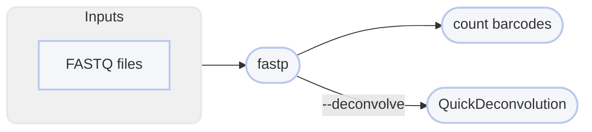

# :icon-codescan-checkmark: Quality Trim Sequences

===  :icon-checklist: You will need
- at least 2 cores/threads available
- paired-end [fastq](../haplotagdata.md/#naming-conventions) sequence files [!badge variant="secondary" text="gzip recommended"]
    - **sample names**: [!badge variant="success" text="a-z"] [!badge variant="success" text="0-9"] [!badge variant="success" text="."] [!badge variant="success" text="_"] [!badge variant="success" text="-"] [!badge variant="secondary" text="case insensitive"]
    - **forward**: [!badge variant="success" text="_F"] [!badge variant="success" text=".F"] [!badge variant="success" text=".1"] [!badge variant="success" text="_1"] [!badge variant="success" text="_R1_001"] [!badge variant="success" text=".R1_001"] [!badge variant="success" text="_R1"] [!badge variant="success" text=".R1"] 
    - **reverse**: [!badge variant="success" text="_R"] [!badge variant="success" text=".R"] [!badge variant="success" text=".2"] [!badge variant="success" text="_2"] [!badge variant="success" text="_R2_001"] [!badge variant="success" text=".R2_001"] [!badge variant="success" text="_R2"] [!badge variant="success" text=".R2"] 
    - **fastq extension**: [!badge variant="success" text=".fq"] [!badge variant="success" text=".fastq"] [!badge variant="secondary" text="case insensitive"]
===

Raw sequences are not suitable for downstream analyses. They have sequencing adapters,
index sequences, regions of poor quality, etc. The first step of any genetic sequence
analyses is to remove these adapters and trim poor quality data. You can remove adapters,
remove duplicates, deconvolve, and quality trim sequences using the [!badge corners="pill" text="qc"] module:

```bash usage
harpy qc OPTIONS... INPUTS...
```

```bash example
harpy qc --threads 20 -a auto Sequences_Raw/ 
```

## :icon-terminal: Running Options
In addition to the [!badge variant="info" corners="pill" text="common runtime options"](/common_options.md), the [!badge corners="pill" text="qc"] module is configured using these command-line arguments:

{.compact}
| argument               | default | description                                                                                                                                                                                                  |
|:-----------------------|:-------:|:-------------------------------------------------------------------------------------------------------------------------------------------------------------------------------------------------------------|
| `INPUTS`               |         | [!badge variant="info" text="required"] Files or directories containing [input FASTQ files](/common_options.md#input-arguments)                                                                              |
| `--deconvolve` `-c`    |         | Resolve barcode clashes between reads from different molecules. Accepts the [QuickDeconvolution parameters](/Workflows/deconvolve.md/#running-options) for `k`,`w`,`d`,`a`, in that order (e.g. `21 40 3 0`) |
| `--deduplicate` `-d`   |         | Identify and remove PCR duplicates                                                                                                                                                                           |
| `--extra-params` `-x`  |         | Additional fastp arguments, in quotes                                                                                                                                                                        |
| `--ignore-bx`          |  false  | Ignore parts of the workflow specific to linked-read sequences                                                                                                                                               |
| `--min-length` `-m`    |  `30`   | Discard reads shorter than this length                                                                                                                                                                       |
| `--max-length` `-M`    |  `150`  | Maximum length to trim sequences down to                                                                                                                                                                     |
| `--trim-adapters` `-a` |         | Detect and remove adapter sequences  [!badge variant="secondary" text="recommended"]                                                                                                                         |

By default, this workflow will only quality-trim the sequences.
#### deduplicate reads [!badge variant="warning" text="not recommended"]
You can opt-in to have `fastp` deduplicate optical (PCR) duplicates. It's generally not recommended to perform deduplication during quality-checking,
as the [!badge corners="pill" text="align"](Align/Align.md) workflows use the linked-read barcode to more accurately tag reads as duplicates.

#### deconvolve reads [!badge variant="secondary" text="conditionally recommended"]
You can opt-in to resolve situations where reads from different molecules have the same barcode (see [!badge corners="pill" text="deconvolve"](deconvolve.md)).
Performing deconvolution during the quality-checking stage of ones work would be most useful for [!badge corners="pill" text="assembly"](assembly.md)
and [!badge corners="pill" text="metassembly"](metassembly.md) workflows, but might hinder variant-detection workflows.

#### trimming adapters [!badge variant="secondary" text="recommended"]
You can opt-in to find and remove adapter content in sequences.
- accepts `auto` for automatic adapter detection and removal
- accepts a FASTA file of adapter sequences
``` example FASTA file of adapters
>Illumina TruSeq Adapter Read 1
AGATCGGAAGAGCACACGTCTGAACTCCAGTCA
>Illumina TruSeq Adapter Read 2
AGATCGGAAGAGCGTCGTGTAGGGAAAGAGTGT
>polyA
AAAAAAAAAAAAAAAAAAAAAAAAAAAAAAAAAAAAAAAAAAAAAAA
```
==- Trimming reads to different lengths
In the event you need the forward and reverse reads trimmed down to different read lengths, this can be achieved by
setting `-M` (`--max-length`) to the length you want the **forward** reads trimmed down to (e.g. `-M 125`), then specify an extra
`fastp` parameter with `-x "--max_len2 VAL"` to set the maximum length of the **reverse** reads to `VAL`, e.g. `-x "--max_len2 130"`.
In practice that would look like:
```bash
harpy qc -M 150 -x "--max_len2 125" -a data/fastq/
```
===

---
## :icon-git-pull-request: QC Workflow
+++ :icon-git-merge: details
[Fastp](https://github.com/OpenGene/fastp) is an ultra-fast all-in-one adapter remover, deduplicator, 
and quality trimmer. Harpy uses it to remove adapters, low-quality bases, and trim sequences down to a particular
length (default 150bp). Harpy uses the fastp overlap analysis to identify adapters for removal and a sliding window
approach (`--cut-right`) to identify low quality bases. The workflow is quite simple.



+++ :icon-file-directory: qc output
The default output directory is `QC` with the folder structure below. `Sample1` and `Sample2` are generic sample names for demonstration purposes. 
The resulting folder also includes a `workflow` directory (not shown) with workflow-relevant runtime files and information.
```
QC/
├── Sample1.R1.fq.gz
├── Sample1.R2.fq.gz
├── Sample2.R1.fq.gz
├── Sample2.R2.fq.gz
├── reports
│   ├── Sample1.html
│   ├── Sample2.html
│   ├── summary.bx.valid.html
│   └── trim.report.html
└── logs
    ├── err
    │   ├── Sample1.log
    │   └── Sample2.log
    └── json
        ├── Sample1.fastp.json
        └── Sample2.fastp.json
```
{.compact}
| item                            | description                                                                        |
|:--------------------------------|:-----------------------------------------------------------------------------------|
| `*.R1.fq.gz`                    | quality trimmed forward reads of the samples                                       |
| `*.R1.fq.gz`                    | quality trimmed reverse reads of the samples                                       |
| `logs/`                         | all debug/diagnostic files that aren't the trimmed reads `fastp` creates           |
| `logs/err`                      | what fastp prints to `stderr` when running                                         |
| `reports/*.html`                | interactive html reports `fastp` creates from quality trimming                     |
| `reports/trim.report.html`      | a report generated by `multiqc` summarizing the quality trimming results           |
| `reports/summary.bx.valid.html` | a report detailing valid vs invalid barcodes and the segments causing invalidation |
| `logs/json`                     | json representation of the data `fastp` uses to create the html reports            |

+++ :icon-code-square: fastp parameters
By default, Harpy runs `fastp` with these parameters (excluding inputs and outputs):
```bash
fastp --trim_poly_g --cut_right
```

The list of all `fastp` command line options is quite extensive and would
be cumbersome to print here. See the list of options in the [fastp documentation](https://github.com/OpenGene/fastp).

+++ :icon-graph: reports

These are the summary reports Harpy generates for this workflow. You may right-click
the images and open them in a new tab if you wish to see the examples in better detail.

||| fastp reports
Reports of all QC activities performed by fastp (fastp creates this)

||| Trimming and QC
Aggregates the metrics FASTP generates for every sample during QC.

||| BX validation
Reports the number of valid/invalid barcodes in the sequences and the segments contributing to invalidation.

|||

+++
