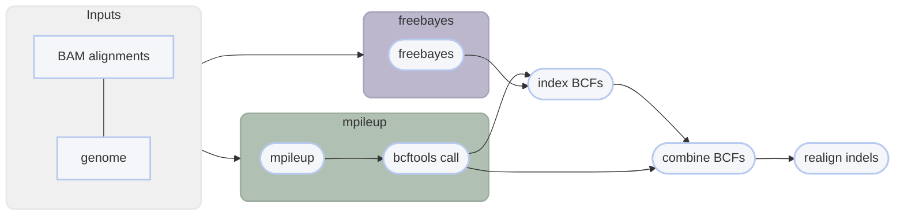

# :icon-sliders: Call SNPs and small indels

===  :icon-checklist: You will need
- at least 4 cores/threads available
- sequence alignments: [!badge variant="success" text=".bam"] [!badge variant="secondary" text="coordinate-sorted"]
    - **sample name**: [!badge variant="success" text="a-z"] [!badge variant="success" text="0-9"] [!badge variant="success" text="."] [!badge variant="success" text="_"] [!badge variant="success" text="-"] [!badge variant="secondary" text="case insensitive"]
- genome assembly in FASTA format: [!badge variant="success" text=".fasta"] [!badge variant="success" text=".fa"] [!badge variant="success" text=".fasta.gz"] [!badge variant="success" text=".fa.gz"] [!badge variant="secondary" text="case insensitive"]
- [!badge variant="ghost" text="optional"] sample grouping file
==- :icon-file: sample grouping file [!badge variant="ghost" text="optional"]
This file is optional and useful if you want variant calling to happen on a per-population level.
- takes the format of sample[!badge variant="ghost" text="tab"]group
    - spaces can be used as delimeters too
- the groups can be numbers or text (_i.e._ meaningful population names)
- you can comment out lines with `#` for Harpy to ignore them
- create with [!badge corners="pill" text="harpy template groupings"](other.md/#groupings) or manually
- if created with [!badge corners="pill" text="harpy template groupings"](other.md/#groupings), all the samples will be assigned to group `pop1`, so make sure to edit the second column to reflect your data correctly.

``` example file for --populations
sample1 pop1
sample2 pop1
sample3 pop2
sample4 pop1
sample5 pop3
#sample5 pop4
```

!!!warning known quirk
There's an unusual error on the Snakemake side of things that happens when the name of a sample and population are identical.
It has been unclear how to resolve this issue, so to protect yourself, it's best to make sure the population names are different
from the sample names. A simple fix would be to use underscores (`_`) to differentiate the population name.
!!!
===

After reads have been aligned, _e.g._, with [!badge corners="pill" text="harpy align"](Align/Align.md), you can use those alignment files
(`.bam`) to call variants in your data. Harpy can call SNPs and small indels using 
[bcftools mpileup](#snp-calling-workflow) or with [freebayes](#snp-calling-workflow). 
You can call SNPs with the [!badge corners="pill" text="snp"] module:

```bash usage
harpy snp method OPTIONS... REFERENCE INPUTS...
```

```bash examples
# call variants with mpileup
harpy snp mpileup --threads 20 genome.fasta Align/bwa

# call variants with freebayes
harpy snp freebayes --threads 20 genome.fasta Align/bwa
```

## :icon-terminal: Running Options
In addition to the [!badge variant="info" corners="pill" text="common runtime options"](../Getting_Started/common_options.md), the [!badge corners="pill" text="snp"] module is configured using these command-line arguments:

{.compact}
| argument              | default | description                                                                                                                   |
|:----------------------|:-------:|:------------------------------------------------------------------------------------------------------------------------------|
| `REFERENCE` `-g`      |         | [!badge variant="info" text="required"] Reference genome used for variant calling                                             |
| `INPUTS`              |         | [!badge variant="info" text="required"] Files or directories containing [input BAM files](/Getting_Started/common_options.md#input-arguments) |
| `--extra-params` `-x` |         | Additional mpileup/freebayes arguments, in quotes                                                                             |
| `--ploidy` `-n`       |   `2`   | Ploidy of samples                                                                                                             |
| `--populations` `-p`  |         | Tab-delimited file of sample\<*tab*\>group                                                                                    |
| `--regions` `-r`      | `50000` | Regions to call variants on ([see below](#regions))                                                                           |

### ploidy
If you are calling haploid or diploid samples, using either `mpileup` or `freebayes` will be comparable. However, if you need to call SNPs in polyploids (ploidy >2),
then you will need to use `freebayes`, since `mpileup` does not call variants for ploidy greater than 2.

### regions
The `--regions` (`-r`) option lets you specify the genomic regions you want to call variants on. Keep in mind that
`mpileup` uses 1-based positions for genomic intervals, whereas `freebayes` uses 0-based positions. Harpy will perform
variant calling in parallel over these invervals and they can be specified in three ways:

=== Option 1: Call variants over entire genome
!!!info
**input**: an integer to make fixed-size genomic intervals

**example**: `harpy snp -r 25000 -g genome.fasta data/mapped`
!!!

This is the default method (`-r 50000`), where Harpy will create 50 kbp non-overlapping genomic intervals across
the entire genome. Intervals towards the end of contigs that are shorter than the specified interval
size are still used. These invervals look like:
```
chromosome_1    1   50000
chromosome_1    50001 100000
chromosome_1    100001  121761    <- reached the end of the contig
```

==- Option 2: Call variants on exactly one genomic interval
!!!info
**input**: a single region in the format `contig:start-end`

**example**: `harpy snp -r chrom1:2000-15000 -g genome.fasta data/mapped`
!!!

Following the `mpileup` and `freebayes` format, you can specify a single genomic interval of interest
to call variants on. This interval must be in the format `contig:start-end` where:
- `contig` is the exact name of a contig in the supplied genome
- `start` is an integer specifying the start position of the interval for that `contig`
- `end` is an integer specifying the end position of the interval for that `contig`

==- Option 3: Call variants on specific genomic intervals
!!!info
**input**: a tab (or space) delimited file of contigs and positions

**example**: `harpy snp -r data/positions.txt -g genome.fasta data/mapped`
!!!

A BED-like file of `contig<whitespace>start<whitespace>end` can be provided to call variants
on only specific genomic intervals. This file will look like:
```
chromosome_1    1   45000
chromosome_1    723123 999919
chromosome_5    22421   564121
```
===

### populations
Grouping samples changes the way the variant callers computes certain statistics when calling variants. If you
have reason to believe there is a biologically meaningful grouping scheme to your samples, then you should include
it.

## :icon-git-pull-request: SNP calling workflow
+++ :icon-git-merge: details
The workflow is parallelized over genomic intervals (`--regions`). All intermediate outputs are removed, leaving 
you only the raw variants file (in `.bcf` format), the index of that file, and some stats about it.

### SNP workflows
The `mpileup` and `call` modules from [bcftools](https://samtools.github.io/bcftools/bcftools.html) (formerly samtools) or [Freebayes](https://github.com/freebayes/freebayes) are used to call variants from alignments. Both
are very popular variant callers to call SNPs and small indels. 



+++ :icon-file-directory: snp output
The default output directory is `SNP/mpileup` or `SNP/freebayes`(depending on workflow) with the folder structure below.
Below, `contig1` and `contig2` are generic contig names from an imaginary `genome.fasta` for demonstration purposes.
The resulting folder also includes a `workflow` directory (not shown) with workflow-relevant runtime files and information.
```
SNP/method
├── variants.raw.bcf
├── variants.raw.bcf.csi
├── logs
│   ├── contig1.call.log   # mpileup only
│   ├── contig1.METHOD.log
│   ├── contig2.call.log   # mpileup only
│   ├── contig2.METHOD.log
│   ├── sample.groups
│   ├── samples.files
│   └── samples.names
└── reports
    ├── contig1.stats
    ├── contig2.stats
    ├── variants.raw.html
    └── variants.raw.stats
```
{.compact}
| item                      | description                                                                                    |
|:--------------------------|:-----------------------------------------------------------------------------------------------|
| `variants.raw.bcf`        | vcf file produced from variant calling, contains all samples and loci                          |
| `variants.normalized.bcf` | variants, but with indels realigned and duplicates removed                                     |
| `variants.*.bcf.csi`      | index file for `variants.*.bcf`                                                                |
| `logs/*.call.log`         | what `bcftools call` writes to `stderr`                                                        |
| `logs/*.METHOD.log`       | what `bcftools mpileup` or `freebayes` writes to `stderr`                                      |
| `logs/sample.groups`      | if provided, a copy of the file provided to `--populations` with commented lines removed       |
| `logs/samples.files`      | list of alignment files used for variant calling                                               |
| `logs/samples.names`      | list of sample names associated with alignment files used for variant calling                  |
| `reports/*.stats`         | output of `bcftools stats`                                                                     |
| `reports/variants.*.html` | report summarizing variants                                                                    |

+++ :icon-code-square: mpileup parameters
By default, Harpy runs `mpileup` with these parameters (excluding inputs and outputs):
```bash
bcftools mpileup --region contigname:START-END --annotate AD --output-type b --ploidy ploidy
```

The mpileup module of samtools has *a lot* of command line options. Listing them all here would be difficult to read, therefore please
refer to the [mpileup documentation](http://www.htslib.org/doc/samtools-mpileup.html#OPTIONS) to explore ways to configure your mpileup run.

+++ :icon-code-square: freebayes parameters
By default, Harpy runs `freebayes` with these parameters (excluding inputs and outputs):
```bash
freebayes -f genome.fasta -r contigname:START-END -L bam.list -p ploidy
```

Freebayes has *a lot* of command line options. Listing them all here would be difficult to read, therefore please
refer to the [freebayes documentation](https://github.com/freebayes/freebayes#usage) to explore ways to configure your freebayes run.
+++ :icon-graph: reports
These are the summary reports Harpy generates for this workflow. You may right-click
the image and open it in a new tab if you wish to see the example in better detail.

||| Variant stats

Summarizes information provided by `bcftools stats` on the called SNPs and indels.


|||

+++
