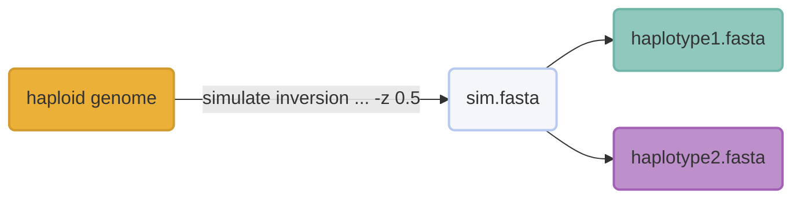
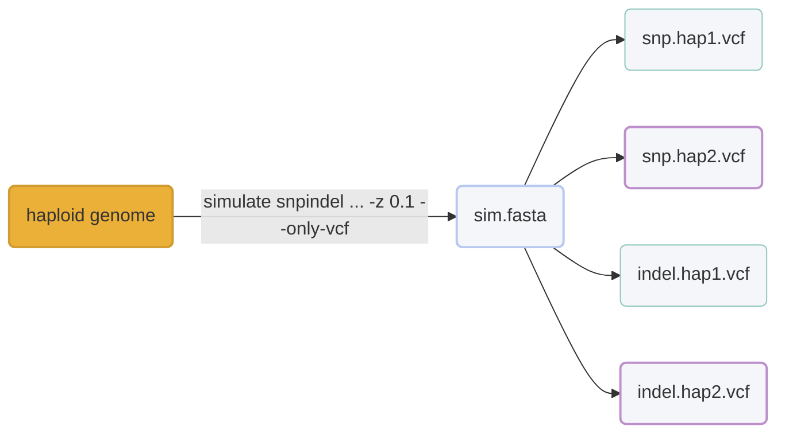
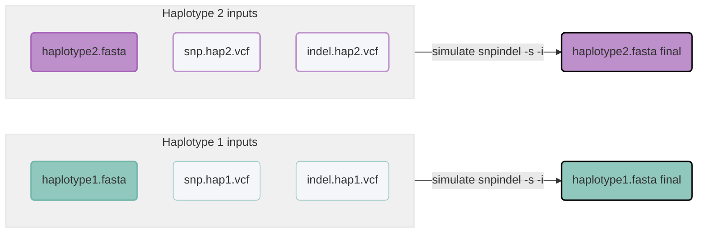

# :icon-git-merge-queue: Simulating variants
You may want to (and are encouraged to) simulate data before investing in the
costs associated with linked-read sample preparation and subsequent sequencing. 
Harpy provides both a variant and linked-read simulators and this tutorial serves to
show a real-world workflow starting with a haploid genome and creating a diploid genome
with the variants we want in it, which will then be fed into linked-read simulation. The
process might seem a little roundabout due to the limitations of the underlying software,
but it shouldn't be too bad to wrap your head around it! Ultimately, you will creating
linked-reads from the resulting genome and then aligning those reads onto your **original**
genome to identify those variants.

===  :icon-checklist: You will need
- a genome assembly in FASTA format: [!badge variant="success" text=".fasta"] [!badge variant="success" text=".fa"] [!badge variant="success" text=".fasta.gz"] [!badge variant="success" text=".fa.gz"] [!badge variant="secondary" text="case insensitive"]
!!! Picking a genome
For simplicity and shorter runtimes, this tutorial can be followed with a [Drosophila melanogaster](https://www.ncbi.nlm.nih.gov/datasets/genome/GCF_000001215.4/)
genome. Otherwise use your favorite genome! For learning purposes, the fewer contigs the better.
!!!
===

To keep this tutorial simple, but with a certain amount of real-world complexity, let's say you are interested in **inversions** and
whether your linked-reads will be able to identify inversions in your system. To simulate inversions, we will first simulate the inversions,
then simulate introduce SNPs and small idnels. The SNPs and indels serve to create typical variants in the downstream linked-reads because it's highly
unlikely that the _only_ variants in your data are a few inversions. 

!!! heterozygosity
By specifying a heterozygosity value for `harpy simulate ...`, we can make sure that our diploid haplotypes aren't exclusively homozygous for the alternative allele of the variants we are introducing.
!!!

## 1. Add random inversions
First, we will need to simulate some inversions and set a `--heterozygosity` value >0 to get a diploid genome as the output.
If you wanted to manually create inversions in specific areas or with specific lengths, this would be a good starting point too since
you could manually modify the resulting VCF to create the specific inversions you want (although use `--only-vcf`). We won't be covering
that here, but you should hopefully be able to intuit how to do that by the end of this tutorial.

```bash
harpy simulate inversion -n 20 -z 0.5 --min-size 30000 dmel.fa
```
==- :icon-terminal: code explanation
- `-n` is the number of random inversions (`20`)
- `--min-size` is the minimum inversion size (`30000`)
    - default is 1000 bp, which was arbitrarily made bigger in this example
- `-z` is the level of heterozygosity (`0.5` = 50%)
- `-o` is the name of the output directory
- `GENOME.fa` is your genome file
==- :icon-git-compare: diagram

=== 📝 output to keep
The two haploid FASTA files in `Simulate/inversion/diploid/`
===

## 2. Add snps and indels
Let's say we wanted to simulate SNPs and indels like so:
- 500 indels
- 75k snps
- introduce a heterozygosity of 10% for the variants
  - based on [this for flies](https://www.ncbi.nlm.nih.gov/pmc/articles/PMC1203202/pdf/255.pdf)

We will need to first create random SNPs and indels from the haploid genome, then let Harpy create
the homo/heterozygotes. We can then use the VCFs of hom/het variants to simulate those genotypes ([Step 3](#3-simulate-known-snps-and-indels-onto-the-diploid-genome-with-inversions)) onto
the resulting diploid genome from [Step 1](#1-add-random-inversions).

The Harpy command to accomplish this is:
```bash
harpy simulate snpindel -m 500 -n 75000 -z 0.1 --only-vcf -o sim_snpindel GENOME.fa
```
==- :icon-terminal: code explanation
- `-m` is the number of ranbom indels (`500`)
- `-n` is the number of random snps (`500`)
- `-z` is the level of heterozygosity (`0.1` = 10%)
- `-o` is the name of the output directory
    - specifying this so subsequent runs don't overwrite each other
- `--only-vcf` is to skip the diploid genome simulation
- `GENOME.fa` is your genome file
==- :icon-git-compare: diagram

=== 📝 output to keep
The two VCF files of SNPs and indels in the `diploid/` subdirectory. There should be 2 haplotypes for SNPs and two for indels, depending
on if you simulated one, the other, or both (up to a total of 4 VCF files).
===

## 3. Simulate "known" snps and indels onto the diploid genome with inversions
We will run Harpy twice, once for each haplotype, using the corresponding VCFs from [**Step 2**](#2-add-snps-and-indels):

The Harpy command to accomplish this is:
```bash
# haplotype 1
harpy simulate snpindel --snp-vcf SNP.hap1.vcf --indel-vcf indel.hap1.vcf -o sim_snp_hap1 haplotype1.fa

# haplotype 2
harpy simulate snpindel --snp-vcf SNP.hap2.vcf --indel-vcf indel.hap2.vcf -o sim_snp_hap2 haplotype2.fa
```
==- :icon-terminal: code explanation
- `--snp-vcf` is the vcf of snps for haplotype 1 (or 2) from [**Step 2**](#2-add-snps-and-indels)
- `--indel-vcf` is the vcf of indels for haplotype 1 (or 2) from [**Step 2**](#2-add-snps-and-indels)
- `-o` is the name of the output directory
- `haplotypeX.fa` is the two haploype genomes from  [**Step 1**](#1-add-random-inversions)
==- :icon-git-compare: diagram

=== 📝 output to keep
The resulting genomes for both haplotype 1 and haplotype 2
===
-------

## 5. Simulating linked-reads
Now that you have heterozygous haplotypes created from your starting genome, you can simulate linked-reads from it using
`harpy simulate linkedreads`. A simple implementation of that could look like:
```bash
harpy simulate linkedreads -t 4 6,96 HAP1.fa HAP2.fa
```
==- :icon-terminal: code explanation
- `-t` is the number of threads to use (`4`)
- `6,96` is the specification of generating 96 random barcodes that are 6bp each
  - the workflow defaults to the haplotagging design, meaning the barcodes will be 4-combinatorial (i.e. $96^4$ combinations)
- `HAP1.fa` is the resulting genome from [**Step 3: haplotype 1**](#3-simulate-known-snps-and-indels-onto-the-diploid-genome-with-inversions)
 - i.e. haplotype 1 with the simulated snps, indels, and inversions
- `HAP2.fa` is the resulting genome from [**Step 3: haplotype 2**](#3-simulate-known-snps-and-indels-onto-the-diploid-genome-with-inversions)
 - i.e. haplotype 2 with the simulated snps, indels, and inversions
===