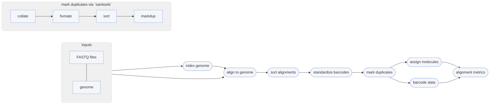

# :icon-quote: align bwa

===  :icon-checklist: You will need
- at least 4 cores/threads available
- a genome assembly in FASTA format: [!badge variant="success" text=".fasta"] [!badge variant="success" text=".fa"] [!badge variant="success" text=".fasta.gz"] [!badge variant="success" text=".fa.gz"] [!badge variant="secondary" text="case insensitive"]
- paired-end fastq sequence files [!badge variant="secondary" icon=":heart:" text="gzipped recommended"]
    - **sample name**: [!badge variant="success" text="a-z"] [!badge variant="success" text="0-9"] [!badge variant="success" text="."] [!badge variant="success" text="_"] [!badge variant="success" text="-"] [!badge variant="secondary" text="case insensitive"]
    - **forward**: [!badge variant="success" text="_F"] [!badge variant="success" text=".F"] [!badge variant="success" text=".1"] [!badge variant="success" text="_1"] [!badge variant="success" text="_R1_001"] [!badge variant="success" text=".R1_001"] [!badge variant="success" text="_R1"] [!badge variant="success" text=".R1"] 
    - **reverse**: [!badge variant="success" text="_R"] [!badge variant="success" text=".R"] [!badge variant="success" text=".2"] [!badge variant="success" text="_2"] [!badge variant="success" text="_R2_001"] [!badge variant="success" text=".R2_001"] [!badge variant="success" text="_R2"] [!badge variant="success" text=".R2"] 
    - **fastq extension**: [!badge variant="success" text=".fq"] [!badge variant="success" text=".fastq"] [!badge variant="secondary" text="case insensitive"]
===

Once sequences have been trimmed and passed through other QC filters, they will need to
be aligned to a reference genome. This module within Harpy expects filtered reads as input,
such as those derived using [!badge corners="pill" text="harpy qc"](../qc.md). You can map reads onto a genome assembly with Harpy 
using the [!badge corners="pill" text="align bwa"] module:

```bash usage
harpy align bwa OPTIONS... REFERENCE INPUTS...
```
```bash example
harpy align bwa genome.fasta Sequences/ 
```

## :icon-terminal: Running Options
In addition to the [!badge variant="info" corners="pill" text="common runtime options"](/Getting_Started/common_options.md), the [!badge corners="pill" text="align bwa"] module is configured using these command-line arguments:

{.compact .clean}
| argument    {.whitespace-nowrap} | default {.whitespace-nowrap} | description                                                                                                                                     |
| :------------------------------- | :--------------------------: | :---------------------------------------------------------------------------------------------------------------------------------------------- |
| `REFERENCE`                      |                              | [!badge variant="info" text="required"] Reference assembly for read mapping                                                                     |
| `INPUTS`                         |                              | [!badge variant="info" text="required"] Files or directories containing [input FASTQ files](/Getting_Started/common_options.md#input-arguments) |
| `-depth-window` `-w`             |           `50000`            | Interval size (in bp) for depth stats                                                                                                           |
| `--extra-params` `-x`            |                              | Additional BWA arguments, in quotes                                                                                                             |
| `--keep-unmapped` `-u`           |            false             | Output unmapped sequences too                                                                                                                   |
| `--molecule-distance` `-d`       |             `0`              | Base-pair distance threshold to separate molecules given as base pairs, disabled with `0`                                                       |
| `--min-quality` `-q`             |             `30`             | Minimum `MQ` (SAM mapping quality) to pass filtering                                                                                            |

### Output format
Regardless of the input linked-read format, the `align` workflows will standardize the output alignment records
such that the barcode is contained in the `BX:Z` tag and barcode validation is in the `VX:i` tag.

### Molecule distance
The `--molecule-distance` option is used during the alignment workflow
to deconvolute alignments with the same barcode that might not have originated
from the same DNA molecule based on the [distance threshold](/Getting_Started/linked_read_data.md#barcode-thresholds)
you specify. This happens _during the linked-read stats step_ to internally split molecules based on this value, but
**it doesn't modify** the barcodes in the output. Set this value to `0` to skip distance-based deconvolution during the
this reporting step. Ignored if using `--skip-reports`. 

## Quality filtering
The `--min-quality` argument filters out alignments below a given $MQ$ threshold. The default, `30`, keeps alignments
that are at least 99.9% likely correctly mapped. Set this value to `1` if you only want alignments removed with
$MQ = 0$ (0% likely correct). You may also set it to `0` to keep all alignments for diagnostic purposes.
The plot below shows the relationship between $MQ$ score and the likelihood the alignment is correct and will serve to help you decide
on a value you may want to use. It is common to remove alignments with $MQ <30$ (<99.9% chance correct) or $MQ <40$ (<99.99% chance correct).

==- What is the $MQ$ score?
Every alignment in a BAM file has an associated mapping quality score ($MQ$) that informs you of the likelihood 
that the alignment is accurate. This score can range from 0-40, where higher numbers mean the alignment is more
likely correct. The math governing the $MQ$ score actually calculates the percent chance the alignment is ***incorrect***: 
$$
\%\ chance\ incorrect = 10^\frac{-MQ}{10} \times 100\\
\text{where }0\le MQ\le 40
$$
You can simply subtract it from 100 to determine the percent chance the alignment is ***correct***:
$$
\%\ chance\ correct = 100 - \%\ chance\ incorrect\\
\text{or} \\
\%\ chance\ correct = (1 - 10^\frac{-MQ}{10}) \times 100
$$


===

## Marking PCR duplicates
Harpy uses `samtools markdup` to mark putative PCR duplicates by using both the `BX` tag
as a UMI (unique molecule identified) for more accurate duplicate detection. The read name
is also parsed to determine if the sequencing platform was HiSeq/NovaSeq to distinguish between
PCR and optical duplicates. Duplicate marking also uses the `-S` option to mark supplementary (chimeric)
alignments as duplicates if the primary alignment was marked as a duplicate. Duplicates get marked but **are not removed**.

----

## :icon-git-pull-request: BWA workflow
+++ :icon-git-merge: details
- ignores (but retains) barcode information
- fast

The [BWA MEM](https://github.com/bwa-mem2/bwa-mem2) workflow maps all reads against the reference genome. Duplicates are marked using `samtools markdup`.
The `BX:Z` tags in the read headers are still added to the alignment headers, even though barcodes
are not used to inform mapping. The `-m` threshold is used for alignment molecule assignment.


+++ :icon-file-directory: BWA output
The default output directory is `Align/bwa` with the folder structure below. `Sample1` is a generic sample name for demonstration purposes.
The resulting folder also includes a `workflow` directory (not shown) with workflow-relevant runtime files and information.
```
Align/bwa
├── Sample1.bam
├── Sample1.bam.bai
├── logs
│   ├── sample1.bwa.log
│   ├── sample1.markdup.log
│   │── sample1.sort.log
└── reports
    ├── barcodes.summary.html
    ├── bwa.stats.html
    ├── Sample1.html
    └── data
        ├── bxstats
        │   └── Sample1.bxstats.gz
        └── coverage
            └── Sample1.cov.gz
```
{.compact}
| item        {.whitespace-nowrap} | description                                                                      |
| :------------------------------- | :------------------------------------------------------------------------------- |
| `*.bam`                          | sequence alignments for each sample                                              |
| `*.bai`                          | sequence alignment indexes for each sample                                       |
| `logs/*bwa.log`                  | output of BWA during run                                                         |
| `logs/*markdup.log`              | stats provided by `samtools markdup`                                             |
| `logs/*sort.log`                 | output of `samtools sort`                                                        |
| `reports/`                       | various counts/statistics/reports relating to sequence alignment                 |
| `reports/barcodes.summary.ipynb` | report summarizing barcode-specific metrics across all samples                   |
| `reports/bwa.summary.ipynb`      | report summarizing `samtools stats` of raw alignments across all samples         |
| `reports/Sample1.ipynb`          | report summarizing BX tag metrics and alignment coverage                         |
| `reports/data/coverage/*.cov.gz` | output from mosdepth, used for reports                                           |
| `reports/data/lrstats`           | tabular data containing the information used to generate the BX stats in reports |

+++ :icon-code-square: BWA parameters
By default, Harpy runs `bwa` with these parameters (excluding inputs and outputs):
```bash
minibwa map -y -x sr -R "@RG\tID:samplename\tSM:samplename"
```

Below is a list of all `bwa-mem2 mem` command line arguments, excluding those Harpy already uses or those made redundant by Harpy's implementation of BWA.
These are taken directly from the [BWA documentation](https://bio-bwa.sourceforge.net/bwa.shtml).
```bwa arguments
Common:
    -l NUM           treat reads <NUM as short reads in the default adaptive mode [325]
    -b STR           output a base alignment tag: cs, ds or MD []
    --hic            map Hi-C reads; equivalent to option -5P
    --meth           map *directional* bisulfite sequencing reads
Mapping:
    -k INT           min seed length [19]
    -c NUM           max seed occurrences [250]
    -g NUM           max gap size, controlling extension and chain breaking [100]
    -w NUM           bandwidth [100]
    -W NUM           long bandwidth (for long reads or the adaptive mode) [20000]
    -m INT           min chaining score [25]
    -p FLOAT         min secondary-to-primary score ratio [0.5]
    -N INT           retain at most INT secondary alignments [50]
    --chain-only     perform chaining only without base alignment
Alignment:
    -A INT           matching score [2]
    -B INT           mismatching openalty [8]
    -O INT1[,INT2]   gap open penalty [12,23]
    -E INT1[,INT2]   gap extension penalty [2,1]
    -s INT           suppress alignment with DP score lower than INT*{-A} [30]
Paired-end:
    -P               skip pairing and mate rescue
    --rescue=INT     mate rescue for up to INT candidates; 0 to skip rescue [10]
    -I INT[,INT[,INT[,INT]]]
                     mean, stddev, max and min of isize distribution [inferred]
Input/Output:
    -o FILE          output file name [stdout]
    -u               don't output unmapped reads
    --outn=NUM       output up to {NUM,-N} secondary alignments [0]
    --outs=FLOAT     output a secondary hit if score at least FLOAT*bestScore [0.8]
    --xa=NUM         if <=NUM hits with score >80% of the best hit, output them to XA [5]
    -Y               use soft clipping for supplementary alignments
    -H STR           if STR starts with @, insert to header; or insert lines in file STR []
    -5               take the alignment with the smallest query position as primary
    -K NUM1[,NUM2]   process NUM1-NUM2 bp of query sequences in a batch [100m,1g]
    --mmap[=lite]    load the index via memory mapped files (slower mapping) []
```

+++
