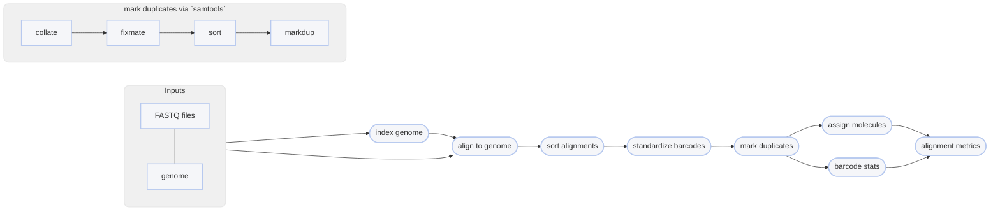

# :icon-quote: align without linked-read information
The process and commands for using minibwa, strobealign, and minimap2 are identical and consolidated here.

===  :icon-checklist: You will need
- at least 4 cores/threads available
- a genome assembly in FASTA format: [!badge variant="success" text=".fasta"] [!badge variant="success" text=".fa"] [!badge variant="success" text=".fasta.gz"] [!badge variant="success" text=".fa.gz"] [!badge variant="secondary" text="case insensitive"]
- paired-end fastq sequence files [!badge variant="secondary" icon=":heart:" text="gzipped recommended"]
    - **sample name**: [!badge variant="success" text="a-z"] [!badge variant="success" text="0-9"] [!badge variant="success" text="."] [!badge variant="success" text="_"] [!badge variant="success" text="-"] [!badge variant="secondary" text="case insensitive"]
    - **forward**: [!badge variant="success" text="_F"] [!badge variant="success" text=".F"] [!badge variant="success" text=".1"] [!badge variant="success" text="_1"] [!badge variant="success" text="_R1_001"] [!badge variant="success" text=".R1_001"] [!badge variant="success" text="_R1"] [!badge variant="success" text=".R1"] 
    - **reverse**: [!badge variant="success" text="_R"] [!badge variant="success" text=".R"] [!badge variant="success" text=".2"] [!badge variant="success" text="_2"] [!badge variant="success" text="_R2_001"] [!badge variant="success" text=".R2_001"] [!badge variant="success" text="_R2"] [!badge variant="success" text=".R2"] 
    - **fastq extension**: [!badge variant="success" text=".fq"] [!badge variant="success" text=".fastq"] [!badge variant="secondary" text="case insensitive"]
===

Once sequences have been trimmed and passed through other QC filters, they will need to
be aligned to a reference genome. This module within Harpy expects filtered reads as input,
such as those derived using [!badge corners="pill" text="harpy qc"](../qc.md). You can map reads onto a genome assembly with Harpy 
using the [!badge corners="pill" text="align bwa"] module:

```bash usage
harpy align bwa|stobe|minimap OPTIONS... REFERENCE INPUTS...
```
```bash example
harpy align bwa genome.fasta Sequences/ 
```

## :icon-terminal: Running Options
In addition to the [!badge variant="info" corners="pill" text="common runtime options"](/Getting_Started/common_options.md), the [!badge corners="pill" text="align bwa"]/[!badge corners="pill" text="align strobe"] modules are configured using these command-line arguments:

{.compact .clean}
| argument    {.whitespace-nowrap} | default {.whitespace-nowrap} | description                                                                                                                                     |
| :------------------------------- | :--------------------------: | :---------------------------------------------------------------------------------------------------------------------------------------------- |
| `REFERENCE`                      |                              | [!badge variant="info" text="required"] Reference assembly for read mapping                                                                     |
| `INPUTS`                         |                              | [!badge variant="info" text="required"] Files or directories containing [input FASTQ files](/Getting_Started/common_options.md#input-arguments) |
| `-depth-window` `-w`             |           `50000`            | Interval size (in bp) for depth stats                                                                                                           |
| `--extra-params` `-x`            |                              | Additional aligner-specific arguments, in quotes                                                                                                |
| `--keep-unmapped` `-u`           |            false             | Output unmapped sequences too                                                                                                                   |
| `--molecule-distance` `-d`       |             `0`              | Base-pair distance threshold to separate molecules given as base pairs, disabled with `0`                                                       |
| `--min-quality` `-q`             |             `30`             | Minimum `MQ` (SAM mapping quality) to pass filtering                                                                                            |
| `--technology` `-t`              |             `sr`             | [!badge variant="secondary" text="minimap only"] Sequence type preset [`sr`, `pb`, `hifi`, `ont`, `iclr`]                                       |

### Technology
This option is specific to [!badge corners="pill" text="align minimap"] and ignored otherwise. It configures the aligner for
specific data types, where:

{.compact .clean}
| technology | description                                            |
| :--------- | :----------------------------------------------------- |
| `sr`       | short-read, typically Illumina, data (<600bp, default) |
| `pb`       | PacBio data that is not HiFi                           |
| `hifi`     | PacBio HiFi data                                       |
| `ont`      | Oxford Nanopore data                                   |
| `iclr`     | Illumina Complete Long Reads data                      |

### Output format
Regardless of the input linked-read format, the `align` workflows will standardize the output alignment records
such that the barcode is contained in the `BX:Z` tag and barcode validation is in the `VX:i` tag.

### Molecule distance
The `--molecule-distance` option is used during the alignment workflow
to deconvolute alignments with the same barcode that might not have originated
from the same DNA molecule based on the [distance threshold](/Getting_Started/linked_read_data.md#barcode-thresholds)
you specify. This happens _during the linked-read stats step_ to internally split molecules based on this value, but
**it doesn't modify** the barcodes in the output. Set this value to `0` to skip distance-based deconvolution during the
this reporting step. Ignored if using `--skip-reports`. 

## Quality filtering
The `--min-quality` argument filters out alignments below a given $MQ$ threshold. The default, `30`, keeps alignments
that are at least 99.9% likely correctly mapped. Set this value to `1` if you only want alignments removed with
$MQ = 0$ (0% likely correct). You may also set it to `0` to keep all alignments for diagnostic purposes.
The plot below shows the relationship between $MQ$ score and the likelihood the alignment is correct and will serve to help you decide
on a value you may want to use. It is common to remove alignments with $MQ <30$ (<99.9% chance correct) or $MQ <40$ (<99.99% chance correct).

==- What is the $MQ$ score?
Every alignment in a BAM file has an associated mapping quality score ($MQ$) that informs you of the likelihood 
that the alignment is accurate. This score can range from 0-40, where higher numbers mean the alignment is more
likely correct. The math governing the $MQ$ score actually calculates the percent chance the alignment is ***incorrect***: 
$$
\%\ chance\ incorrect = 10^\frac{-MQ}{10} \times 100\\
\text{where }0\le MQ\le 40
$$
You can simply subtract it from 100 to determine the percent chance the alignment is ***correct***:
$$
\%\ chance\ correct = 100 - \%\ chance\ incorrect\\
\text{or} \\
\%\ chance\ correct = (1 - 10^\frac{-MQ}{10}) \times 100
$$


===

## Marking PCR duplicates
Harpy uses `samtools markdup` to mark putative PCR duplicates by using both the `BX` tag
as a UMI (unique molecule identified) for more accurate duplicate detection. The read name
is also parsed to determine if the sequencing platform was HiSeq/NovaSeq to distinguish between
PCR and optical duplicates. Duplicate marking also uses the `-S` option to mark supplementary (chimeric)
alignments as duplicates if the primary alignment was marked as a duplicate. Duplicates get marked but **are not removed**.

----

## :icon-git-pull-request: Workflows
Regardless of which aligner you choose, the workflows are mostly identical:

+++ :icon-git-pull-request: workflow


+++ :icon-file-directory: output
The default output directory is `Align/{aligner}` with the folder structure below.
`Sample1` is a generic sample name for demonstration purposes. The resulting folder also includes a `workflow` directory
(not shown) with workflow-relevant runtime files and information.
```
Align/{aligner}
├── Sample1.bam
├── Sample1.bam.bai
├── logs
│   ├── sample1.arachne.log
│   ├── sample1.markdup.log
│   │── sample1.sort.log
└── reports
    ├── barcodes.summary.ipynb
    ├── {aligner}.stats.ipynb
    ├── Sample1.ipynb
    └── data
        ├── lrstats
        │   └── Sample1.lrstats.gz
        └── coverage
            ├── Sample1.molcov.gz
            └── Sample1.cov.gz
```
{.compact}
| item    {.whitespace-nowrap}        | description                                                                            |
| :---------------------------------- | :------------------------------------------------------------------------------------- |
| `*.bam`                             | sequence alignments for each sample                                                    |
| `*.bai`                             | sequence alignment indexes for each sample                                             |
| `logs/*{aligner}.log`                 | output of arachne during run                                                           |
| `logs/*markdup.log`                 | stats provided by `samtools markdup` _for invalid-barcoded reads_                      |
| `logs/*sort.log`                    | output of `samtools sort`                                                              |
| `reports/`                          | various counts/statistics/reports relating to sequence alignment                       |
| `reports/barcodes.summary.ipynb`    | report summarizing barcode-specific metrics across all samples                         |
| `reports/{aligner}.summary.ipynb`     | report summarizing `samtools stats` of raw and processed alignments across all samples |
| `reports/Sample1.ipynb`             | report summarizing BX tag metrics and alignment coverage                          |
| `reports/data/coverage/*.cov.gz`    | output from mosdepth, used for reports                                                 |
| `reports/data/coverage/*.molcov.gz` | molecular coverage stats, used for reports                                             |
| `reports/data/lrstats`              | tabular data containing the information used to generate the BX stats in reports       |
+++

==- minibwa
+++ :icon-git-merge: details
- ignores barcode information (but retains in output) 
- fast and accurate

The [minibwa](https://github.com/lh3/minibwa) workflow maps all reads against the reference genome. Duplicates are marked using `samtools markdup`.
The `BX:Z` tags in the read headers are still added to the alignment headers, even though barcodes
are not used to inform mapping. The `-m` threshold is used for calculating statistics.

+++ :icon-code-square: minbwa parameters
By default, Harpy runs `minibwa` with these parameters (excluding inputs and outputs):
```bash
minibwa map -y -x sr -R "@RG\tID:samplename\tSM:samplename"
```

Below is a list of all `minibwa map` command line arguments, excluding those Harpy already uses or those made redundant by Harpy's implementation of BWA.

{.compact .clean}
| argument {.whitespace-nowrap} | category   {.whitespace-nowrap} | description                                                            |
| :---------------------------- | :-----------------------------: | :--------------------------------------------------------------------- |
| `-l`                          |             common              | treat reads <NUM as short reads in the default adaptive mode [325]     |
| `-b`                          |             common              | output a base alignment tag: cs, ds or MD []                           |
| `--hic`                       |             common              | map Hi-C reads; equivalent to option -5P                               |
| `--meth`                      |             common              | map *directional* bisulfite sequencing reads                           |
| `-k`                          |             mapping             | min seed length [19]                                                   |
| `-c`                          |             mapping             | max seed occurrences [250]                                             |
| `-g`                          |             mapping             | max gap size, controlling extension and chain breaking [100]           |
| `-w`                          |             mapping             | bandwidth [100]                                                        |
| `-W`                          |             mapping             | long bandwidth (for long reads or the adaptive mode) [20000]           |
| `-m`                          |             mapping             | min chaining score [25]                                                |
| `-p`                          |             mapping             | min secondary-to-primary score ratio [0.5]                             |
| `-N`                          |             mapping             | retain at most INT secondary alignments [50]                           |
| `--chain-only`                |             mapping             | perform chaining only without base alignment                           |
| `-A`                          |            alignment            | matching score [2]                                                     |
| `-B`                          |            alignment            | mismatching openalty [8]                                               |
| `-O`                          |            alignment            | gap open penalty [12,23]                                               |
| `-E`                          |            alignment            | gap extension penalty [2,1]                                            |
| `-s`                          |            alignment            | suppress alignment with DP score lower than INT*{-A} [30]              |
| `-P`                          |           paired-end            | skip pairing and mate rescue                                           |
| `--rescue=INT`                |           paired-end            | mate rescue for up to INT candidates; 0 to skip rescue [10]            |
| `-I`                          |           paired-end            | mean, stddev, max and min of isize distribution [inferred]             |
| `--outn=NUM`                  |             file IO             | output up to {NUM,-N} secondary alignments [0]                         |
| `--outs=FLOAT`                |             file IO             | output a secondary hit if score at least FLOAT*bestScore [0.8]         |
| `--xa=NUM`                    |             file IO             | if <=NUM hits with score >80% of the best hit, output them to XA [5]   |
| `-Y`                          |             file IO             | use soft clipping for supplementary alignments                         |
| `-H`                          |             file IO             | if STR starts with @, insert to header; or insert lines in file STR [] |
| `-5`                          |             file IO             | take the alignment with the smallest query position as primary         |
| `-K`                          |             file IO             | process NUM1-NUM2 bp of query sequences in a batch [100m,1g]           |
| `--mmap[=lite]`               |             file IO             | load the index via memory mapped files (slower mapping) []             |

+++

==- strobealign
+++ :icon-git-merge: details
- ignores barcode information (but retains in output) 
- ultra-fast
- [as-good-or-better accuracy](https://github.com/ksahlin/strobealign/blob/main/evaluation.md) to BWA MEM for sequences greater than 100bp
    - accuracy may be lower for sequences shorter than 100bp

The [strobealign](https://github.com/lksahlinh3/strobealign) workflow is nearly identical to the BWA workflow,
the only real difference being how the input genome is indexed and that alignment is performed with
`strobealign` instead of BWA. Duplicates are marked using `samtools markdup`.
The `BX:Z` tags in the read headers are still added to the alignment headers, even though barcodes
are not used to inform mapping. The `-m` threshold is used for alignment molecule assignment.


+++ :icon-code-square: strobealign parameters
By default, Harpy runs `strobealign` with these parameters (excluding inputs and outputs):
```bash
strobealign [--use-index -r ...] -t THREADS -U -C --rg-id={sample} --rg=SM:{sample}
```

Below is a list of all `strobealign` command line arguments, excluding those Harpy already uses or those made redundant by Harpy's implementation of it.

{.compact .clean}
| argument {.whitespace-nowrap} | type   {.whitespace-nowrap} | description                                                                                                                                                                                                                                                                                                                             |
| :---------------------------- | :-------------------------: | :-------------------------------------------------------------------------------------------------------------------------------------------------------------------------------------------------------------------------------------------------------------------------------------------------------------------------------------- |
| `-v`                          |           toggle            | Verbose output                                                                                                                                                                                                                                                                                                                          |
| `--aemb`                      |           toggle            | Output the estimated abundance value of contigs, the format of output file is: contig_id abundance_value                                                                                                                                                                                                                                |
| `--eqx`                       |           toggle            | Emit =/X instead of M CIGAR operations                                                                                                                                                                                                                                                                                                  |
| `--no-PG`                     |           toggle            | Do not output PG header                                                                                                                                                                                                                                                                                                                 |
| `--details`                   |           toggle            | Add debugging details to SAM records                                                                                                                                                                                                                                                                                                    |
| `--rg=`                       |       [TAG:VALUE...]        | Add read group metadata to SAM header (can be specified multiple times). Example: SM:samplename                                                                                                                                                                                                                                         |
| `-N`                          |           integer           | Retain at most INT secondary alignments (is upper bounded by -M and depends on -S) [0]                                                                                                                                                                                                                                                  |
| `-m`                          |           integer           | Maximum seed length. Defaults to r - 50. For reasonable values on -l and -u, the seed length distribution is usually determined by parameters l and u. Then, this parameter is only active in regions where syncmers are very sparse.                                                                                                   |
| `-k`                          |           integer           | Strobe length, has to be below 32. [20]                                                                                                                                                                                                                                                                                                 |
| `-l`                          |           integer           | Lower syncmer offset from k/(k-s+1). Start sample second syncmer k/(k-s+1) + l syncmers downstream [0]                                                                                                                                                                                                                                  |
| `-u`                          |           integer           | Upper syncmer offset from k/(k-s+1). End sample second syncmer k/(k-s+1) + u syncmers downstream [7]                                                                                                                                                                                                                                    |
| `-c`                          |           integer           | Bitcount length between 2 and 63. [8]                                                                                                                                                                                                                                                                                                   |
| `-s`                          |           integer           | Submer size used for creating syncmers [k-4]. Only even numbers on k-s allowed. A value of s=k-4 roughly represents w=10 as minimizer window [k-4]. It is recommended not to change this parameter unless you have a good understanding of syncmers as it will drastically change the memory usage and results with non default values. |
| `-b`                          |           integer           | No. of top bits of hash to use as bucket indices (8-31)[determined from reference size]                                                                                                                                                                                                                                                 |
| `-A`                          |           integer           | Matching score [2]                                                                                                                                                                                                                                                                                                                      |
| `-B`                          |           integer           | Mismatch penalty [8]                                                                                                                                                                                                                                                                                                                    |
| `-O`                          |           integer           | Gap open penalty [12]                                                                                                                                                                                                                                                                                                                   |
| `-E`                          |           integer           | Gap extension penalty [1]                                                                                                                                                                                                                                                                                                               |
| `-L`                          |           integer           | Soft clipping penalty [10]                                                                                                                                                                                                                                                                                                              |
| `-f`                          |            float            | Top fraction of repetitive strobemers to filter out from sampling [0.0002]                                                                                                                                                                                                                                                              |
| `-S`                          |            float            | Try candidate sites with mapping score at least S of maximum mapping score [0.5]                                                                                                                                                                                                                                                        |
| `-M`                          |           integer           | Maximum number of mapping sites to try [20]                                                                                                                                                                                                                                                                                             |
| `-R`                          |           integer           | Rescue level. Perform additional search for reads with many repetitive seeds filtered out. This search includes seeds of R*repetitive_seed_size_filter (default: R=2). Higher R than default makes strobealign significantly slower but more accurate. R <= 1 deactivates rescue and is the fastest.                                    |

+++

==- minimap2
+++ :icon-git-merge: details
- ignores barcode information (but retains in output) 
- ultra-fast
- highly tuned for long-read data

[Minimap2](https://github.com/lh3/minimap2) is a versatile sequence alignment program that aligns DNA or mRNA sequences against a large reference database.
For ~10kb noisy reads sequences, minimap2 is tens of times faster than mainstream long-read mappers such as BLASR, BWA-MEM, NGMLR and GMAP.
The `BX:Z` tags in the read headers are still added to the alignment headers, even though barcodes
are not used to inform mapping. The `-m` threshold is used for alignment molecule assignment.


+++ :icon-code-square: minimap2 parameters
By default, Harpy runs `minimap2` with these parameters (excluding inputs and outputs):
```bash
minimap2 -t {threads} -a --MD -y -x map-{technology} -R "@RG\tID:samplename\tSM:samplename"
```

Below is a list of all `minimap2` command line arguments, excluding those Harpy already uses or those made redundant by Harpy's implementation of it.
Values in `[brackets]` are the software's default.

{.compact .clean}
| argument {.whitespace-nowrap} | category   {.whitespace-nowrap} | description                                                                     |
| :---------------------------- | :-----------------------------: | :------------------------------------------------------------------------------ |
| `-H`                          |            indexing             | use homopolymer-compressed k-mer (preferrable for PacBio)                       |
| `-k`                          |            indexing             | k-mer size (no larger than 28) [15]                                             |
| `-w`                          |            indexing             | minimizer window size [10]                                                      |
| `-I`                          |            indexing             | split index for every ~NUM input bases [8G]                                     |
| `-f`                          |             mapping             | filter out top FLOAT fraction of repetitive minimizers [0.0002]                 |
| `-g`                          |             mapping             | stop chain enlongation if there are no minimizers in INT-bp [5000]              |
| `-G`                          |             mapping             | max intron length (effective with -xsplice; changing -r) [200k]                 |
| `-F`                          |             mapping             | max fragment length (effective with -xsr or in the fragment mode) [800]         |
| `-r`                          |             mapping             | chaining/alignment bandwidth and long-join bandwidth [500,20000]                |
| `-n`                          |             mapping             | minimal number of minimizers on a chain [3]                                     |
| `-m`                          |             mapping             | minimal chaining score (matching bases minus log gap penalty) [40]              |
| `-X`                          |             mapping             | skip self and dual mappings (for the all-vs-all mode)                           |
| `-p`                          |             mapping             | min secondary-to-primary score ratio [0.8]                                      |
| `-N`                          |             mapping             | retain at most INT secondary alignments [5]                                     |
| `-A`                          |            alignment            | matching score [2]                                                              |
| `-B`                          |            alignment            | mismatch penalty (larger value for lower divergence) [4]                        |
| `-O`                          |            alignment            | gap open penalty [4,24]                                                         |
| `-E`                          |            alignment            | gap extension penalty; a k-long gap costs min{O1+k*E1,O2+k*E2} [2,1]            |
| `-z`                          |            alignment            | Z-drop score and inversion Z-drop score [400,200]                               |
| `-s`                          |            alignment            | minimal peak DP alignment score [80]                                            |
| `-u`                          |            alignment            | how to find GT-AG. f:transcript strand, b:both strands, n:don't match GT-AG [n] |
| `-J`                          |            alignment            | splice mode. 0: original minimap2 model; 1: miniprot model [1]                  |
| `-j`                          |            alignment            | junctions in BED12 to extend *short* RNA-seq alignment []                       |
| `-L`                          |             file IO             | write CIGAR with >65535 ops at the CG tag                                       |
| `--cs[=STR]`                  |             file IO             | output the cs tag; STR is 'short' (if absent) or 'long' [none]                  |
| `--ds`                        |             file IO             | output the ds tag, which is an extension to cs                                  |
| `--eqx`                       |             file IO             | write =/X CIGAR operators                                                       |
| `-Y`                          |             file IO             | use soft clipping for supplementary alignments                                  |
| `-K`                          |             file IO             | minibatch size for mapping [500M]                                               |
+++

===