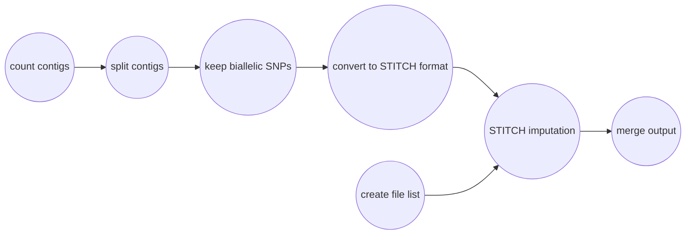

# Impute Genotypes from Genotype Likelihoods
You can impute genotypes with Harpy by calling the `impute` module:
```bash
harpy impute OPTIONS...
```
To do so, you will need:
- a tab-delimited parameter file 
    - create with `harpy impute --init`
    - modify the file with parameters suitable for your study
- a variant call format file with genotype likelihoods
    - accepted formats: `.vcf`, `.vcf.gz`, `.bcf`
- sequence alignments, in `.bam` format

## Running Options
| long name | short name | value type | default value | description|
| :---: | :----: | :---: | :---: | :--- |                  
| `--init`  |  `-i` | toggle | | Create example parameter file and exit |                                            
| `--dir`    |  `-d` | file path     | ReadMapping/align | Directory with sequence alignments  |              
| `--parameters` |  `-p` | file path    | stitch.params |  STITCH parameter file (tab-delimited)  |             
| `--vcf`   |   `-v` |   file path | VariantCall/mpileup/variants.raw.bcf |  Path to VCF/BCF file |
| `--threads` | `-t` | integer  | 4 | Number of threads to use      |
| `--resume` |  `-r` |  toggle  | |      Resume an incomplete run      |
| `--help`  |         |      |    | Show this message and exit.        |


## Parameter file
Typically, one runs STITCH multiple times, exploring how results vary with
different model parameters. The solution Harpy uses for this is to have the user
provide a tab-delimited dataframe file where the columns are the 5 STITCH model 
parameters and the rows are the values for those parameters. The parameter file 
is required and can be created manually or with `harpy impute --init`.
If created using harpy, the resulting file includes largely meaningless values 
that you will need to adjust for your study. The parameter must follow a particular format:
- tab or comma delimited
- column order doesn't matter, but all 5 column names must be present
- header row present with the specific column names below
    - all column names begin with a lowercase character
| column name | value type | accepted values | description |
| :--- | :---: | :---: | :--- |
| model | text | pseudoHaploid, diploid, diploid-inbred | The STITCH model/method to use |
| useBX | text/boolean | true, false, yes, no (case insensitive) | Whether to incorporate beadtag information |
| k | integer | ≥ 1 | Number of founder haplotypes |
| s | integer | ≥ 1 | Number of instances of the founder haplotypes to average results over |
| nGen | integer | ≥ 1 | Estimated number of generations since founding |
- example parameter file (tab-delimited):
```
model   useBX   k       s       nGen
pseudoHaploid   TRUE    10      5       50
pseudoHaploid   TRUE    10      1       50
pseudoHaploid   TRUE    15      10      100
```
- which is interpreted as:
| model         | useBX | k  | s  | nGen |
|:----          |:---   |:---|:---|:---  |
| pseudoHaploid | TRUE  | 10 | 5  | 50   |
| pseudoHaploid | TRUE  | 10 | 1  | 50   |
| pseudoHaploid | TRUE  | 15 | 10 | 100  |

## STITCH Workflow
[STITCH](https://github.com/rwdavies/STITCH) is a genotype imputation software developed for use in
the R programming language. It has quite a few model parameters that can be tweaked, but HARPY only
focuses on a small handful that have the largest impact on the quality of the results. Imputation is
performed on a per-contig (or chromosome) level, so Harpy automatically iterates over the contigs
present in the input variant call file. Using the magic of Snakemake, Harpy will automatically
iterate over these model parameters.

