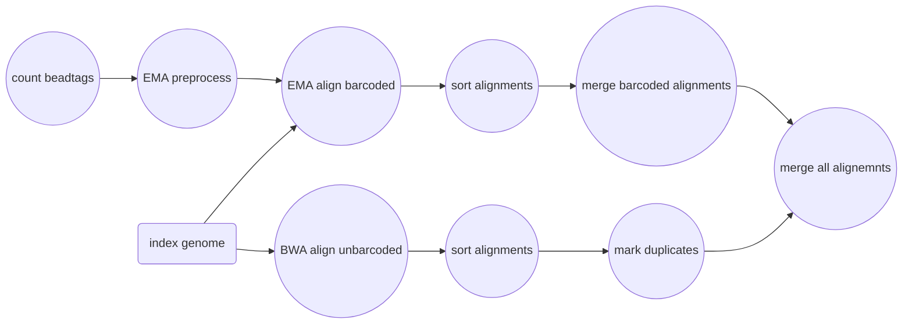
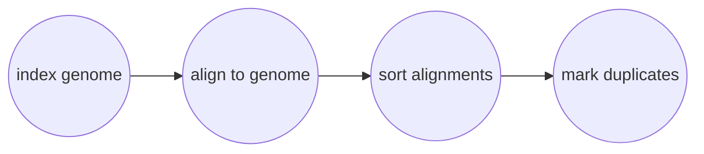

# Mapping Reads onto a Reference Genome

```bash
Usage: harpy align [OPTIONS]

Align sample sequences to a reference genome                 
 If you don't have a configuration file, use harpy init to    
 generate one and modify it for your project.                 
                                                              
╭─ Options ──────────────────────────────────────────────────╮
│ --config   -c  PATH     HARPY configuration yaml file      │
│                         [default: config.yaml]             │
│ --dir      -d  PATH     Directory with sample sequences    │
│                         [default: SeqTrimmed]              │
│ --threads  -t  INTEGER  Number of threads to use           │
│                         [default: 4]                       │
│ --bwa      -b           Use BWA MEM (ignores bardcodes)    │
│                         instead of EMA                     │
│ --resume   -r           Resume an incomplete run           │
│ --help                  Show this message and exit.        │
╰────────────────────────────────────────────────────────────╯
```

Reads can be aligned (mapped) onto a reference genome one of two ways:
1. [EMA](https://github.com/arshajii/ema): Barcode-aware mapping 
    - **recommended**
    - leverages the BX barcode information to improve mapping
    - slower
    - creates a lot of temporary files
2. [BWA MEM](https://github.com/lh3/bwa): Ignores barcode information
    - ignores barcode information (repeated for dramatic effect)
    - might be preferred depending on experimental design
    - faster
    - no temporary files

----

## Workflows
### EMA

Due to the additional complexity, the EMA workflow is quite a bit more complicated than BWA under the hood. Reads with barcodes are aligned using EMA and reads without valid barcodes are separately mapped using BWA before merging all the alignments together again. EMA will mark duplicates within alignments, but the BWA alignments need that performed manually. Thankfully, you shouldn't need to worry about any of these details.


----

### BWA

The BWA workflow is substantially simpler than the EMA workflow and maps all reads against the reference genome, no muss no fuss. Duplicates are marked at the end using [sambamba](https://lomereiter.github.io/sambamba/).



## Why EMA?
The original haplotag manuscript uses BWA to map reads, but the authors have since then recommended the use of EMA (EMerald Aligner) for most applications. EMA is barcode-aware, meaning it considers sequences with identical barcodes to have originated from the same molecule, and therefore has higher mapping accuracy than using BWA. Here's a comparison from the [EMA manuscript](https://www.biorxiv.org/content/10.1101/220236v1):
