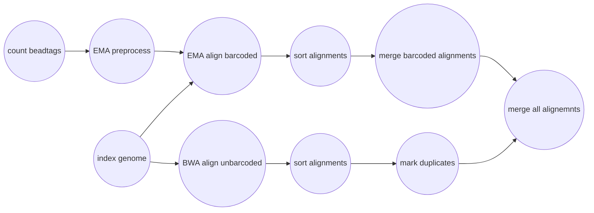
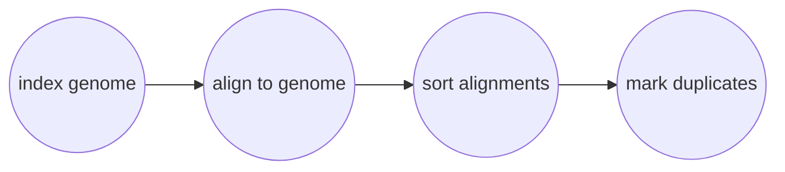

# Mapping Reads onto a Reference Genome
You can map reads onto genome assemblies with Harpy by calling the `align` module:
```bash
harpy align OPTIONS...
```
To do so, you will need:
- at least 4 cores/threads available
- a configuration yaml file 
    - created with `harpy init`
- a genome assembly in FASTA format
- b/gzipped fastq sequence files

## Running Options
| long name | short name | value type | default value | description|
| :---: | :----: | :---: | :---: | :--- |                                                              
| `--config` |  `-c` | file path    | config.yaml | HARPY configuration yaml file    |             
| `--dir`    |  `-d` | file path     | SeqTrimmed | Directory with sample sequences  |              
| `--threads` | `-t` | integer  | 4 | Number of threads to use      |
| `--bwa`   |   `-b` |   toggle | |  Use BWA MEM instead of EMA |
| `--resume` |  `-r` |  toggle  | |      Resume an incomplete run      |
| `--help`  |         |      |    | Show this message and exit.        |

## Workflows
### EMA
- **recommended**, see bottom of page
- leverages the BX barcode information to improve mapping
- slower
- creates a lot of temporary files

Since [EMA](https://github.com/arshajii/ema) does extra things to account for barcode information, the EMA workflow is a bit more complicated under the hood. Reads with barcodes are aligned using EMA and reads without valid barcodes are separately mapped using BWA before merging all the alignments together again. EMA will mark duplicates within alignments, but the BWA alignments need duplicates marked manually using [sambamba](https://lomereiter.github.io/sambamba/). Thankfully, you shouldn't need to worry about any of these details.


----

### BWA
- ignores barcode information
- might be preferred depending on experimental design
- faster
- no temporary files

The [BWA MEM](https://github.com/lh3/bwa) workflow is substantially simpler than the EMA workflow and maps all reads against the reference genome, no muss no fuss. Duplicates are marked at the end using [sambamba](https://lomereiter.github.io/sambamba/).



## Why EMA?
The original haplotag manuscript uses BWA to map reads, but the authors have since then recommended the use of EMA (EMerald Aligner) for most applications. EMA is barcode-aware, meaning it considers sequences with identical barcodes to have originated from the same molecule, and therefore has higher mapping accuracy than using BWA. Here's a comparison from the [EMA manuscript](https://www.biorxiv.org/content/10.1101/220236v1):
