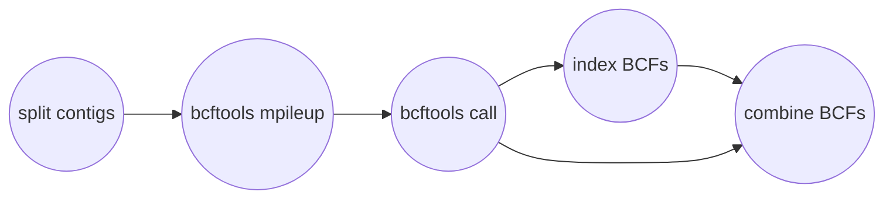
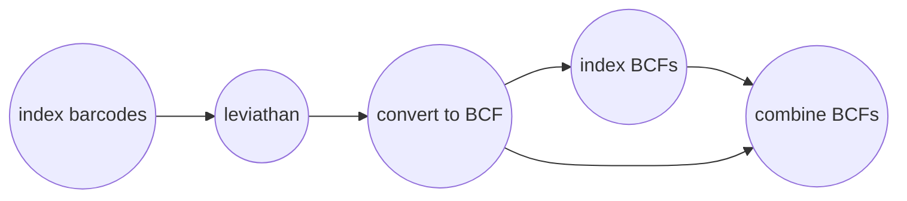

# Calling Variants
You can call variants with Harpy by calling the `variants` module:
```bash
harpy variants OPTIONS... 
```
You will need:
- at least 4 cores/threads available
- a genome assembly in FASTA format
- alignment files
- sample grouping file [optional]
    - takes the format of sample\<tab\>group
    - create with `--populations create` or manually
    - if created with `--populations create`, all the samples will be assigned to group `1`, so make sure to edit the second column to reflect your data correctly.
    - the file looks like:
```
sample1 1
sample2 1
sample3 2
sample4 1
sample5 3
```

## Running Options
| long name | short name | value type | default value | description|
| :---: | :----: | :---: | :---: | :--- |
| `--genome`    | `-g` |    file path | |  Genome assembly for variant calling |                                                              
| `--dir`       |  `-d`  | folder path   |  ReadMapping/align |  Directory with sequence alignments     | 
| `--populations` |  `-p`  | file path or `create`   |  | Tab-delimited file of sample\<tab\>group |                         
| `--ploidy`    |  `-x`  | integer | 2 | Ploidy of samples          |                          
| `--leviathan` |  `-l`    |  toggle  | |  Call variants with Leviathan instead of bcftools |                           
| `--threads`   |  `-t`  | integer | 4| Number of threads to use |                                     
| `--resume`    |  `-r`  | toggle  | | Resume an incomplete run |               
| `--help`        | | |    |          Show the module docstring |            

## Workflows
### bcftools mpileup
The `mpileup` and `call` modules from [bcftools](https://samtools.github.io/bcftools/bcftools.html) (formerly from samtools) are used to call variants from alignments. This is a tried-and-true method and one of methods featured in other variant callers, such as that provided in [ANGSD](http://www.popgen.dk/angsd/index.php/Genotype_Likelihoods), which is why Harpy uses it by default. To speed things along, Harpy will parallelize `mpileup` to call variants separately on different contigs, then merge everything at the end. This would mean that a more fragmented assembly would probably run faster than a chromosome-scale one, but you're more likely to have fewer variants detected. All intermediate outputs are removed, leaving you only the raw variants file (in compressed `.bcf` format), the index of that file, and some basic stats about it.



### Leviathan
Leviathan is an alternative variant caller that uses linked read barcode information to call variants. Harpy first uses [LRez](https://github.com/morispi/LRez) to index the barcodes in the alignments, then it calls variants for individual samples using Leviathan. All the samples then get merged into a single BCF file using [bcftools](https://samtools.github.io/bcftools/bcftools.html).

!> Until it gets resolved, Leviathan doesn't seem to output sample names into the resulting variant call files.


