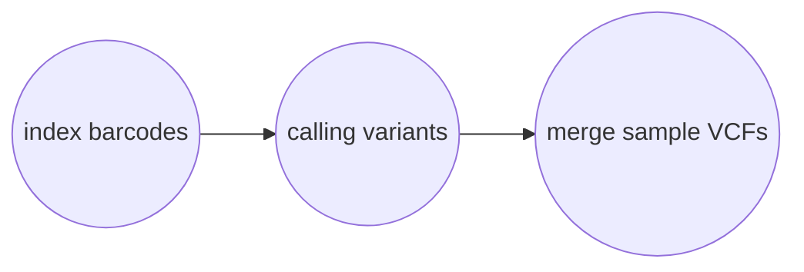

# Calling Variants

```
 Usage: harpy callvariants [OPTIONS]                          
                                                              
 Call variants from sample alignments                         
 If you don't have a configuration file, use harpy init to    
 generate one and modify it for your project.                 
                                                              
╭─ Options ──────────────────────────────────────────────────╮
│ --config   -c  PATH     HARPY configuration yaml file      │
│                         [default: config.yaml]             │
│ --dir      -d  PATH     Directory with sequence alignments │
│                         [default: ReadMapping]             │
│ --threads  -t  INTEGER  Number of threads to use           │
│                         [default: 4]                       │
│ --resume   -r           Resume an incomplete run           │
│ --help                  Show this message and exit.        │
╰────────────────────────────────────────────────────────────╯
```

## Workflow
### Leviathan
Leviathan does the brunt of the work during variant calling. Harpy first uses [LRez](https://github.com/morispi/LRez) to index the barcodes in the alignments, then it calls variants for individual samples using Leviathan. All the samples then get merged into a single VCF file using [bcftools](https://samtools.github.io/bcftools/bcftools.html).




## Why Leviathan?
Harpy uses the variant caller [LEVIATHAN](https://github.com/morispi/LEVIATHAN). What makes this variant caller special is that is is barcode-aware, making it suitable to leverage the beadtag information haplotagging provides at the variant-calling step. Here are the merits of LEVIATHAN as described in the [publication](https://www.biorxiv.org/content/10.1101/2021.03.25.437002v1):
