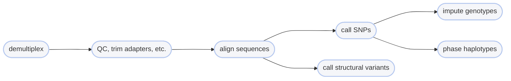

# :icon-home: Home


Harpy is a [haplotagging data](haplotagdata.md) processing pipeline for Linux-based systems. It uses all the 
magic of [Snakemake](https://snakemake.readthedocs.io/en/stable/) under the hood to handle 
the worklfow decision-making, but as a user, you just interact with it like a normal command-line 
program. Harpy uses both well known and niche programs to take raw haplotagging sequences and process
them to become called SNP genotypes (or haplotypes) or large structural variants (inversions, deletions, duplications).
Most of the settings are pre-configured and the settings you can modify are done at the command line. 

## Harpy Modules
Harpy is modular, meaning you can use different parts of it independent from each other. Need to only align reads?
Great! Only want to call variants? Awesome! All modules are called by `harpy <workflow>`. For example, use `harpy align` to align reads.

{.compact}
| Workflow                                                                | Description                                                          |
| :---------------------------------------------------------------------- | :------------------------------------------------------------------- |
| [!badge corners="pill" text="align"](Workflows/Align/Align.md)          | Align sample sequences to a reference genome                         |
| [!badge corners="pill" text="assembly"](Workflows/assembly.md)          | Create a genome assembly from linked-reads                           |
| [!badge corners="pill" text="demultiplex"](Workflows/demultiplex.md)    | Demultiplex haplotagged FASTQ files                                  |
| [!badge corners="pill" text="impute"](Workflows/impute.md)              | Impute genotypes using variants and sequences                        |
| [!badge corners="pill" text="metassembly"](Workflows/metassembly.md)    | Create a metagenome assembly from linked-reads                       |
| [!badge corners="pill" text="phase"](Workflows/phase.md)                | Phase SNPs into haplotypes                                           |
| [!badge corners="pill" text="preflight"](Workflows/preflight.md)        | Run various format checks for FASTQ and BAM files                    |
| [!badge corners="pill" text="qc"](Workflows/qc.md)                      | Remove adapters, deduplicate, and quality trim sequences             |
| [!badge corners="pill" text="simulate"](Workflows/Simulate/Simulate.md) | Simulate haplotag linked reads or genomic variants                   |
| [!badge corners="pill" text="snp"](Workflows/snp.md)                    | Call SNPs and small indels                                           |
| [!badge corners="pill" text="sv"](Workflows/SV/SV.md)                   | Call large structural variants (inversions, deletions, duplications) |

## Using Harpy
You can call `harpy` without any arguments (or with `--help`) to print the docstring to your terminal. You can likewise call any of the modules without arguments or with `--help` to see their usage  (e.g. `harpy align --help`).
``` harpy --help                                                      
 Usage: harpy COMMAND [ARGS]...                                            
                                                                           
 An automated workflow for haplotagging linked-read data to go from raw    
 data to genotypes (or phased haplotypes). Batteries included.             
 demultiplex >> qc >> align >> snp >> impute >> phase >> sv                
                                                                           
 Documentation: https://pdimens.github.io/harpy/                           
                                                                           
╭─ Options ───────────────────────────────────────────────────────────────╮
│ --version      Show the version and exit.                               │
│ --help     -h  Show this message and exit.                              │
╰─────────────────────────────────────────────────────────────────────────╯
╭─ workflows ─────────────────────────────────────────────────────────────╮
│ demultiplex  Demultiplex haplotagged FASTQ files                        │
│ qc           Remove adapters and quality-control sequences              │
│ align        Align sample sequences to a reference genome               │
│ snp          Call SNPs and small indels on alignments                   │
│ sv           Call large structural variants on alignments               │
│ impute       Impute genotypes using variants and alignments             │
│ phase        Phase SNPs into haplotypes                                 │
│ simulate     Simulate variants or linked-reads from a genome            │
│ assembly     Create an assembly from linked-reads                       │
│ metassembly  Create a metassembly from linked-reads                     │
╰─────────────────────────────────────────────────────────────────────────╯
╭─ Other Commands ────────────────────────────────────────────────────────╮
│ deconvolve    Resolve clashing barcodes from different molecules        │
│ hpc           Profile templates for cluster job submissions             │
│ imputeparams  Create a template imputation parameter file               │
│ popgroup      Create a template grouping file for samples               │
│ preflight     File format checks for haplotag data                      │
│ resume        Resume a workflow from an existing Harpy directory        │
│ view          View a workflow log, config, or snakefile                 │
╰─────────────────────────────────────────────────────────────────────────╯
```

## Typical Linked-Read Workflows
Depending on your project goals, you may want any combination of SNPs, structural
variants (inversions, deletions, duplications), or phased haplotypes. Below is a flow chart
outlining a general workflow of linked-read data.



Alternatively, if you are interested in assembling a genome or metagenome, your workflow might look like:

