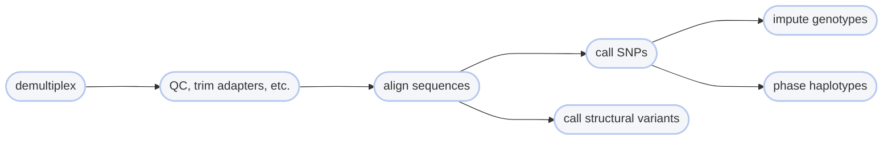

# :icon-home: Home


Harpy is a [haplotagging data](Getting_Started/inputformat.md) processing pipeline for Linux-based systems-- at least it
was prior to the release of version 2. Now, it can process linked-read data from haplotagging, TELLseq, stLFR, and
even regular non-linked WGS data. It uses all the magic of [Snakemake](https://snakemake.readthedocs.io/en/stable/)
under the hood to handle the worklfow decision-making, but as a user, you just interact with it like a normal command-line 
program. Harpy employs both well known and niche programs to take raw linked-read sequences and process
them to become called SNP genotypes (or haplotypes) or large structural variants (inversions, deletions, duplications).
Feel free to open an [Issue](https://github.com/pdimens/harpy/issues/new/choose) or begin a [Discussion](https://github.com/pdimens/harpy/discussions) on GitHub.

##### Harpy is ...
==- friendly
Drawing on the lessons of its predecessors and contemporaries, one of the top priorities for Harpy as a software is user-friendliness.
Bioinformatics is _hard_, and we recognize that users may span a wide range of expertise and seniority, so we strive to minimize the
commonplace **struggle** of bioinformatics, inasmuch as we can.
==- hackable
All this engineering and focus on user accessibility need not come at the cost of usability and utility. Harpy's commands
expose the most common and consequential arguments of the key software it will be running, but you need not stop there. Harpy workflow
commands set up everything necessary to initiate Snakemake, whether it's harpy doing it or not (i.e. using `--setup`) You _should_ hack it
if you need a workflow to address the nuance of your data-- we do it all the time 🙂. But, be aware that addressing Issues opened up regarding
custom modified workflows and configs will not be a priority. 
==- deliberately modular
There's many different critical parameters between raw FASTQ files and called genotypes. We believe in the "stop and assess" approach between
data processing steps, which should hopefully be evident by harpy's reporting system.
==- over-engineered
Our goals for harpy are ambitious, and to meet those goals we  invest significant time and effort to implement thoughtful
designs. That means more safety nets, better error messages, convenience tools (e.g. `harpy view`) to skip the boring/tedious
parts of doing basic things, streamlined ways to debug/troubleshoot when things _inevitably_ go wrong, etc. Harpy isn't a product--
we don't worry about the cost of engineering vs revenue gained; we just want it to work and to work well.
==- not analysis software
Genetics/Genomics isn't one specific thing. Harpy exists to leverage linked-read data to get you as far as genotypes or assemblies, without
making assumptions about how you plan on analyzing those data (popgen, biomed, etc.). We are excited to learn how you apply these data and
your resulting discoveries!
===

## Harpy Commands
Harpy is modular, meaning you can use different parts of it independent from each other. Need to only align reads?
Great! Only want to call variants? Awesome! All modules are called by `harpy <workflow>`. For example, use `harpy align` to align reads.

{.compact}
| Command                                                                | Description                                                          |
|:------------------------------------------------------------------------|:---------------------------------------------------------------------|
| [!badge corners="pill" text="align"](Workflows/Align/Align.md)          | Align sample sequences to a reference genome                         |
| [!badge corners="pill" text="assembly"](Workflows/assembly.md)          | Create a genome assembly from linked-reads                           |
| [!badge corners="pill" text="deconvolve"](Workflows/deconvolve.md)      | Resolve barcode sharing in unrelated molecules                       |
| [!badge corners="pill" text="demultiplex"](Workflows/demultiplex.md)    | Demultiplex haplotagged FASTQ files                                  |
| [!badge corners="pill" text="impute"](Workflows/impute.md)              | Impute genotypes using variants and sequences                        |
| [!badge corners="pill" text="metassembly"](Workflows/metassembly.md)    | Create a metagenome assembly from linked-reads                       |
| [!badge corners="pill" text="phase"](Workflows/phase.md)                | Phase SNPs into haplotypes                                           |
| [!badge corners="pill" text="validate"](Workflows/validate.md)          | Run various format checks for FASTQ and BAM files                    |
| [!badge corners="pill" text="qc"](Workflows/qc.md)                      | Remove adapters, deduplicate, and quality trim sequences             |
| [!badge corners="pill" text="simulate"](Workflows/Simulate/Simulate.md) | Simulate linked reads or genomic variants                            |
| [!badge corners="pill" text="snp"](Workflows/snp.md)                    | Call SNPs and small indels                                           |
| [!badge corners="pill" text="sv"](Workflows/SV/SV.md)                   | Call large structural variants (inversions, deletions, duplications) |

## Harpy Scripts
An installation of Harpy also includes a series of [scripts/utilities](Getting_Started/Resources/utilities.md) that are exported along with the `harpy` package. These scripts are used within Harpy workflows, but you can also use them outside of Harpy workflows.

## Using Harpy
You can call `harpy` without any arguments (or with `--help`) to print the docstring to your terminal. You can likewise call any of the modules without arguments or with `--help` to see their usage  (e.g. `harpy align --help`).
``` harpy --help                                                      
Usage: harpy COMMAND [ARGS]...

An automated workflow for linked-read data to go from raw data to
genotypes (or phased haplotypes). Batteries included.
demultiplex >> qc >> align >> snp >> impute >> phase >> sv
                                                                 
Documentation: https://pdimens.github.io/harpy/

Data Processing:
  align        Align sequences to a reference genome
  assembly     Assemble linked reads into a genome
  demultiplex  Demultiplex haplotagged FASTQ files
  impute       Impute variant genotypes from alignments
  metassembly  Assemble linked reads into a metagenome
  phase        Phase SNPs into haplotypes
  qc           FASTQ adapter removal, quality filtering, etc.
  simulate     Simulate genomic variants
  snp          Call SNPs and small indels from alignments
  sv           Call inversions, deletions, and duplications from alignments

Other Commands:
  deconvolve  Resolve barcode sharing in unrelated molecules
  template    Create files and HPC configs for workflows

Troubleshoot:
  deps      Locally install workflow dependencies
  diagnose  Attempt to resolve workflow errors
  resume    Continue an incomplete Harpy workflow
  validate  File format checks for linked-read data
  view      View a workflow's components
```

## Typical Linked-Read Workflows
Depending on your project goals, you may want any combination of SNPs, structural
variants (inversions, deletions, duplications), or phased haplotypes. Below are diagrams
outlining general workflows for linked-read data, depending on your goals.

+++ Variant Calling


```mermaid
graph LR
    Demux([demultiplex]):::clean--->QC([QC, trim adapters, etc.]):::clean
    QC--->Align([align sequences]):::clean
    Align--->SNP([call SNPs]):::clean
    SNP--->Impute([impute genotypes]):::clean
    SNP--->Phase([phase haplotypes]):::clean
    Align--->SV([call structural variants]):::clean

    classDef clean fill:#f5f6f9,stroke:#b7c9ef,stroke-width:2px
```
+++ Assembly


```mermaid
graph LR
    QC([QC, trim adapters, etc.]):::clean--->DC([barcode deconvolution]):::clean
    DC--->Assembly([assembly/metassembly]):::clean

    classDef clean fill:#f5f6f9,stroke:#b7c9ef,stroke-width:2px
```
+++