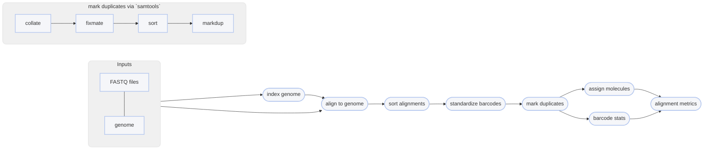

# :icon-quote: Map Reads onto a genome with BWA MEM

===  :icon-checklist: You will need
- at least 4 cores/threads available
- a genome assembly in FASTA format: [!badge variant="success" text=".fasta"] [!badge variant="success" text=".fa"] [!badge variant="success" text=".fasta.gz"] [!badge variant="success" text=".fa.gz"] [!badge variant="secondary" text="case insensitive"]
- paired-end fastq sequence files [!badge variant="secondary" icon=":heart:" text="gzipped recommended"]
    - **sample name**: [!badge variant="success" text="a-z"] [!badge variant="success" text="0-9"] [!badge variant="success" text="."] [!badge variant="success" text="_"] [!badge variant="success" text="-"] [!badge variant="secondary" text="case insensitive"]
    - **forward**: [!badge variant="success" text="_F"] [!badge variant="success" text=".F"] [!badge variant="success" text=".1"] [!badge variant="success" text="_1"] [!badge variant="success" text="_R1_001"] [!badge variant="success" text=".R1_001"] [!badge variant="success" text="_R1"] [!badge variant="success" text=".R1"] 
    - **reverse**: [!badge variant="success" text="_R"] [!badge variant="success" text=".R"] [!badge variant="success" text=".2"] [!badge variant="success" text="_2"] [!badge variant="success" text="_R2_001"] [!badge variant="success" text=".R2_001"] [!badge variant="success" text="_R2"] [!badge variant="success" text=".R2"] 
    - **fastq extension**: [!badge variant="success" text=".fq"] [!badge variant="success" text=".fastq"] [!badge variant="secondary" text="case insensitive"]
===

Once sequences have been trimmed and passed through other QC filters, they will need to
be aligned to a reference genome. This module within Harpy expects filtered reads as input,
such as those derived using [!badge corners="pill" text="harpy qc"](../qc.md). You can map reads onto a genome assembly with Harpy 
using the [!badge corners="pill" text="align bwa"] module:

```bash usage
harpy align bwa OPTIONS... REFERENCE INPUTS...
```
```bash example
harpy align bwa genome.fasta Sequences/ 
```

## :icon-terminal: Running Options
In addition to the [!badge variant="info" corners="pill" text="common runtime options"](/Getting_Started/common_options.md), the [!badge corners="pill" text="align bwa"] module is configured using these command-line arguments:

{.compact}
| argument                   | type                 | default | description                                                                                                                                     |
|:---------------------------|:---------------------|:-------:|:------------------------------------------------------------------------------------------------------------------------------------------------|
| `REFERENCE`                | file path            |         | [!badge variant="info" text="required"] Reference assembly for read mapping                                                                     |
| `INPUTS`                   | file/directory paths |         | [!badge variant="info" text="required"] Files or directories containing [input FASTQ files](/Getting_Started/common_options.md#input-arguments) |
| `--contigs`                | file path or list    |         | [Contigs to plot](/Getting_Started/common_options.md#--contigs) in the report                                                                   |
| `--extra-params` `-x`      | string               |         | Additional BWA arguments, in quotes                                                                                                             |
| `--molecule-distance` `-d` | integer              |   `0`   | Base-pair distance threshold to separate molecules given as base pairs, disabled with `0`                                                       |
| `--min-quality` `-q`       | integer (0-40)       |  `30`   | Minimum `MQ` (SAM mapping quality) to pass filtering                                                                                            |
| `--keep-unmapped` `-u`     | toggle               |  false  | Output unmapped sequences too                                                                                                                   |

### Output format
Regardless of the input linked-read format, the `align` workflows will standardize the output alignment records
such that the barcode is contained in the `BX:Z` tag and barcode validation is in the `VX:i` tag.

### Molecule distance
The `--molecule-distance` option is used during the BWA alignment workflow
to assign alignments a unique Molecular Identifier `MI:i` tag based on their
linked-read barcode and the [distance threshold](/Getting_Started/linked_read_data.md#barcode-thresholds) you specify.
Set this value to `0` to skip distance-based deconvolution,
which may improve detection of very large structural variants. 

## Quality filtering
The `--min-quality` argument filters out alignments below a given $MQ$ threshold. The default, `30`, keeps alignments
that are at least 99.9% likely correctly mapped. Set this value to `1` if you only want alignments removed with
$MQ = 0$ (0% likely correct). You may also set it to `0` to keep all alignments for diagnostic purposes.
The plot below shows the relationship between $MQ$ score and the likelihood the alignment is correct and will serve to help you decide
on a value you may want to use. It is common to remove alignments with $MQ <30$ (<99.9% chance correct) or $MQ <40$ (<99.99% chance correct).

==- What is the $MQ$ score?
Every alignment in a BAM file has an associated mapping quality score ($MQ$) that informs you of the likelihood 
that the alignment is accurate. This score can range from 0-40, where higher numbers mean the alignment is more
likely correct. The math governing the $MQ$ score actually calculates the percent chance the alignment is ***incorrect***: 
$$
\%\ chance\ incorrect = 10^\frac{-MQ}{10} \times 100\\
\text{where }0\le MQ\le 40
$$
You can simply subtract it from 100 to determine the percent chance the alignment is ***correct***:
$$
\%\ chance\ correct = 100 - \%\ chance\ incorrect\\
\text{or} \\
\%\ chance\ correct = (1 - 10^\frac{-MQ}{10}) \times 100
$$


===

## Marking PCR duplicates
Harpy uses `samtools markdup` to mark putative PCR duplicates by using both the `BX` tag
as a UMI (unique molecule identified) for more accurate duplicate detection. The read name
is also parsed to determine if the sequencing platform was HiSeq/NovaSeq to distinguish between
PCR and optical duplicates. Duplicate marking also uses the `-S` option to mark supplementary (chimeric)
alignments as duplicates if the primary alignment was marked as a duplicate. Duplicates get marked but **are not removed**.

----

## :icon-git-pull-request: BWA workflow
+++ :icon-git-merge: details
- ignores (but retains) barcode information
- fast

The [BWA MEM](https://github.com/lh3/bwa) workflow maps all reads against the reference genome. Duplicates are marked using `samtools markdup`.
The `BX:Z` tags in the read headers are still added to the alignment headers, even though barcodes
are not used to inform mapping. The `-m` threshold is used for alignment molecule assignment.


+++ :icon-file-directory: BWA output
The default output directory is `Align/bwa` with the folder structure below. `Sample1` is a generic sample name for demonstration purposes.
The resulting folder also includes a `workflow` directory (not shown) with workflow-relevant runtime files and information.
```
Align/bwa
├── Sample1.bam
├── Sample1.bam.bai
├── logs
│   ├── sample1.bwa.log
│   ├── sample1.markdup.log
│   │── sample1.sort.log
└── reports
    ├── barcodes.summary.html
    ├── bwa.stats.html
    ├── Sample1.html
    └── data
        ├── bxstats
        │   └── Sample1.bxstats.gz
        └── coverage
            └── Sample1.cov.gz
```
{.compact}
| item     | description                                                                                                 |
|:---------|:------------------------------------------------------------------------------------------------------------|
| `*.bam`                             | sequence alignments for each sample                                              |
| `*.bai`                             | sequence alignment indexes for each sample                                       |
| `logs/*bwa.log`                     | output of BWA during run                                                         |
| `logs/*markdup.log`                 | stats provided by `samtools markdup`                                             |
| `logs/*sort.log`                    | output of `samtools sort`                                                        |
| `reports/`                          | various counts/statistics/reports relating to sequence alignment                 |
| `reports/barcodes.summary.ipynb`    | report summarizing barcode-specific metrics across all samples                   |
| `reports/bwa.summary.ipynb`         | report summarizing `samtools stats` of raw alignments across all samples         |
| `reports/Sample1.ipynb`             | report summarizing BX tag metrics and alignment coverage                         | 
| `reports/data/coverage/*.cov.gz`    | output from mosdepth, used for reports                                           |
| `reports/data/lrstats`              | tabular data containing the information used to generate the BX stats in reports |

+++ :icon-code-square: BWA parameters
By default, Harpy runs `bwa` with these parameters (excluding inputs and outputs):
```bash
bwa-mem2 mem -T10 -m 10 -C -R "@RG\tID:samplename\tSM:samplename"
```

Below is a list of all `bwa mem` command line arguments, excluding those Harpy already uses or those made redundant by Harpy's implementation of BWA.
These are taken directly from the [BWA documentation](https://bio-bwa.sourceforge.net/bwa.shtml).
```bwa arguments
  Algorithm options:
    -k INT        minimum seed length [19]
    -w INT        band width for banded alignment [100]
    -d INT        off-diagonal X-dropoff [100]
    -r FLOAT      look for internal seeds inside a seed longer than {-k} * FLOAT [1.5]
    -y INT        seed occurrence for the 3rd round seeding [20]
    -c INT        skip seeds with more than INT occurrences [500]
    -D FLOAT      drop chains shorter than FLOAT fraction of the longest overlapping chain [0.50]
    -W INT        discard a chain if seeded bases shorter than INT [0]
    -S            skip mate rescue
    -P            skip pairing; mate rescue performed unless -S also in use
Scoring options:
   -A INT        score for a sequence match, which scales options -TdBOELU unless overridden [1]
   -B INT        penalty for a mismatch [4]
   -O INT[,INT]  gap open penalties for deletions and insertions [6,6]
   -E INT[,INT]  gap extension penalty; a gap of size k cost '{-O} + {-E}*k' [1,1]
   -L INT[,INT]  penalty for 5'- and 3'-end clipping [5,5]
   -U INT        penalty for an unpaired read pair [17]
Input/output options:
   -p            smart pairing (ignoring in2.fq)
   -H STR/FILE   insert STR to header if it starts with @; or insert lines in FILE [null]
   -j            treat ALT contigs as part of the primary assembly (i.e. ignore <idxbase>.alt file)
   -5            for split alignment, take the alignment with the smallest coordinate as primary
   -q            don't modify mapQ of supplementary alignments
   -K INT        process INT input bases in each batch regardless of nThreads (for reproducibility) []
   -h INT[,INT]  if there are <INT hits with score >80% of the max score, output all in XA [5,200]
   -a            output all alignments for SE or unpaired PE
   -V            output the reference FASTA header in the XR tag
   -Y            use soft clipping for supplementary alignments
   -M            mark shorter split hits as secondary
   -I FLOAT[,FLOAT[,INT[,INT]]]
                 specify the mean, standard deviation (10% of the mean if absent), max
                 (4 sigma from the mean if absent) and min of the insert size distribution.
                 FR orientation only. [inferred]
```

+++
