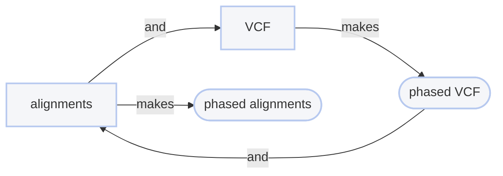
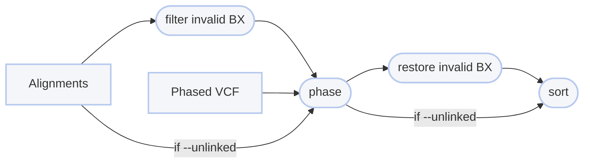

# :icon-stack: Phase Alignments from Haplotypes

===  :icon-checklist: You will need
- at least 3 cores/threads available
- sequence alignments: [!badge variant="success" text=".bam"]  [!badge variant="secondary" icon=":exclamation:" text="coordinate-sorted"]
    - **sample name**: [!badge variant="success" text="a-z"] [!badge variant="success" text="0-9"] [!badge variant="success" text="."] [!badge variant="success" text="_"] [!badge variant="success" text="-"] [!badge variant="secondary" text="case insensitive"]
    - **linked reads**: barcode must be in alignment `BX` tag
- a variant call format file of genotypes: [!badge variant="success" text=".vcf"] [!badge variant="success" text=".bcf"]  [!badge variant="secondary" icon=":exclamation:" text="phased"]
- a reference genome in FASTA format: [!badge variant="success" text=".fasta"] [!badge variant="success" text=".fa"] [!badge variant="success" text=".fasta.gz"] [!badge variant="success" text=".fa.gz"] [!badge variant="secondary" text="case insensitive"]
===

If you are considering structural variant detection, then you will likely need to phase your alignments.
It's similar to the process of phasing SNPs, but in reverse. Using phased SNP genotypes (a la
[!badge corners="pill" text="phase snp"](./phase_snp.md)), you can back-phase the alignments that were used
to phase the SNPs.

==- A diagram to help
If you haven't done it before, this workflow visualization may help explain the process. Start at `alignments`
and follow the arrows.

===

```bash usage
harpy phase bam OPTIONS... VCF INPUTS...
```
```bash example
harpy phase bam --threads 10 phased.bcf data/*.bam 
```

## :icon-terminal: Running Options
In addition to the [!badge variant="info" corners="pill" text="common runtime options"](/Getting_Started/common_options.md), the [!badge corners="pill" text="phase"] module is configured using these command-line arguments:

{.compact .clean}
| argument          {.whitespace-nowrap} | default  {.whitespace-nowrap} | description                                                                                                                                   |
| :------------------------------------- | :---------------------------: | :-------------------------------------------------------------------------------------------------------------------------------------------- |
| `REFERENCE`                            |                               | Path to reference genome used to create alignments                                                                                            |
| `VCF`                                  |                               | [!badge variant="info" text="required"] Path to phased BCF/VCF file                                                                           |
| `INPUTS`                               |                               | [!badge variant="info" text="required"] Files or directories containing [input BAM files](/Getting_Started/common_options.md#input-arguments) |
| `--extra-params` `-x`                  |                               | Additional `whatshap haplotag` arguments, in quotes                                                                                           |
| `--molecule-distance` `-d`             |           `100000`            | Base-pair distance threshold to separate molecules                                                                                            |
| `--ploidy` `-n`                        |              `2`              | Ploidy of samples                                                                                                                             |
| `--unlinked` `-U`                      |                               | Ignore linked-read information in the alignment `BX` tag when phasing                                                                         |
| `--vcf-samples` , `-V`                 |                               | [Use samples present in vcf file](#prioritize-the-vcf-file) for phasing rather than those found the directory                                 |

### Prioritize the vcf file
By default, Harpy assumes you want to use all the samples
present in the `INPUTS` and will inform you of errors when there is a mismatch between the sample files
present and those listed in the `VCF` file. You can instead use the `--vcf-samples` flag if you want Harpy to build a workflow
around the samples present in the `VCF` file. When using this toggle, Harpy will inform you when samples in the `VCF` file
are missing from the provided `INPUTS`.  

### Molecule distance
The molecule distance refers to the base-pair distance dilineating separate molecules.
In other words, when two alignments on a single contig share the same barcode, how far
away from each other are we willing to say they were and still consider them having 
originated from the same DNA molecule rather than having the same barcodes by chance.
Feel free to play around with this number if you aren't sure. A larger distance means
you are allowing the program to be more lenient in assuming two alignments with the
same barcode originated from the same DNA molecule. Unless you have strong evidence
in favor of it, a distance above `250000` (250kbp) would probably do more harm than good.
See [Barcode Thresholds](/Getting_Started/linked_read_data.md#barcode-thresholds) for a more thorough explanation.

---
## :icon-git-pull-request: Phasing Workflow
+++ :icon-git-merge: details
Phasing is performed using [Whatshap](https://github.com/whatshap/whatshap).



+++ :icon-file-directory: phasing output
The default output directory is `Phase/bam` with the folder structure below. `Sample1` and `Sample2` are generic sample names
for demonstration purposes. The resulting folder also includes a `workflow` directory (not shown) with workflow-relevant runtime files and information.

```
Phase/bam/
├── Sample1.phased.bam
├── Sample2.phased.bam
└── logs
    └── phasing.summary.log
```

{.compact .clean}
| item           {.whitespace-nowrap} | description                          |
| :---------------------------------- | :----------------------------------- |
| `*.phased.bam`                      | phased alignment file output         |
| `logs/phasing.summary.log`          | consolidated output of whatshap logs |

+++ :icon-code-square: Whatshap parameters
By default, Harpy runs `whatshap haplotag` with these parameters (excluding inputs and outputs):
```bash
whatshap haplotag --tag-supplementary copy-primary --no-supplementary-strand-match --supplementary-distance {3 * mol_dist} --ignore-read-groups --skip-missing-contigs
```

Below is a list of all `whatshap haplotag` command line options, excluding those Harpy already uses or those made redundant by Harpy's implementation of whatshap.

``` whatshap haplotag arguments
--regions   Specify region(s) of interest to limit the tagging to reads/varian overlapping those regions. You can specify a space-separated list of regions in the form of chrom:start-end, chrom (consider entire chromosome), or chrom:start (consider region from this start to end of chromosome)
--output-haplotag-list  Write assignments of read names to haplotypes (tab separated) to given output file. If filename ends in .gz, then output is gzipped.     
```

+++
