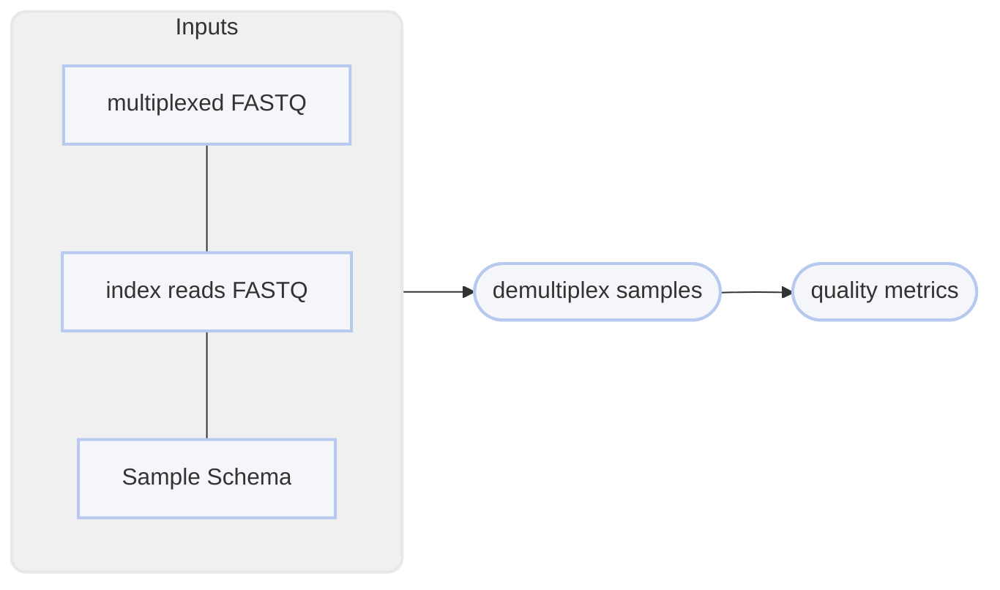

# :icon-versions: Preprocess Raw Sequences
Sequences that come off of a sequencer are typically not ready for
analytical use. If the data hasn't already been separated out by sample,
you need to do that first. If you're using linked-read data, you then
need to identify the linked-read barcodes and pull them out of the 
sequence. Below describes the workflows for the original haplotagging
protocol published by Meier et _al._ (2021), along with the one we're
developed at Cornell University (Iqbal et _al._, in prep).

## gih
==- Iqbal et _al._ 
!!!warning
The name `gih` is a placeholder and will be replaced with `iqbal202_` in a future release when the
protocol is officially published.
!!!

- Barcode configuration: `stagger + 8 + 8 + 8` on read 1
- Sample identifier: UDIs
- Facility should demultiplex

The Genomics Innovation Hub at Cornell University has been developing a variant to the Meier/Chan haplotagging chemistry.
Due to the differences in adapters, barcode design, and barcode position, these data require a different preprocessing approach.
This design puts linked-read barcodes inline at the beginning of read 1. It begins with a variable-length stagger,
followed by 3 8bp combinatorial barcodes, with a short spacer between each, followed by an ME sequence. This design
does sacrifice some sequencing space on read 1, but in doing so makes these libraries follow standard Illumina sequencing
protocols, meaning it doesn't require any sequencing customization. The variable-length spacer at the beginning of the read
requires padding so the demultiplexer can start looking for barcodes at a consistent position across all reads. Preprocessing
also requires the removal of the ME sequence after the linked-read barcodes. The preprocessing workflow in Harpy accounts
for these characteristics, so it does not require user intervention. 

===  :icon-checklist: You will need
- at least 2 cores/threads available
- sample-demultiplexed paired-end reads (R1, R2) from an Illumina sequencer in FASTQ format [!badge variant="secondary" icon=":heart:" text="gzipped recommended"]
===

```bash usage
harpy preprocess gih OPTIONS... INPUTS
```

```bash example | using wildcards
harpy preprocess gih --threads 20 data/*R{1,2}.fastq.gz
```
### :icon-terminal: Running Options
In addition to the [!badge variant="info" corners="pill" text="common runtime options"](/Getting_Started/common_options.md), the [!badge corners="pill" text="preprocess meier2021"] module is configured using these command-line arguments:

{.compact .clean}
| argument   {.whitespace-nowrap} | default  {.whitespace-nowrap} | description                                                                |
| :------------------------------ | ----------------------------- | :------------------------------------------------------------------------- |
| `INPUTS`                        |                               | [!badge variant="info" text="required"] The sample FASTQ files (R1 and R2) |
| `--me-seq` `-m`                 | AGATGTGTATAAGAGACAG           | ME sequence to look for                                                    |
| `--mismatch` `n`                | 2                             | Allow $n$ mismatches in ME sequence                                        |

### The ME Sequence
The ME sequence is very important for preprocessing these data correctly, as identifying the position it starts will
allow the algorithm to determine how much to pad the sequence (to offset the variable stagger). The GIH at Cornell University
uses the `AGATGTGTATAAGAGACAG`, which is why it is set to the default. 

!!!warning
Please verify your ME sequence, as using the wrong sequence will
cause the algorithm to catastrophically fail (reads without the ME sequence are filtered out).
!!!

The default `--mismatch` value tolerate 2 mismatches in the ME sequence before determining the ME sequence is absent. The
`N` nucleotide counts as a partial mismatch (0.3), whereas the standard `ATCG` bases count as a single mismatch. This means
1 `ATCG` mismatch and 2 `N`s would still pass with `--mismatch 2`:

$$
\text{-m} = AGATGTGTATAAGAGACAG
$$
$$
\text{sequence} = \hat GGATGTGTATAAGA\hat NACA\hat N
$$
$$
\text{mismatch} = 1_{ATCG} + 0.3_{N} + 0.3_{N} = 1.6
$$

!!!warning
We generally **don't recommend** setting `--mismatch` higher than 3 or 4. The ME sequence is 19bp,
so allowing 5 mismatches is equivalent to allowing ~25% of it to be explicitly incorrect (`ATCG` mismatches),
or considerably more when `N` nucleotides are present.
!!!

---
### :icon-git-pull-request: Workflow
+++ :icon-git-merge: details


+++ :icon-file-directory: preprocessing output
The default output directory is `Preprocess` with the folder structure below. `Sample1` and `Sample2` are
generic sample names for demonstration purposes. The resulting folder also includes a `workflow` directory
(not shown) with workflow-relevant runtime files and information.
```
Preprocess/
├── Sample1.F.fq.gz
├── Sample1.R.fq.gz
├── Sample2.F.fq.gz
├── Sample2.R.fq.gz
└── reports
    ├── performance.QC.ipynb
    └── preprocess.QC.html
```
{.compact .clean}
| item      {.whitespace-nowrap} | description                                   |
| :----------------------------- | :-------------------------------------------- |
| `*.R1.fq.gz`                   | Processed forward-reads in 'standard' format  |
| `*.R2.fq.gz`                   | Processed reverse-reads in 'standard' format  |
| `reports/preprocess.QC.html`   | MultiQC report of FASTQC quality assessment   |
| `reports/performance.ipynb`    | Preprocessing-specific report for all samples |
+++

## meier2021
==- Meier et _al._ (2021)
!!!warning
This was formerly known as `gen1`, which is deprecated!
!!!

- Barcode configuration: `13 + 13` in each index read
- sequencing mask: `151+13+13+151`
- Sample identifier: `Cxx` barcode
- Facility should **not** demultiplex

These are the original 13 + 13 barcodes described in Meier et al. 2021. You should request that the sequencing facility you used
do **not** demultiplex the sequences. Requires the use of [bcl2fastq](https://support.illumina.com/sequencing/sequencing_software/bcl2fastq-conversion-software.html) without `sample-sheet` and with the settings
`--use-bases-mask=Y151,I13,I13,Y151` and `--create-fastq-for-index-reads`. With Generation I beadtags, the `C` barcode is sample-specific,
meaning a single sample should have the same `C` barcode for all of its sequences.

===  :icon-checklist: You will need
- at least 2 cores/threads available
- paired-end reads from an Illumina sequencer in FASTQ format [!badge variant="secondary" icon=":heart:" text="gzipped recommended"]
===

```bash usage
harpy preprocess meier2021 OPTIONS... R1_FQ R2_FQ I1_FQ I2_FQ
```

```bash example | using wildcards instead of manually writing each file name
harpy preprocess meier2021 --threads 20 --schema demux.schema Plate_1_S001_R*.fastq.gz Plate_1_S001_I*.fastq.gz
```
### :icon-terminal: Running Options
In addition to the [!badge variant="info" corners="pill" text="common runtime options"](/Getting_Started/common_options.md), the [!badge corners="pill" text="preprocess meier2021"] module is configured using these command-line arguments:

{.compact .clean}
| argument      {.whitespace-nowrap} | description                                                                                              |
| :--------------------------------- | :------------------------------------------------------------------------------------------------------- |
| `R1_FQ`                            | [!badge variant="info" text="required"] The forward multiplexed FASTQ file                               |
| `R2_FQ`                            | [!badge variant="info" text="required"] The reverse multiplexed FASTQ file                               |
| `I1_FQ`                            | [!badge variant="info" text="required"] The forward FASTQ index file provided by the sequencing facility |
| `I2_FQ`                            | [!badge variant="info" text="required"] The reverse FASTQ index file provided by the sequencing facility |
| `--keep-unknown-samples` `-u`      | Keep a separate file of reads with recognized barcodes but don't match any sample in the schema          |
| `--keep-unknown-barcodes` `-b`     | Keep a separate file of reads with unrecognized barcodes                                                 |
| `--qxrx` `-q`                      | Include the `QX:Z` and `RX:Z` tags in the read header                                                    |
| `--schema` `-s`                    | [!badge variant="info" text="required"] Tab-delimited file of sample\<tab\>barcode                       |

#### Keeping Unknown Samples
It's not uncommon that some sequences cannot be demultiplexed due to sequencing errors at the ID location. Use `--keep-unknown-samples`/`-u` to
have Harpy still separate those reads from the original multiplex. Those reads will be labelled `_unknown_sample.R*.fq.gz` 

#### Keeping Unknown Barcodes
It's likewise not uncommon that sequencing errors make it so that the sequences don't match the list of known barcode segments. Use
`--keep-unknown-barcodes`/`-b` to have Harpy separate those reads out from the original multiplex as `_unknown_barcodes.R*.fq.gz`.

#### Keep QX and RX Tags
Using `--qx-rx`, you can opt-in to retain the `QX:Z` (barcode PHRED scores) and `RX:Z` (nucleotide barcode)
tags in the sequence headers. These tags aren't used by any subsequent analyses, but may be useful for your own diagnostics. 

### Demultiplexing Schema
Generation I haplotags typically use a unique `Cxx` barcode per sample-- that's the barcode segment
that will be used to identify sequences by sample. However, any of the 4 segments (`A`,`B`,`C`,`D`) are valid, so long as the schema only features a single segment.
You will need to provide a simple text file to `--schema` (`-s`) with two columns, the first being the sample name, the second being
the identifying segment barcode (e.g., `C19`). This file is to be `tab` or `space` delimited and must have **no column names**.
``` example sample sheet
Sample01    C01
Sample02    C02
Sample03    C03
Sample04    C04
```
This will result in splitting the multiplexed reads into individual file pairs `Sample01.F.fq.gz`, `Sample01.R.fq.gz`, `Sample02.F.fq.gz`, etc.
A sample can have multiple barcodes, but a barcode **cannot** have multiple samples:

+++ duplicate samples [!badge variant="success" text="valid"]
```
Sample01    D01
Sample02    D02
Sample03    D03
Sample03    D21
```

+++ duplicate barcodes [!badge variant="danger" text="invalid"]
```
Sample01    C01
Sample02    C02
Sample03    C02
```
+++  multiple segments [!badge variant="danger" text="invalid"]
```
Sample01    C01
Sample02    D02
Sample03    C03
```
+++

---
### :icon-git-pull-request: Workflow
+++ :icon-git-merge: details



+++ :icon-file-directory: preprocessing output
The default output directory is `Preprocess` with the folder structure below. `Sample1` and `Sample2` are
generic sample names for demonstration purposes. The resulting folder also includes a `workflow` directory
(not shown) with workflow-relevant runtime files and information.
```
Preprocess/
├── Sample1.F.fq.gz
├── Sample1.R.fq.gz
├── Sample2.F.fq.gz
├── Sample2.R.fq.gz
└── reports
    └── preprocess.QC.html
```
{.compact .clean}
| item                         | description                                                                               |
| :--------------------------- | :---------------------------------------------------------------------------------------- |
| `*.F.fq.gz`                  | Forward-reads from multiplexed input `--file` belonging to samples from the `samplesheet` |
| `*.R.fq.gz`                  | Reverse-reads from multiplexed input `--file` belonging to samples from the `samplesheet` |
| `reports/preprocess.QC.html` | MultiQC report of FASTQC quality assessment                                               |

+++

### The power of dmox!
Harpy v2 introduced a new demultiplexer under the hood called dmox, which is singificantly faster,
lighter on memory, and has better maintenance than the previous solution. [Iago Bonnici](https://isem-evolution.fr/en/membre/bonnici/) of 
[Montpellier Bioinformatics Biodiversity](https://isem-evolution.fr/en/plateau/montpellier-bioinformatics-biodiversity-facility/) 
(MBB) saw the need for better demultiplexing performance and took it upon themselves to donate their time to write a brand-new
purpose-built demultiplexer for the Meier/Chan haplotagging bead design. Beyond just being way more performant, this new
demultiplexer has more features, has more output options, and is flexible for haplotagging bead designs where the sample
ID is not the C-segment. If you're happy with the performance of the new demultiplexing workflow, please let Iago/MBB know!
